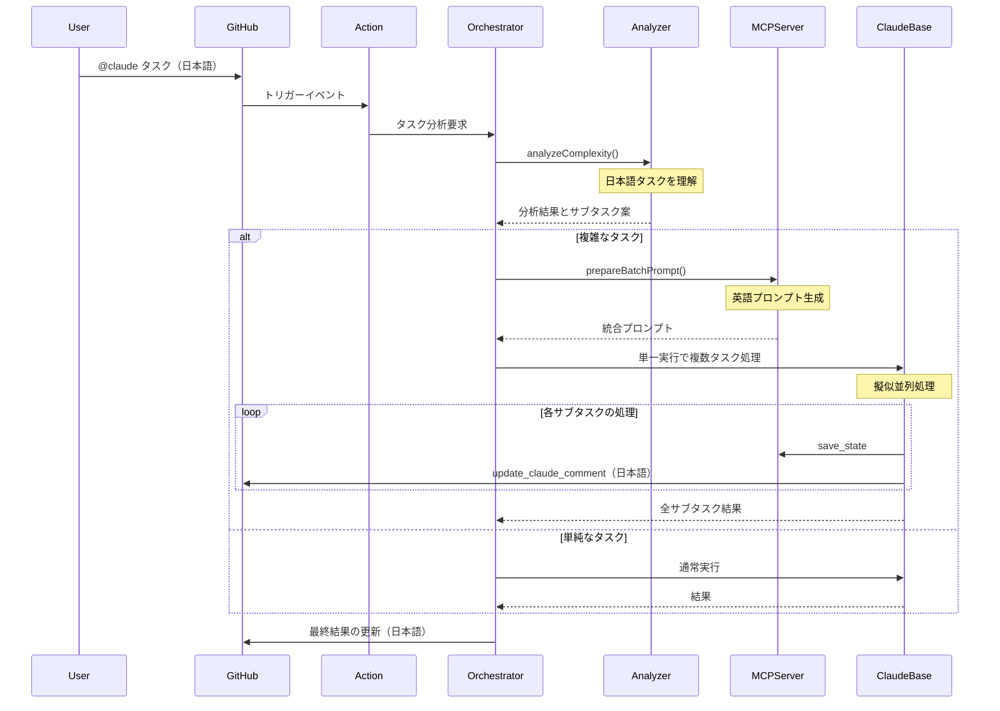

# Claude Code Action Orchestrator詳細設計ドキュメント

## 1. 仕様・要件

### 1.1 機能要件

#### MVP機能スコープ

1. **タスク分析・分解機能**

   - 日本語タスクの理解と処理に完全対応
   - ルールベースとLLMベースのハイブリッド判定
   - 複雑なタスクの論理的なサブタスクへの分解

2. **モード別コンテキスト最適化**

   - 各モード（architect/code/debug/ask/orchestrator）に応じた優先度設定
   - サブタスクごとに必要最小限のコンテキストを生成
   - トークン制限内での最適化

3. **サブタスク実行管理**

   - 単一プロンプト内での複数タスク処理（擬似並列）
   - MCPツールによる状態管理と進捗報告
   - 既存のチェックボックス機能を活用した進捗可視化

4. **既存機能との互換性**
   - orchestratorモードを常に有効化（デフォルト動作）
   - MCPサーバー機能との共存
   - GitHub Actionsワークフローとの完全な互換性

### 1.2 非機能要件

1. **言語対応**

   - 日本語によるタスク指示の完全サポート
   - システム内部のプロンプトは英語（トークン効率のため）
   - エラーメッセージとユーザー向け出力は日本語

2. **パフォーマンス**

   - ルールベース判定は100ms以内
   - LLM判定を含む場合でも5秒以内
   - 単一プロンプトでの擬似並列処理による効率化

3. **拡張性**
   - 将来の機能追加を考慮した設計
   - カスタムルールの追加が容易
   - フォーク不要な設計（既存アクションの最大活用）

## 2. アーキテクチャ概要

### 2.1 全体構成

```
┌─────────────────┐     ┌──────────────────┐
│ Claude Code     │     │ Orchestration    │
│ Action          │────▶│ Layer            │
│ (常時有効)      │     │                  │
└─────────────────┘     └──────────────────┘
         │                       │
         ▼                       ▼
┌─────────────────┐     ┌──────────────────┐
│ prepare.ts      │     │ Orchestrator MCP │
│ (拡張)          │     │ Server           │
└─────────────────┘     └──────────────────┘
         │                       │
         ▼                       ▼
┌─────────────────────────────────────────┐
│ claude-code-base-action                  │
│ (単一実行で複数タスク処理)               │
└─────────────────────────────────────────┘
```

### 2.2 実行フロー



## 3. 主要コンポーネントの詳細設計

### 3.1 トリガー判定（常時有効）

```typescript
// src/github/validation/trigger.ts への追加
export function shouldUseOrchestrator(context: ParsedGitHubContext): boolean {
  // orchestratorモードは常に有効
  // 単純なタスクでもオーケストレーターが判断して直接実行
  return true;
}

export function extractTaskFromComment(context: ParsedGitHubContext): string {
  const commentBody = extractCommentBody(context);

  // @claude の後のテキストをタスクとして抽出
  const triggerPhrase = context.inputs.triggerPhrase || "@claude";
  const regex = new RegExp(`${escapeRegExp(triggerPhrase)}\\s*(.+)`, "is");
  const match = commentBody.match(regex);

  return match ? match[1].trim() : "";
}
```

### 3.2 タスク分析器（日本語対応）

```typescript
// src/orchestrator/task-analyzer.ts
export class TaskAnalyzer {
  private japanesePatterns = {
    multipleActions: /(?:して|し、|してから|した後|その後|それから)/g,
    designKeywords: /(?:設計|アーキテクチャ|構造|システム|仕組み)/g,
    implementKeywords: /(?:実装|開発|作成|作る|コーディング)/g,
    testKeywords: /(?:テスト|試験|検証|確認)/g,
    conditionals: /(?:場合|とき|なら|によって|に応じて)/g,
    sequentialMarkers: /(?:まず|次に|最後に|その後|ステップ)/g,
  };

  private englishPatterns = {
    multipleActions: /(?:and then|then|after that|followed by)/gi,
    designKeywords: /(?:design|architect|structure|system)/gi,
    implementKeywords: /(?:implement|develop|create|build|code)/gi,
    testKeywords: /(?:test|verify|validate|check)/gi,
    conditionals: /(?:if|when|depending|based on)/gi,
    sequentialMarkers: /(?:first|next|finally|step)/gi,
  };

  analyze(task: string): ComplexityAnalysis {
    // 日本語と英語の両方のパターンをチェック
    const isJapanese = /[\u3040-\u309F\u30A0-\u30FF\u4E00-\u9FAF]/.test(task);
    const patterns = isJapanese ? this.japanesePatterns : this.englishPatterns;

    const indicators = {
      multipleActions: patterns.multipleActions.test(task),
      hasDesignKeywords: patterns.designKeywords.test(task),
      hasImplementKeywords: patterns.implementKeywords.test(task),
      hasTestKeywords: patterns.testKeywords.test(task),
      hasConditionals: patterns.conditionals.test(task),
      hasSequentialMarkers: patterns.sequentialMarkers.test(task),
      taskLength: task.length > (isJapanese ? 50 : 100),
    };

    let score = 0;
    let reasons = [];

    if (indicators.multipleActions) {
      score += 0.3;
      reasons.push(
        isJapanese ? "複数のアクションを含む" : "Contains multiple actions",
      );
    }

    // スコア計算...

    const isComplex = score >= 0.5;

    // サブタスクの提案
    let suggestedSubtasks = [];
    if (isComplex) {
      if (indicators.hasDesignKeywords) {
        suggestedSubtasks.push({
          mode: "architect",
          description: isJapanese
            ? "設計とアーキテクチャの決定"
            : "Design and architecture",
        });
      }
      if (indicators.hasImplementKeywords) {
        suggestedSubtasks.push({
          mode: "code",
          description: isJapanese ? "実装" : "Implementation",
        });
      }
      if (indicators.hasTestKeywords || isComplex) {
        suggestedSubtasks.push({
          mode: "code",
          description: isJapanese ? "テストの作成" : "Test creation",
        });
      }
    }

    return {
      isComplex,
      confidence: Math.min(score * 1.5, 1),
      reason: reasons.join("、"),
      suggestedSubtasks,
    };
  }
}
```

### 3.3 Orchestrator MCPサーバー

```typescript
// src/mcp/orchestrator-server.ts
const server = new McpServer({
  name: "Orchestrator Server",
  version: "0.1.0",
});

// タスク分析ツール
server.tool(
  "analyze_complexity",
  "Analyze task complexity and suggest subtasks",
  {
    task: z.string().describe("Task description in any language"),
  },
  async ({ task }) => {
    const analyzer = new TaskAnalyzer();
    const result = await analyzer.analyze(task);

    return {
      content: [
        {
          type: "text",
          text: JSON.stringify(result, null, 2),
        },
      ],
    };
  },
);

// バッチプロンプト生成ツール（英語プロンプト）
server.tool(
  "prepare_batch_prompt",
  "Prepare a batch prompt for multiple subtasks execution",
  {
    subtasks: z.array(
      z.object({
        id: z.string(),
        description: z.string(),
        mode: z.enum(["architect", "code", "debug", "ask", "orchestrator"]),
        dependencies: z.array(z.string()).optional(),
      }),
    ),
  },
  async ({ subtasks }) => {
    const prompt = `
Execute the following subtasks efficiently. Process each subtask according to its mode.

${subtasks
  .map(
    (task, index) => `
=== Subtask ${index + 1}: ${task.id} ===
Mode: ${task.mode}
Description: ${task.description}
${task.dependencies?.length ? `Dependencies: ${task.dependencies.join(", ")}` : ""}

Instructions:
1. Switch to ${task.mode} mode mentally
2. Execute this subtask using appropriate tools for the mode
3. Save progress using orchestrator_save_state with key "${task.id}"
4. Update progress using update_claude_comment (in Japanese)
5. Continue to the next subtask
`,
  )
  .join("\n")}

After completing all subtasks:
1. Compile the results
2. Save the final summary using orchestrator_save_state with key "final_summary"
3. Update the comment with the final results in Japanese

Important: Work through all subtasks in a single session without stopping.
`;

    return {
      content: [
        {
          type: "text",
          text: prompt,
        },
      ],
    };
  },
);
```

### 3.4 プロンプト生成の拡張

```typescript
// src/create-prompt/orchestrator.ts
export async function createOrchestratorPrompt(
  context: PreparedContext,
  taskDescription: string,
): Promise<string> {
  // 日本語タスクでも英語プロンプトを生成（トークン効率）
  return `
# Orchestrator Mode Execution

You are operating in orchestrator mode. The user has provided a task that may be in Japanese.

Task: ${taskDescription}

## Available Tools

You have access to the following orchestrator-specific tools:
- analyze_complexity: Analyze task complexity (supports Japanese)
- prepare_batch_prompt: Prepare a batch execution prompt for subtasks
- orchestrator_save_state: Save intermediate results
- orchestrator_load_state: Load previously saved results
- update_claude_comment: Update progress (output in Japanese)

## Available Modes

When executing subtasks, you can operate in these modes:
- architect: Design and architecture decisions
- code: Implementation and coding
- debug: Debugging and problem solving
- ask: Clarification and questions
- orchestrator: Task coordination (current mode)

## Execution Flow

1. Analyze the task complexity using analyze_complexity tool
2. If complex, use prepare_batch_prompt and execute all subtasks
3. If simple, execute directly in the appropriate mode
4. Always update progress in Japanese using update_claude_comment

Remember: User communication should be in Japanese.
`;
}
```

## 4. 設定ファイル仕様

```yaml
# .claude/orchestrator.yml
orchestrator:
  # orchestratorは常に有効（設定不要）

  complexity_analysis:
    confidence_threshold: 0.7
    enable_subtask_suggestions: true

  execution:
    strategy: batch # batch | sequential
    max_subtasks: 10
    timeout_per_subtask: 300 # 秒

  patterns:
    # 日本語パターン
    - name: feature_implementation_ja
      keywords: ["実装", "機能", "開発", "作成"]
      subtasks:
        - { mode: architect, description: "設計とアーキテクチャ" }
        - { mode: code, description: "実装" }
        - { mode: code, description: "テスト作成" }

    # 英語パターン
    - name: feature_implementation_en
      keywords: ["implement", "feature", "develop", "create"]
      subtasks:
        - { mode: architect, description: "Design and architecture" }
        - { mode: code, description: "Implementation" }
        - { mode: code, description: "Test creation" }

  reporting:
    update_interval: 30 # 秒
    show_subtask_details: true
    language: japanese # 出力言語
```

## 5. タスク分解（実装チェックリスト）

### Phase 1: 基礎実装（3-4日）

- [ ] orchestrator-server.ts の作成
  - [ ] analyze_complexity ツール（日本語対応）
  - [ ] prepare_batch_prompt ツール
  - [ ] 状態管理ツール
- [ ] TaskAnalyzer の実装
  - [ ] 日本語パターンマッチング
  - [ ] 英語パターンマッチング
  - [ ] ハイブリッド分析ロジック
- [ ] トリガー判定の更新
  - [ ] 常時orchestratorモード有効化
  - [ ] prepare.ts への統合
- [ ] ブランチの作成
  - [ ] orchestrator-alpha ブランチの作成
  - [ ] タグ付け準備

### Phase 2: 統合とテスト（3-4日）

- [ ] createOrchestratorPrompt の実装
- [ ] prepareMcpConfig への orchestrator サーバー追加
- [ ] action.yml の更新
  - [ ] allowed_tools に orchestrator ツール追加
  - [ ] max_turns と timeout_minutes の調整
- [ ] 日本語タスクでのテスト
  - [ ] 単純タスクの動作確認
  - [ ] 複雑タスク（3-5サブタスク）の検証
  - [ ] エラーメッセージの日本語化確認
- [ ] README.md の更新
  - [ ] 新機能の説明（日本語・英語）
  - [ ] 使用例の追加
  - [ ] ワークフロー設定例の更新

### Phase 3: リリース準備（2-3日）

- [ ] パフォーマンステスト
  - [ ] 複数サブタスクの実行時間測定
  - [ ] API使用量の確認
- [ ] ドキュメント完成
  - [ ] インストール手順
  - [ ] 設定ガイド
  - [ ] トラブルシューティング
- [ ] サンプルワークフローの作成
  - [ ] 基本的な使用例
  - [ ] 高度な使用例
- [ ] リリース作業
  - [ ] orchestrator-alpha タグの作成
  - [ ] リリースノートの作成

## 6. 使用例

### 基本的な使用方法

```yaml
# PRコメントでの使用（日本語）
@claude ユーザー認証システムを実装してください。JWTトークンを使用し、リフレッシュトークンの仕組みも含めてください。

# 結果
🤖 オーケストレーターモード実行中
📊 タスク分析: 複雑度 高 (信頼度: 0.85)

📋 サブタスク実行中:
☑️ タスク 1: 認証システムの設計 (architect モード)
☑️ タスク 2: JWT実装 (code モード)
☐ タスク 3: リフレッシュトークン実装 (code モード)
☐ タスク 4: テストスイート作成 (code モード)

[リアルタイムで更新される進捗]
```

### ワークフロー設定例

```yaml
name: Orchestrated Development
on:
  issue_comment:
    types: [created]

jobs:
  orchestrate:
    if: contains(github.event.comment.body, '@claude')
    runs-on: ubuntu-latest
    steps:
      - uses: actions/checkout@v4

      - uses: MasashiFukuzawa/claude-code-action@orchestrator-alpha
        with:
          anthropic_api_key: ${{ secrets.ANTHROPIC_API_KEY }}
          github_token: ${{ secrets.GITHUB_TOKEN }}

          # Orchestrator設定（常に有効）
          allowed_tools: |
            View,GlobTool,GrepTool,Edit,Write,
            mcp__github_file_ops__commit_files,
            mcp__github_file_ops__update_claude_comment,
            mcp__orchestrator__analyze_complexity,
            mcp__orchestrator__prepare_batch_prompt,
            mcp__orchestrator__save_state,
            mcp__orchestrator__load_state

          max_turns: "30"
          timeout_minutes: "45"
```

## 7. 成功基準とメトリクス

### 定量的指標

- 日本語タスクの認識率: 95%以上
- タスク完了時間: 従来比30-50%削減
- API呼び出し回数: 単一実行で完結
- 成功率: 85%以上

### 定性的指標

- 日本語でのユーザビリティ
- タスク分解の妥当性
- エラーメッセージの分かりやすさ

## 8. リスクと対策

### 技術的リスク

1. **日本語処理の精度**: パターンマッチングの限界

   - 対策: 継続的なパターン改善とLLMフォールバック

2. **タイムアウト**: 長時間実行への対応
   - 対策: 適切なtimeout設定と中間保存

### 運用リスク

1. **常時orchestratorの副作用**: 単純タスクでのオーバーヘッド

   - 対策: 単純タスクの高速判定と直接実行

2. **日本語・英語混在**: 出力の一貫性
   - 対策: ユーザー向けは日本語、内部は英語の徹底

## 9. 実装詳細ガイド

### 9.1 ディレクトリ構造

```
claude-code-action/
├── src/
│   ├── orchestrator/              # 新規作成
│   │   ├── index.ts              # エクスポート用
│   │   ├── task-analyzer.ts      # タスク分析ロジック
│   │   ├── hybrid-analyzer.ts    # ハイブリッド分析（将来用）
│   │   └── types.ts              # 型定義
│   ├── mcp/
│   │   ├── orchestrator-server.ts # 新規作成
│   │   ├── install-mcp-server.ts  # 修正: orchestrator追加
│   │   └── github-file-ops-server.ts  # 既存（参考）
│   ├── create-prompt/
│   │   ├── orchestrator.ts        # 新規作成
│   │   ├── index.ts              # 修正: orchestrator分岐追加
│   │   └── types.ts              # 既存
│   ├── github/
│   │   └── validation/
│   │       └── trigger.ts        # 修正: orchestrator判定追加
│   └── entrypoints/
│       └── prepare.ts            # 修正: orchestrator統合
├── .github/
│   └── workflows/
│       └── test-orchestrator.yml  # 新規作成（テスト用）
└── examples/
    └── orchestrator-example.yml   # 新規作成（使用例）
```

### 9.2 MCPサーバーの登録方法

```typescript
// src/mcp/install-mcp-server.ts の修正内容

export async function prepareMcpConfig(
  params: PrepareConfigParams,
): Promise<string> {
  const {
    githubToken,
    owner,
    repo,
    branch,
    additionalMcpConfig,
    claudeCommentId,
  } = params;

  try {
    const baseMcpConfig = {
      mcpServers: {
        github: {
          // 既存の設定...
        },
        github_file_ops: {
          // 既存の設定...
        },
        // Orchestratorサーバーを追加
        orchestrator: {
          command: "bun",
          args: [
            "run",
            `${process.env.GITHUB_ACTION_PATH}/src/mcp/orchestrator-server.ts`,
          ],
          env: {
            // 状態管理用のディレクトリ
            ORCHESTRATOR_STATE_DIR:
              process.env.GITHUB_WORKSPACE || process.cwd(),
            // デバッグ用（必要に応じて）
            DEBUG: process.env.ORCHESTRATOR_DEBUG || "false",
            // 言語設定
            USER_LANGUAGE: "ja",
          },
        },
      },
    };

    // 既存のマージロジックはそのまま維持
    if (additionalMcpConfig && additionalMcpConfig.trim()) {
      // ... 既存のコード
    }

    return JSON.stringify(mergedConfig, null, 2);
  } catch (error) {
    // ... 既存のエラーハンドリング
  }
}
```

### 9.3 ブランチ戦略とリリースフロー

```bash
# 1. feature/orchestrator-alpha ブランチの作成（初回のみ）
git checkout main
git pull origin main
git checkout -b feature/orchestrator-alpha
git push -u origin feature/orchestrator-alpha

# 2. 作業ブランチの作成（各実装者）
git checkout feature/orchestrator-alpha
git checkout -b feat/orchestrator-task-analyzer
# または
git checkout -b feat/orchestrator-mcp-server

# 3. 作業完了後
git push origin feat/orchestrator-task-analyzer
# feature/orchestrator-alpha へのPRを作成

# 4. 全機能完成後
# feature/orchestrator-alpha から main へのPRを作成

# 5. mainマージ後のタグ付け
git checkout main
git pull origin main
git tag -a orchestrator-alpha -m "Orchestrator Alpha Release"
git push origin orchestrator-alpha
```

### 9.4 エラーハンドリング実装ガイド

```typescript
// src/orchestrator/task-analyzer.ts

export class TaskAnalyzer {
  analyze(task: string): ComplexityAnalysis {
    try {
      // メイン処理
      return this.performAnalysis(task);
    } catch (error) {
      console.error("[Orchestrator] Task analysis error:", error);

      // TODO: 将来的には以下の改善を検討
      // 1. エラーの種類に応じた処理分岐
      //    - 日本語処理エラー: 英語パターンにフォールバック
      //    - メモリ不足: タスクを分割して再試行
      // 2. エラーメトリクスの収集
      // 3. ユーザーへの通知方法の改善

      // 現時点では安全側に倒して単純タスクとして処理
      return {
        isComplex: false,
        confidence: 0,
        reason: "Analysis failed - treating as simple task",
        suggestedSubtasks: [],
        error: error instanceof Error ? error.message : "Unknown error",
      };
    }
  }

  private performAnalysis(task: string): ComplexityAnalysis {
    // 実際の分析処理
    // エラーが発生する可能性がある処理
  }
}

// src/mcp/orchestrator-server.ts

server.tool(
  "analyze_complexity",
  "Analyze task complexity and suggest subtasks",
  {
    task: z.string().describe("Task description in any language"),
  },
  async ({ task }) => {
    try {
      const analyzer = new TaskAnalyzer();
      const result = await analyzer.analyze(task);

      // エラーがある場合は警告として含める
      if (result.error) {
        console.warn(
          "[Orchestrator] Analysis completed with warning:",
          result.error,
        );
      }

      return {
        content: [
          {
            type: "text",
            text: JSON.stringify(result, null, 2),
          },
        ],
      };
    } catch (error) {
      // MCPツールレベルでのエラー
      // TODO: 将来的な改善点
      // 1. リトライロジックの実装
      // 2. 部分的な結果の返却
      // 3. エラーの詳細な分類

      const errorMessage =
        error instanceof Error ? error.message : "Unknown error";
      return {
        content: [
          {
            type: "text",
            text: JSON.stringify(
              {
                isComplex: false,
                confidence: 0,
                reason: `Tool error: ${errorMessage}`,
                suggestedSubtasks: [],
              },
              null,
              2,
            ),
          },
        ],
        isError: true,
      };
    }
  },
);
```

### 9.5 動作確認方法

#### ローカル環境での確認

```bash
# 1. 依存関係のインストール
cd claude-code-action
bun install

# 2. MCPサーバーの単体テスト
# 別ターミナルでサーバーを起動
bun run src/mcp/orchestrator-server.ts

# テスト用のクライアントスクリプトを作成
cat > test-orchestrator.js << 'EOF'
import { spawn } from 'child_process';

const server = spawn('bun', ['run', 'src/mcp/orchestrator-server.ts']);

// サーバーからの出力を確認
server.stdout.on('data', (data) => {
  console.log(`Server: ${data}`);

  // 初期化完了後、テストリクエストを送信
  if (data.includes('ready')) {
    const testRequest = {
      method: 'tools/call',
      params: {
        name: 'analyze_complexity',
        arguments: {
          task: 'ユーザー認証システムを実装してください'
        }
      }
    };

    server.stdin.write(JSON.stringify(testRequest) + '\n');
  }
});
EOF

bun run test-orchestrator.js

# 3. タスク分析の単体テスト
bun test src/orchestrator/__tests__/task-analyzer.test.ts
```

#### GitHub Actions での統合テスト

```yaml
# .github/workflows/test-orchestrator.yml
name: Test Orchestrator
on:
  pull_request:
    branches: [feature/orchestrator-alpha]
  workflow_dispatch:

jobs:
  test:
    runs-on: ubuntu-latest
    steps:
      - uses: actions/checkout@v4

      - name: Setup test repository
        run: |
          # テスト用のIssueを作成
          gh issue create \
            --title "Orchestrator Test" \
            --body "Test issue for orchestrator"
        env:
          GH_TOKEN: ${{ secrets.GITHUB_TOKEN }}

      - name: Test orchestrator trigger
        uses: ./ # ローカルアクションを使用
        with:
          anthropic_api_key: ${{ secrets.ANTHROPIC_API_KEY }}
          github_token: ${{ secrets.GITHUB_TOKEN }}

      - name: Post test comment
        run: |
          # テストコメントを投稿
          gh issue comment ${{ env.ISSUE_NUMBER }} \
            --body "@claude ユーザー認証システムを実装してください。JWTを使用。"
        env:
          GH_TOKEN: ${{ secrets.GITHUB_TOKEN }}
          ISSUE_NUMBER: ${{ steps.create-issue.outputs.number }}

      - name: Wait and check results
        run: |
          sleep 60  # 処理を待つ

          # コメントを確認
          gh issue view ${{ env.ISSUE_NUMBER }} --comments
        env:
          GH_TOKEN: ${{ secrets.GITHUB_TOKEN }}
```

#### 手動での動作確認手順

1. **フォークしたリポジトリでの確認**

   ```bash
   # 1. リポジトリをフォーク
   # 2. feature/orchestrator-alpha ブランチをチェックアウト
   # 3. GitHub Actions を有効化
   # 4. シークレットを設定 (ANTHROPIC_API_KEY)
   ```

2. **テスト用Issueでの確認**

   ```markdown
   # Issue作成

   Title: Orchestrator機能テスト

   # コメント例1（単純タスク）

   @claude README.mdのタイポを修正してください

   # コメント例2（複雑タスク）

   @claude ユーザー管理システムを実装してください。
   以下の機能を含めてください：

   - ユーザー登録
   - ログイン/ログアウト
   - パスワードリセット
   - 権限管理
   ```

3. **期待される動作**

   - 単純タスク: 直接実行される
   - 複雑タスク: サブタスクに分解されて実行
   - 進捗がリアルタイムで更新される

4. **デバッグ方法**

   ```bash
   # GitHub Actions のログを確認
   # 1. Actions タブを開く
   # 2. 該当のワークフロー実行を選択
   # 3. ステップごとのログを確認

   # 特に以下を確認：
   # - MCPサーバーの起動ログ
   # - analyze_complexity の実行結果
   # - prepare_batch_prompt の生成内容
   ```

## 10. 将来の拡張計画

### Phase 1 後の改善（1-2ヶ月後）

- 分析精度の向上
  - より高度な日本語パターン
  - LLMベースの分析追加
- カスタムモードのサポート
  - ユーザー定義モードの追加
  - モード別の優先度カスタマイズ

### Phase 2 後の改善（3-4ヶ月後）

- 実行モードの追加
  - fast/accurate モードの実装
  - 並列実行オプション（GitHub Actions マトリックス）
- ブーメランタスク機能
  - モード間の自動切り替え
  - 動的なタスク再割り当て

### Phase 3 後の改善（6ヶ月後以降）

- エンタープライズ機能
  - 実行履歴の分析
  - チーム別のカスタマイズ
- 高度な最適化
  - 機械学習による最適化
  - プロジェクト固有の学習
