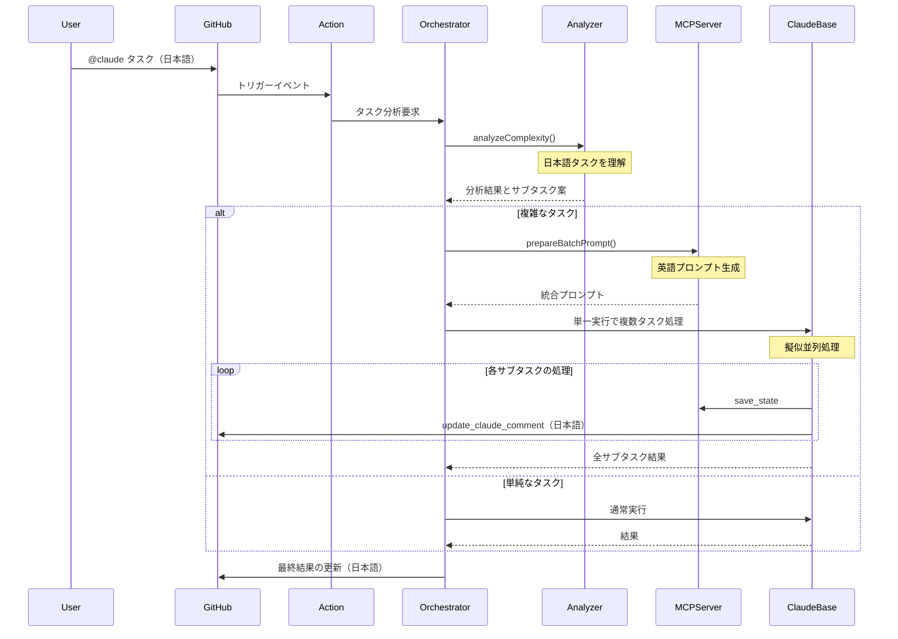

# Claude Code Action Orchestrator詳細設計ドキュメント

## 1. 仕様・要件

### 1.1 機能要件

#### MVP機能スコープ

1. **タスク分析・分解機能**

   - 日本語タスクの理解と処理に完全対応
   - ルールベースとLLMベースのハイブリッド判定
   - 複雑なタスクの論理的なサブタスクへの分解

2. **モード別コンテキスト最適化**

   - 各モード（architect/code/debug/ask/orchestrator）に応じた優先度設定
   - サブタスクごとに必要最小限のコンテキストを生成
   - トークン制限内での最適化

3. **サブタスク実行管理**

   - 単一プロンプト内での複数タスク処理（擬似並列）
   - MCPツールによる状態管理と進捗報告
   - 既存のチェックボックス機能を活用した進捗可視化

4. **既存機能との互換性**
   - orchestratorモードを常に有効化（デフォルト動作）
   - MCPサーバー機能との共存
   - GitHub Actionsワークフローとの完全な互換性

### 1.2 非機能要件

1. **言語対応**

   - 日本語によるタスク指示の完全サポート
   - システム内部のプロンプトは英語（トークン効率のため）
   - エラーメッセージとユーザー向け出力は日本語

2. **パフォーマンス**

   - ルールベース判定は100ms以内
   - LLM判定を含む場合でも5秒以内
   - 単一プロンプトでの擬似並列処理による効率化

3. **拡張性**
   - 将来の機能追加を考慮した設計
   - カスタムルールの追加が容易
   - フォーク不要な設計（既存アクションの最大活用）

## 2. アーキテクチャ概要

### 2.1 全体構成

```
┌─────────────────┐     ┌──────────────────┐
│ Claude Code     │     │ Orchestration    │
│ Action          │────▶│ Layer            │
│ (常時有効)      │     │                  │
└─────────────────┘     └──────────────────┘
         │                       │
         ▼                       ▼
┌─────────────────┐     ┌──────────────────┐
│ prepare.ts      │     │ Orchestrator MCP │
│ (拡張)          │     │ Server           │
└─────────────────┘     └──────────────────┘
         │                       │
         ▼                       ▼
┌─────────────────────────────────────────┐
│ claude-code-base-action                  │
│ (単一実行で複数タスク処理)               │
└─────────────────────────────────────────┘
```

### 2.2 実行フロー



## 3. 主要コンポーネントの詳細設計

### 3.1 トリガー判定（常時有効）

```typescript
// src/github/validation/trigger.ts への追加
export function shouldUseOrchestrator(context: ParsedGitHubContext): boolean {
  // orchestratorモードは常に有効
  // 単純なタスクでもオーケストレーターが判断して直接実行
  return true;
}

export function extractTaskFromComment(context: ParsedGitHubContext): string {
  const commentBody = extractCommentBody(context);

  // @claude の後のテキストをタスクとして抽出
  const triggerPhrase = context.inputs.triggerPhrase || "@claude";
  const regex = new RegExp(`${escapeRegExp(triggerPhrase)}\\s*(.+)`, "is");
  const match = commentBody.match(regex);

  return match ? match[1].trim() : "";
}
```

### 3.2 タスク分析器（日本語対応）

```typescript
// src/orchestrator/task-analyzer.ts
export class TaskAnalyzer {
  private japanesePatterns = {
    multipleActions: /(?:して|し、|してから|した後|その後|それから)/g,
    designKeywords: /(?:設計|アーキテクチャ|構造|システム|仕組み)/g,
    implementKeywords: /(?:実装|開発|作成|作る|コーディング)/g,
    testKeywords: /(?:テスト|試験|検証|確認)/g,
    conditionals: /(?:場合|とき|なら|によって|に応じて)/g,
    sequentialMarkers: /(?:まず|次に|最後に|その後|ステップ)/g,
  };

  private englishPatterns = {
    multipleActions: /(?:and then|then|after that|followed by)/gi,
    designKeywords: /(?:design|architect|structure|system)/gi,
    implementKeywords: /(?:implement|develop|create|build|code)/gi,
    testKeywords: /(?:test|verify|validate|check)/gi,
    conditionals: /(?:if|when|depending|based on)/gi,
    sequentialMarkers: /(?:first|next|finally|step)/gi,
  };

  analyze(task: string): ComplexityAnalysis {
    // 日本語と英語の両方のパターンをチェック
    const isJapanese = /[\u3040-\u309F\u30A0-\u30FF\u4E00-\u9FAF]/.test(task);
    const patterns = isJapanese ? this.japanesePatterns : this.englishPatterns;

    const indicators = {
      multipleActions: patterns.multipleActions.test(task),
      hasDesignKeywords: patterns.designKeywords.test(task),
      hasImplementKeywords: patterns.implementKeywords.test(task),
      hasTestKeywords: patterns.testKeywords.test(task),
      hasConditionals: patterns.conditionals.test(task),
      hasSequentialMarkers: patterns.sequentialMarkers.test(task),
      taskLength: task.length > (isJapanese ? 50 : 100),
    };

    let score = 0;
    let reasons = [];

    if (indicators.multipleActions) {
      score += 0.3;
      reasons.push(
        isJapanese ? "複数のアクションを含む" : "Contains multiple actions",
      );
    }

    // スコア計算...

    const isComplex = score >= 0.5;

    // サブタスクの提案
    let suggestedSubtasks = [];
    if (isComplex) {
      if (indicators.hasDesignKeywords) {
        suggestedSubtasks.push({
          mode: "architect",
          description: isJapanese
            ? "設計とアーキテクチャの決定"
            : "Design and architecture",
        });
      }
      if (indicators.hasImplementKeywords) {
        suggestedSubtasks.push({
          mode: "code",
          description: isJapanese ? "実装" : "Implementation",
        });
      }
      if (indicators.hasTestKeywords || isComplex) {
        suggestedSubtasks.push({
          mode: "code",
          description: isJapanese ? "テストの作成" : "Test creation",
        });
      }
    }

    return {
      isComplex,
      confidence: Math.min(score * 1.5, 1),
      reason: reasons.join("、"),
      suggestedSubtasks,
    };
  }
}
```

### 3.3 Orchestrator MCPサーバー

```typescript
// src/mcp/orchestrator-server.ts
const server = new McpServer({
  name: "Orchestrator Server",
  version: "0.1.0",
});

// タスク分析ツール
server.tool(
  "analyze_complexity",
  "Analyze task complexity and suggest subtasks",
  {
    task: z.string().describe("Task description in any language"),
  },
  async ({ task }) => {
    const analyzer = new TaskAnalyzer();
    const result = await analyzer.analyze(task);

    return {
      content: [
        {
          type: "text",
          text: JSON.stringify(result, null, 2),
        },
      ],
    };
  },
);

// バッチプロンプト生成ツール（英語プロンプト）
server.tool(
  "prepare_batch_prompt",
  "Prepare a batch prompt for multiple subtasks execution",
  {
    subtasks: z.array(
      z.object({
        id: z.string(),
        description: z.string(),
        mode: z.enum(["architect", "code", "debug", "ask", "orchestrator"]),
        dependencies: z.array(z.string()).optional(),
      }),
    ),
  },
  async ({ subtasks }) => {
    const prompt = `
Execute the following subtasks efficiently. Process each subtask according to its mode.

${subtasks
  .map(
    (task, index) => `
=== Subtask ${index + 1}: ${task.id} ===
Mode: ${task.mode}
Description: ${task.description}
${task.dependencies?.length ? `Dependencies: ${task.dependencies.join(", ")}` : ""}

Instructions:
1. Switch to ${task.mode} mode mentally
2. Execute this subtask using appropriate tools for the mode
3. Save progress using orchestrator_save_state with key "${task.id}"
4. Update progress using update_claude_comment (in Japanese)
5. Continue to the next subtask
`,
  )
  .join("\n")}

After completing all subtasks:
1. Compile the results
2. Save the final summary using orchestrator_save_state with key "final_summary"
3. Update the comment with the final results in Japanese

Important: Work through all subtasks in a single session without stopping.
`;

    return {
      content: [
        {
          type: "text",
          text: prompt,
        },
      ],
    };
  },
);
```

### 3.4 プロンプト生成の拡張

```typescript
// src/create-prompt/orchestrator.ts
export async function createOrchestratorPrompt(
  context: PreparedContext,
  taskDescription: string,
): Promise<string> {
  // 日本語タスクでも英語プロンプトを生成（トークン効率）
  return `
# Orchestrator Mode Execution

You are operating in orchestrator mode. The user has provided a task that may be in Japanese.

Task: ${taskDescription}

## Available Tools

You have access to the following orchestrator-specific tools:
- analyze_complexity: Analyze task complexity (supports Japanese)
- prepare_batch_prompt: Prepare a batch execution prompt for subtasks
- orchestrator_save_state: Save intermediate results
- orchestrator_load_state: Load previously saved results
- update_claude_comment: Update progress (output in Japanese)

## Available Modes

When executing subtasks, you can operate in these modes:
- architect: Design and architecture decisions
- code: Implementation and coding
- debug: Debugging and problem solving
- ask: Clarification and questions
- orchestrator: Task coordination (current mode)

## Execution Flow

1. Analyze the task complexity using analyze_complexity tool
2. If complex, use prepare_batch_prompt and execute all subtasks
3. If simple, execute directly in the appropriate mode
4. Always update progress in Japanese using update_claude_comment

Remember: User communication should be in Japanese.
`;
}
```

## 4. 設定ファイル仕様

```yaml
# .claude/orchestrator.yml
orchestrator:
  # orchestratorは常に有効（設定不要）

  complexity_analysis:
    confidence_threshold: 0.7
    enable_subtask_suggestions: true

  execution:
    strategy: batch # batch | sequential
    max_subtasks: 10
    timeout_per_subtask: 300 # 秒

  patterns:
    # 日本語パターン
    - name: feature_implementation_ja
      keywords: ["実装", "機能", "開発", "作成"]
      subtasks:
        - { mode: architect, description: "設計とアーキテクチャ" }
        - { mode: code, description: "実装" }
        - { mode: code, description: "テスト作成" }

    # 英語パターン
    - name: feature_implementation_en
      keywords: ["implement", "feature", "develop", "create"]
      subtasks:
        - { mode: architect, description: "Design and architecture" }
        - { mode: code, description: "Implementation" }
        - { mode: code, description: "Test creation" }

  reporting:
    update_interval: 30 # 秒
    show_subtask_details: true
    language: japanese # 出力言語
```

## 5. マイクロタスク分解（実装チェックリスト）

### 【重要】5-15分ルール

- 各タスクは5-15分で完了できる粒度に分解
- 実装後、即座に `bun run format && bun tsc --noEmit && bun test`
- エラーがあれば即修正、Green状態でコミット・プッシュ

### Phase 1: 基礎実装

#### 1-1. 型定義とディレクトリ構造

##### ブランチ作成

- [ ] **新ブランチ**: `git checkout -b feat/orchestrator-1-1-types`

##### 1-1-1. ディレクトリ作成（5分）

- [ ] `src/orchestrator/` ディレクトリ作成
- [ ] `.gitkeep` ファイル追加
- [ ] **コミット**: `chore: create orchestrator directory`

##### 1-1-2. 基本型定義（10分）

- [ ] `src/orchestrator/types.ts` 作成
- [ ] `ComplexityAnalysis` 型のみ定義
- [ ] **型チェック**: `bun tsc --noEmit`
- [ ] **コミット**: `feat: add ComplexityAnalysis type`

##### 1-1-3. エクスポート設定（5分）

- [ ] `src/orchestrator/index.ts` 作成
- [ ] types.tsからのexport文のみ
- [ ] **型チェック**: `bun tsc --noEmit`
- [ ] **コミット**: `feat: add orchestrator module exports`

##### PR作成

- [ ] **プッシュ**: `git push origin feat/orchestrator-1-1-types`
- [ ] **PR作成**: `feature/orchestrator-alpha` へのPR
- [ ] **PRタイトル**: `feat(orchestrator): add type definitions and directory structure`

#### 1-2. TaskAnalyzer基本構造

##### ブランチ作成

- [ ] **新ブランチ**: `git checkout feat/orchestrator-1-1-types && git checkout -b feat/orchestrator-1-2-analyzer-base`

##### 1-2-1. クラスファイル作成（5分）

- [ ] `src/orchestrator/task-analyzer.ts` 作成
- [ ] 空のクラス定義のみ
- [ ] **型チェック**: `bun tsc --noEmit`
- [ ] **コミット**: `feat: create TaskAnalyzer class file`

##### 1-2-2. クラス基本構造（5分）

- [ ] `TaskAnalyzer` クラス定義
- [ ] コンストラクタ追加（引数なし）
- [ ] **型チェック**: `bun tsc --noEmit`
- [ ] **コミット**: `feat: add TaskAnalyzer class structure`

##### 1-2-3. analyzeメソッドスケルトン（5分）

- [ ] `analyze()` メソッド追加
- [ ] 固定値を返すのみ
- [ ] **型チェック**: `bun tsc --noEmit`
- [ ] **コミット**: `feat: add analyze method skeleton`

##### PR作成

- [ ] **プッシュ**: `git push origin feat/orchestrator-1-2-analyzer-base`
- [ ] **PR作成**: `feature/orchestrator-alpha` へのPR
- [ ] **PRタイトル**: `feat(orchestrator): add TaskAnalyzer basic structure`

#### 1-3. TaskAnalyzerテスト（テストファースト）

##### ブランチ作成

- [ ] **新ブランチ**: `git checkout feat/orchestrator-1-2-analyzer-base && git checkout -b feat/orchestrator-1-3-analyzer-tests`

##### 1-3-1. テストファイル作成（5分）

- [ ] `test/task-analyzer.test.ts` 作成
- [ ] 基本的なimport文のみ
- [ ] **コミット**: `test: create task-analyzer test file`

##### 1-3-2. 基本テストケース（5分）

- [ ] "should instantiate" テスト追加
- [ ] **テスト実行**: `bun test task-analyzer.test.ts`
- [ ] **Green確認**
- [ ] **コミット**: `test: add instantiation test`

##### 1-3-3. analyze固定値テスト（5分）

- [ ] "should return fixed analysis" テスト追加
- [ ] **テスト実行**: `bun test task-analyzer.test.ts`
- [ ] **Green確認**
- [ ] **コミット**: `test: add fixed value analysis test`

##### PR作成

- [ ] **プッシュ**: `git push origin feat/orchestrator-1-3-analyzer-tests`
- [ ] **PR作成**: `feature/orchestrator-alpha` へのPR
- [ ] **PRタイトル**: `test(orchestrator): add TaskAnalyzer test foundation`

#### 1-4. 日本語検出機能

##### ブランチ作成

- [ ] **新ブランチ**: `git checkout feat/orchestrator-1-3-analyzer-tests && git checkout -b feat/orchestrator-1-4-japanese-detection`

##### 1-4-1. 検出メソッド定義（5分）

- [ ] `detectJapanese()` プライベートメソッド追加
- [ ] 空実装（false返却）
- [ ] **型チェック**: `bun tsc --noEmit`
- [ ] **コミット**: `feat: add detectJapanese method`

##### 1-4-2. 日本語検出テスト（5分）

- [ ] 日本語検出のテストケース追加
- [ ] **テスト実行**: `bun test`（Red確認）
- [ ] **コミット**: `test: add Japanese detection tests`

##### 1-4-3. 日本語検出実装（5分）

- [ ] 正規表現パターン実装
- [ ] **テスト実行**: `bun test`（Green確認）
- [ ] **コミット**: `feat: implement Japanese detection logic`

##### PR作成

- [ ] **プッシュ**: `git push origin feat/orchestrator-1-4-japanese-detection`
- [ ] **PR作成**: `feature/orchestrator-alpha` へのPR
- [ ] **PRタイトル**: `feat(orchestrator): add Japanese detection functionality`

#### 1-5. 日本語パターン定義

##### ブランチ作成

- [ ] **新ブランチ**: `git checkout feat/orchestrator-1-4-japanese-detection && git checkout -b feat/orchestrator-1-5-japanese-patterns`

##### 1-5-1. パターンプロパティ追加（5分）

- [ ] `japanesePatterns` プロパティ定義
- [ ] 型定義のみ（空オブジェクト）
- [ ] **型チェック**: `bun tsc --noEmit`
- [ ] **コミット**: `feat: add japanesePatterns property`

##### 1-5-2. 基本パターン追加（5分）

- [ ] `multipleActions` パターン追加
- [ ] `conditionals` パターン追加
- [ ] **型チェック**: `bun tsc --noEmit`
- [ ] **コミット**: `feat: add basic Japanese patterns`

##### 1-5-3. キーワードパターン追加（5分）

- [ ] `designKeywords` パターン追加
- [ ] `implementKeywords` パターン追加
- [ ] **型チェック**: `bun tsc --noEmit`
- [ ] **コミット**: `feat: add Japanese keyword patterns`

##### PR作成

- [ ] **プッシュ**: `git push origin feat/orchestrator-1-5-japanese-patterns`
- [ ] **PR作成**: `feature/orchestrator-alpha` へのPR
- [ ] **PRタイトル**: `feat(orchestrator): add Japanese pattern definitions`

#### 1-6. 英語パターン定義

##### ブランチ作成

- [ ] **新ブランチ**: `git checkout feat/orchestrator-1-5-japanese-patterns && git checkout -b feat/orchestrator-1-6-english-patterns`

##### 1-6-1. 英語パターンプロパティ（5分）

- [ ] `englishPatterns` プロパティ定義
- [ ] 型定義のみ（空オブジェクト）
- [ ] **型チェック**: `bun tsc --noEmit`
- [ ] **コミット**: `feat: add englishPatterns property`

##### 1-6-2. 英語基本パターン（5分）

- [ ] `multipleActions` 英語版追加
- [ ] `conditionals` 英語版追加
- [ ] **型チェック**: `bun tsc --noEmit`
- [ ] **コミット**: `feat: add basic English patterns`

##### 1-6-3. 英語キーワード（5分）

- [ ] 残りの英語パターン追加
- [ ] **型チェック**: `bun tsc --noEmit`
- [ ] **コミット**: `feat: complete English patterns`

##### PR作成

- [ ] **プッシュ**: `git push origin feat/orchestrator-1-6-english-patterns`
- [ ] **PR作成**: `feature/orchestrator-alpha` へのPR
- [ ] **PRタイトル**: `feat(orchestrator): add English pattern definitions`

#### 1-7. パターンマッチング機能

##### ブランチ作成

- [ ] **新ブランチ**: `git checkout feat/orchestrator-1-6-english-patterns && git checkout -b feat/orchestrator-1-7-pattern-matching`

##### 1-7-1. indicatorsメソッド定義（5分）

- [ ] `analyzeIndicators()` メソッド追加
- [ ] 空実装（固定値返却）
- [ ] **型チェック**: `bun tsc --noEmit`
- [ ] **コミット**: `feat: add analyzeIndicators method`

##### 1-7-2. パターン選択ロジック（5分）

- [ ] 言語に応じたパターン選択実装
- [ ] **型チェック**: `bun tsc --noEmit`
- [ ] **コミット**: `feat: implement pattern selection`

##### 1-7-3. マッチング実装（5分）

- [ ] 各パターンのテスト実装
- [ ] indicators結果オブジェクト生成
- [ ] **テスト実行**: `bun test`
- [ ] **コミット**: `feat: implement pattern matching logic`

##### PR作成

- [ ] **プッシュ**: `git push origin feat/orchestrator-1-7-pattern-matching`
- [ ] **PR作成**: `feature/orchestrator-alpha` へのPR
- [ ] **PRタイトル**: `feat(orchestrator): implement pattern matching functionality`

#### 1-8. スコアリングロジック

##### ブランチ作成

- [ ] **新ブランチ**: `git checkout feat/orchestrator-1-7-pattern-matching && git checkout -b feat/orchestrator-1-8-scoring-logic`

##### 1-8-1. スコア計算メソッド（5分）

- [ ] `calculateComplexityScore()` メソッド追加
- [ ] 引数と戻り値の型定義
- [ ] **型チェック**: `bun tsc --noEmit`
- [ ] **コミット**: `feat: add score calculation method`

##### 1-8-2. 基本スコアリング（5分）

- [ ] multipleActionsのスコア計算
- [ ] 理由配列への追加
- [ ] **テスト実行**: `bun test`
- [ ] **コミット**: `feat: implement basic scoring`

##### 1-8-3. 完全スコアリング（5分）

- [ ] 全indicatorsのスコア計算
- [ ] 閾値判定（0.5）
- [ ] **テスト実行**: `bun test`
- [ ] **コミット**: `feat: complete scoring logic`

##### PR作成

- [ ] **プッシュ**: `git push origin feat/orchestrator-1-8-scoring-logic`
- [ ] **PR作成**: `feature/orchestrator-alpha` へのPR
- [ ] **PRタイトル**: `feat(orchestrator): implement scoring logic for complexity analysis`

#### 1-9. サブタスク生成機能

##### ブランチ作成

- [ ] **新ブランチ**: `git checkout feat/orchestrator-1-8-scoring-logic && git checkout -b feat/orchestrator-1-9-subtask-generation`

##### 1-9-1. サブタスク生成メソッド（5分）

- [ ] `generateSubtasks()` メソッド追加
- [ ] 空配列返却
- [ ] **型チェック**: `bun tsc --noEmit`
- [ ] **コミット**: `feat: add generateSubtasks method`

##### 1-9-2. 条件付きサブタスク（5分）

- [ ] isComplexチェック追加
- [ ] 基本的なサブタスク生成
- [ ] **テスト実行**: `bun test`
- [ ] **コミット**: `feat: implement conditional subtask generation`

##### 1-9-3. 完全サブタスク生成（5分）

- [ ] 全キーワードに対応したサブタスク
- [ ] 日本語/英語の説明切り替え
- [ ] **全テスト実行**: `bun test`
- [ ] **コミット**: `feat: complete subtask generation`

##### PR作成

- [ ] **プッシュ**: `git push origin feat/orchestrator-1-9-subtask-generation`
- [ ] **PR作成**: `feature/orchestrator-alpha` へのPR
- [ ] **PRタイトル**: `feat(orchestrator): implement subtask generation functionality`

#### 1-11. MCP Server基本構造

##### ブランチ作成

- [ ] **新ブランチ**: `git checkout feat/orchestrator-1-9-subtask-generation && git checkout -b feat/orchestrator-1-11-mcp-server-base`

##### 1-11-1. 新ブランチ作成（3分）

- [ ] ブランチ作成確認
- [ ] **コミット**: ブランチ作成のみ

##### 1-11-2. MCPサーバーファイル（5分）

- [ ] `src/mcp/orchestrator-server.ts` 作成
- [ ] 基本的なimport文のみ
- [ ] **型チェック**: `bun tsc --noEmit`
- [ ] **コミット**: `feat: create orchestrator MCP server file`

##### 1-11-3. サーバー初期化（7分）

- [ ] McpServer インスタンス作成
- [ ] 基本設定（name, version）
- [ ] **型チェック**: `bun tsc --noEmit`
- [ ] **コミット**: `feat: initialize MCP server`

##### PR作成

- [ ] **プッシュ**: `git push origin feat/orchestrator-1-11-mcp-server-base`
- [ ] **PR作成**: `feature/orchestrator-alpha` へのPR
- [ ] **PRタイトル**: `feat(orchestrator): create MCP server basic structure`

#### 1-12. analyze_complexityツール

##### ブランチ作成

- [ ] **新ブランチ**: `git checkout feat/orchestrator-1-11-mcp-server-base && git checkout -b feat/orchestrator-1-12-analyze-complexity`

##### 1-12-1. ツール定義（5分）

- [ ] `server.tool()` 呼び出し追加
- [ ] 名前と説明のみ
- [ ] **型チェック**: `bun tsc --noEmit`
- [ ] **コミット**: `feat: define analyze_complexity tool`

##### 1-12-2. パラメータ定義（5分）

- [ ] zodスキーマ定義
- [ ] task パラメータ追加
- [ ] **型チェック**: `bun tsc --noEmit`
- [ ] **コミット**: `feat: add tool parameters`

##### 1-12-3. ツール実装（5分）

- [ ] TaskAnalyzerインポート
- [ ] 基本的な実行ロジック
- [ ] **サーバー起動テスト**
- [ ] **コミット**: `feat: implement analyze_complexity logic`

##### PR作成

- [ ] **プッシュ**: `git push origin feat/orchestrator-1-12-analyze-complexity`
- [ ] **PR作成**: `feature/orchestrator-alpha` へのPR
- [ ] **PRタイトル**: `feat(orchestrator): implement analyze_complexity MCP tool`

#### 1-13. MCPサーバーテスト

##### ブランチ作成

- [ ] **新ブランチ**: `git checkout feat/orchestrator-1-12-analyze-complexity && git checkout -b feat/orchestrator-1-13-mcp-tests`

##### 1-13-1. テストファイル作成（5分）

- [ ] `test/orchestrator-server.test.ts` 作成
- [ ] 基本的なセットアップ
- [ ] **コミット**: `test: create MCP server test file`

##### 1-13-2. サーバー起動テスト（5分）

- [ ] サーバー起動確認テスト
- [ ] **テスト実行**: `bun test orchestrator-server.test.ts`
- [ ] **コミット**: `test: add server startup test`

##### PR作成

- [ ] **プッシュ**: `git push origin feat/orchestrator-1-13-mcp-tests`
- [ ] **PR作成**: `feature/orchestrator-alpha` へのPR
- [ ] **PRタイトル**: `test(orchestrator): add MCP server tests`

#### 1-14. 状態管理ツール

##### ブランチ作成

- [ ] **新ブランチ**: `git checkout feat/orchestrator-1-13-mcp-tests && git checkout -b feat/orchestrator-1-14-state-management`

##### 1-14-1. save_stateツール（5分）

- [ ] `save_state` ツール定義
- [ ] 基本的な保存ロジック
- [ ] **型チェック**: `bun tsc --noEmit`
- [ ] **コミット**: `feat: add save_state tool`

##### 1-14-2. load_stateツール（5分）

- [ ] `load_state` ツール定義
- [ ] 基本的な読み込みロジック
- [ ] **型チェック**: `bun tsc --noEmit`
- [ ] **コミット**: `feat: add load_state tool`

##### 1-14-3. 状態管理テスト（5分）

- [ ] save/loadのテスト追加
- [ ] **テスト実行**: `bun test`
- [ ] **コミット**: `test: add state management tests`

##### PR作成

- [ ] **プッシュ**: `git push origin feat/orchestrator-1-14-state-management`
- [ ] **PR作成**: `feature/orchestrator-alpha` へのPR
- [ ] **PRタイトル**: `feat(orchestrator): implement state management tools`

#### 1-15. batch_promptツール

##### ブランチ作成

- [ ] **新ブランチ**: `git checkout feat/orchestrator-1-14-state-management && git checkout -b feat/orchestrator-1-15-batch-prompt`

##### 1-15-1. ツール定義（5分）

- [ ] `prepare_batch_prompt` ツール定義
- [ ] パラメータスキーマ
- [ ] **型チェック**: `bun tsc --noEmit`
- [ ] **コミット**: `feat: define batch_prompt tool`

##### 1-15-2. プロンプト生成（5分）

- [ ] 基本的なプロンプトテンプレート
- [ ] サブタスクのマッピング
- [ ] **型チェック**: `bun tsc --noEmit`
- [ ] **コミット**: `feat: implement prompt generation`

##### 1-15-3. 完全実装とテスト（5分）

- [ ] 全機能の統合
- [ ] テストケース追加
- [ ] **全テスト実行**: `bun test`
- [ ] **コミット**: `feat: complete batch_prompt tool`

##### PR作成

- [ ] **プッシュ**: `git push origin feat/orchestrator-1-15-batch-prompt`
- [ ] **PR作成**: `feature/orchestrator-alpha` へのPR
- [ ] **PRタイトル**: `feat(orchestrator): implement batch prompt generation tool`

### Phase 2: 統合とテスト

#### 2-1. トリガー判定機能

##### ブランチ作成

- [ ] **新ブランチ**: `git checkout feat/orchestrator-1-15-batch-prompt && git checkout -b feat/orchestrator-2-1-trigger-logic`

##### 2-1-1. 新ブランチ作成（3分）

- [ ] ブランチ作成確認
- [ ] **コミット**: ブランチ作成のみ

##### 2-1-2. trigger.ts修正準備（5分）

- [ ] `src/github/validation/trigger.ts` を開く
- [ ] 必要なimport文追加
- [ ] **型チェック**: `bun tsc --noEmit`
- [ ] **コミット**: `feat: prepare trigger.ts for orchestrator`

##### 2-1-3. shouldUseOrchestrator関数（5分）

- [ ] `shouldUseOrchestrator()` 関数追加
- [ ] 常にtrueを返す実装
- [ ] **型チェック**: `bun tsc --noEmit`
- [ ] **コミット**: `feat: add shouldUseOrchestrator function`

##### PR作成

- [ ] **プッシュ**: `git push origin feat/orchestrator-2-1-trigger-logic`
- [ ] **PR作成**: `feature/orchestrator-alpha` へのPR
- [ ] **PRタイトル**: `feat(orchestrator): implement trigger detection logic`

#### 2-2. タスク抽出機能

##### ブランチ作成

- [ ] **新ブランチ**: `git checkout feat/orchestrator-2-1-trigger-logic && git checkout -b feat/orchestrator-2-2-task-extraction`

##### 2-2-1. extractTaskメソッド定義（5分）

- [ ] `extractTaskFromComment()` 関数シグネチャ
- [ ] 空文字列を返す実装
- [ ] **型チェック**: `bun tsc --noEmit`
- [ ] **コミット**: `feat: add extractTaskFromComment skeleton`

##### 2-2-2. タスク抽出テスト（5分）

- [ ] テストケース追加（既存のtrigger-validation.test.tsに）
- [ ] **テスト実行**: `bun test trigger-validation.test.ts`（Red確認）
- [ ] **コミット**: `test: add task extraction tests`

##### 2-2-3. タスク抽出実装（5分）

- [ ] 正規表現による抽出ロジック
- [ ] **テスト実行**: `bun test trigger-validation.test.ts`（Green確認）
- [ ] **コミット**: `feat: implement task extraction logic`

##### PR作成

- [ ] **プッシュ**: `git push origin feat/orchestrator-2-2-task-extraction`
- [ ] **PR作成**: `feature/orchestrator-alpha` へのPR
- [ ] **PRタイトル**: `feat(orchestrator): implement task extraction functionality`

#### 2-4. MCPサーバー登録

##### ブランチ作成

- [ ] **新ブランチ**: `git checkout feat/orchestrator-2-2-task-extraction && git checkout -b feat/orchestrator-2-4-mcp-registration`

##### 2-4-1. 新ブランチ作成（3分）

- [ ] ブランチ作成確認
- [ ] **コミット**: ブランチ作成のみ

##### 2-4-2. install-mcp-server.ts準備（5分）

- [ ] `src/mcp/install-mcp-server.ts` を開く
- [ ] 既存構造の理解
- [ ] **型チェック**: `bun tsc --noEmit`
- [ ] **コミット**: `chore: prepare MCP server integration`

##### 2-4-3. orchestratorサーバー設定（5分）

- [ ] baseMcpConfigにorchestrator追加
- [ ] 基本的な設定のみ
- [ ] **型チェック**: `bun tsc --noEmit`
- [ ] **コミット**: `feat: add orchestrator to MCP config`

##### 2-4-4. 環境変数設定（5分）

- [ ] orchestrator用の環境変数追加
- [ ] デバッグ設定の追加
- [ ] **型チェック**: `bun tsc --noEmit`
- [ ] **コミット**: `feat: add orchestrator environment variables`

##### PR作成

- [ ] **プッシュ**: `git push origin feat/orchestrator-2-4-mcp-registration`
- [ ] **PR作成**: `feature/orchestrator-alpha` へのPR
- [ ] **PRタイトル**: `feat(orchestrator): register MCP server in configuration`

#### 2-5. プロンプト生成

##### ブランチ作成

- [ ] **新ブランチ**: `git checkout feat/orchestrator-2-4-mcp-registration && git checkout -b feat/orchestrator-2-5-prompt-generation`

##### 2-5-1. orchestratorプロンプトファイル（5分）

- [ ] `src/create-prompt/orchestrator.ts` 作成
- [ ] 基本的なimport文
- [ ] **型チェック**: `bun tsc --noEmit`
- [ ] **コミット**: `feat: create orchestrator prompt file`

##### 2-5-2. プロンプト関数定義（5分）

- [ ] `createOrchestratorPrompt()` 関数定義
- [ ] 引数と戻り値の型
- [ ] **型チェック**: `bun tsc --noEmit`
- [ ] **コミット**: `feat: add orchestrator prompt function`

##### 2-5-3. プロンプトテンプレート（5分）

- [ ] 基本的なプロンプト構造
- [ ] ツール説明の追加
- [ ] **型チェック**: `bun tsc --noEmit`
- [ ] **コミット**: `feat: implement orchestrator prompt template`

##### PR作成

- [ ] **プッシュ**: `git push origin feat/orchestrator-2-5-prompt-generation`
- [ ] **PR作成**: `feature/orchestrator-alpha` へのPR
- [ ] **PRタイトル**: `feat(orchestrator): implement prompt generation functionality`

#### 2-6. プロンプト統合

##### ブランチ作成

- [ ] **新ブランチ**: `git checkout feat/orchestrator-2-5-prompt-generation && git checkout -b feat/orchestrator-2-6-prompt-integration`

##### 2-6-1. index.ts修正準備（5分）

- [ ] `src/create-prompt/index.ts` を開く
- [ ] orchestratorインポート追加
- [ ] **型チェック**: `bun tsc --noEmit`
- [ ] **コミット**: `feat: import orchestrator prompt`

##### 2-6-2. orchestrator分岐追加（5分）

- [ ] orchestratorモードのチェック
- [ ] 条件分岐の追加
- [ ] **型チェック**: `bun tsc --noEmit`
- [ ] **コミット**: `feat: add orchestrator mode branching`

##### 2-6-3. 統合テスト（5分）

- [ ] 既存テストの確認
- [ ] **全テスト実行**: `bun test`
- [ ] **コミット**: `test: verify orchestrator integration`

##### PR作成

- [ ] **プッシュ**: `git push origin feat/orchestrator-2-6-prompt-integration`
- [ ] **PR作成**: `feature/orchestrator-alpha` へのPR
- [ ] **PRタイトル**: `feat(orchestrator): integrate prompt generation with main flow`

### 【必須】各マイクロタスクでの品質ガード

```bash
# 各タスク完了時に必ず実行
bun run format          # フォーマット
bun tsc --noEmit       # 型チェック
bun test [specific]    # 関連テスト実行

# エラーがある場合は即修正
# Green状態でコミット・プッシュ
git add .
git commit -m "feat: specific micro change"
git push
```

### Phase 3: リリース準備

#### 3-1. パフォーマンステスト

##### ブランチ作成

- [ ] **新ブランチ**: `git checkout feat/orchestrator-2-6-prompt-integration && git checkout -b feat/orchestrator-3-1-performance-test`

##### 3-1-1. テスト環境準備（5分）

- [ ] `test/performance/` ディレクトリ作成
- [ ] 基本的なテストファイル作成
- [ ] **コミット**: `test: create performance test directory`

##### 3-1-2. 実行時間測定（10分）

- [ ] 単純タスクの実行時間テスト
- [ ] 複雑タスクの実行時間テスト
- [ ] 結果をログに記録
- [ ] **コミット**: `test: add execution time measurements`

##### 3-1-3. API使用量測定（10分）

- [ ] トークン使用量の計測コード
- [ ] API呼び出し回数の記録
- [ ] レポート生成
- [ ] **コミット**: `test: add API usage tracking`

##### PR作成

- [ ] **プッシュ**: `git push origin feat/orchestrator-3-1-performance-test`
- [ ] **PR作成**: `feature/orchestrator-alpha` へのPR
- [ ] **PRタイトル**: `test(orchestrator): add performance testing suite`

#### 3-2. ドキュメント作成

##### ブランチ作成

- [ ] **新ブランチ**: `git checkout feat/orchestrator-3-1-performance-test && git checkout -b feat/orchestrator-3-2-documentation`

##### 3-2-1. README更新準備（5分）

- [ ] README.mdのバックアップ
- [ ] orchestratorセクション追加位置決定
- [ ] **コミット**: `docs: prepare README for orchestrator`

##### 3-2-2. インストール手順（10分）

- [ ] orchestratorの有効化方法
- [ ] 必要な権限の説明
- [ ] 設定例の追加
- [ ] **コミット**: `docs: add orchestrator installation guide`

##### 3-2-3. 設定ガイド（10分）

- [ ] orchestrator.yml の説明
- [ ] カスタマイズ方法
- [ ] ベストプラクティス
- [ ] **コミット**: `docs: add orchestrator configuration guide`

##### 3-2-4. トラブルシューティング（10分）

- [ ] よくある問題と解決策
- [ ] デバッグ方法
- [ ] サポート情報
- [ ] **コミット**: `docs: add troubleshooting section`

##### PR作成

- [ ] **プッシュ**: `git push origin feat/orchestrator-3-2-documentation`
- [ ] **PR作成**: `feature/orchestrator-alpha` へのPR
- [ ] **PRタイトル**: `docs(orchestrator): add comprehensive documentation`

#### 3-3. サンプルワークフロー

##### ブランチ作成

- [ ] **新ブランチ**: `git checkout feat/orchestrator-3-2-documentation && git checkout -b feat/orchestrator-3-3-sample-workflows`

##### 3-3-1. 基本サンプル作成（10分）

- [ ] `examples/orchestrator-basic.yml` 作成
- [ ] シンプルなユースケース
- [ ] コメント付き説明
- [ ] **コミット**: `docs: add basic orchestrator example`

##### 3-3-2. 高度なサンプル（10分）

- [ ] `examples/orchestrator-advanced.yml` 作成
- [ ] 複雑なタスク分解例
- [ ] カスタム設定例
- [ ] **コミット**: `docs: add advanced orchestrator example`

##### 3-3-3. 日本語サンプル（5分）

- [ ] `examples/orchestrator-japanese.yml` 作成
- [ ] 日本語タスクの例
- [ ] **コミット**: `docs: add Japanese orchestrator example`

##### PR作成

- [ ] **プッシュ**: `git push origin feat/orchestrator-3-3-sample-workflows`
- [ ] **PR作成**: `feature/orchestrator-alpha` へのPR
- [ ] **PRタイトル**: `docs(orchestrator): add sample workflow examples`

#### 3-4. リリース準備

##### ブランチ作成

- [ ] **新ブランチ**: `git checkout feat/orchestrator-3-3-sample-workflows && git checkout -b feat/orchestrator-3-4-release-prep`

##### 3-4-1. 全機能統合テスト（15分）

- [ ] 全ブランチをfeature/orchestrator-alphaにマージ
- [ ] 統合テストの実行
- [ ] **全テスト実行**: `bun test`
- [ ] **コミット**: `test: final integration test`

##### 3-4-2. リリースノート作成（10分）

- [ ] `RELEASE_NOTES_ORCHESTRATOR.md` 作成
- [ ] 新機能の説明
- [ ] 既知の制限事項
- [ ] **コミット**: `docs: add orchestrator release notes`

##### 3-4-3. タグ作成準備（5分）

- [ ] バージョン番号の決定
- [ ] CHANGELOGの更新
- [ ] **コミット**: `chore: prepare for orchestrator-alpha release`

##### PR作成

- [ ] **プッシュ**: `git push origin feat/orchestrator-3-4-release-prep`
- [ ] **PR作成**: `feature/orchestrator-alpha` へのPR
- [ ] **PRタイトル**: `feat(orchestrator): finalize release preparation`

## 6. 使用例

### 基本的な使用方法

```yaml
# PRコメントでの使用（日本語）
@claude ユーザー認証システムを実装してください。JWTトークンを使用し、リフレッシュトークンの仕組みも含めてください。

# 結果
🤖 オーケストレーターモード実行中
📊 タスク分析: 複雑度 高 (信頼度: 0.85)

📋 サブタスク実行中:
☑️ タスク 1: 認証システムの設計 (architect モード)
☑️ タスク 2: JWT実装 (code モード)
☐ タスク 3: リフレッシュトークン実装 (code モード)
☐ タスク 4: テストスイート作成 (code モード)

[リアルタイムで更新される進捗]
```

### ワークフロー設定例

```yaml
name: Orchestrated Development
on:
  issue_comment:
    types: [created]

jobs:
  orchestrate:
    if: contains(github.event.comment.body, '@claude')
    runs-on: ubuntu-latest
    steps:
      - uses: actions/checkout@v4

      - uses: MasashiFukuzawa/claude-code-action@orchestrator-alpha
        with:
          anthropic_api_key: ${{ secrets.ANTHROPIC_API_KEY }}
          github_token: ${{ secrets.GITHUB_TOKEN }}

          # Orchestrator設定（常に有効）
          allowed_tools: |
            View,GlobTool,GrepTool,Edit,Write,
            mcp__github_file_ops__commit_files,
            mcp__github_file_ops__update_claude_comment,
            mcp__orchestrator__analyze_complexity,
            mcp__orchestrator__prepare_batch_prompt,
            mcp__orchestrator__save_state,
            mcp__orchestrator__load_state

          max_turns: "30"
          timeout_minutes: "45"
```

## 7. 成功基準とメトリクス

### 定量的指標

- 日本語タスクの認識率: 95%以上
- タスク完了時間: 従来比30-50%削減
- API呼び出し回数: 単一実行で完結
- 成功率: 85%以上

### 定性的指標

- 日本語でのユーザビリティ
- タスク分解の妥当性
- エラーメッセージの分かりやすさ

## 8. リスクと対策

### 技術的リスク

1. **日本語処理の精度**: パターンマッチングの限界

   - 対策: 継続的なパターン改善とLLMフォールバック

2. **タイムアウト**: 長時間実行への対応
   - 対策: 適切なtimeout設定と中間保存

### 運用リスク

1. **常時orchestratorの副作用**: 単純タスクでのオーバーヘッド

   - 対策: 単純タスクの高速判定と直接実行

2. **日本語・英語混在**: 出力の一貫性
   - 対策: ユーザー向けは日本語、内部は英語の徹底

## 9. 実装詳細ガイド

### 9.1 ディレクトリ構造

```
claude-code-action/
├── src/
│   ├── orchestrator/              # 新規作成
│   │   ├── index.ts              # エクスポート用
│   │   ├── task-analyzer.ts      # タスク分析ロジック
│   │   ├── hybrid-analyzer.ts    # ハイブリッド分析（将来用）
│   │   └── types.ts              # 型定義
│   ├── mcp/
│   │   ├── orchestrator-server.ts # 新規作成
│   │   ├── install-mcp-server.ts  # 修正: orchestrator追加
│   │   └── github-file-ops-server.ts  # 既存（参考）
│   ├── create-prompt/
│   │   ├── orchestrator.ts        # 新規作成
│   │   ├── index.ts              # 修正: orchestrator分岐追加
│   │   └── types.ts              # 既存
│   ├── github/
│   │   └── validation/
│   │       └── trigger.ts        # 修正: orchestrator判定追加
│   └── entrypoints/
│       └── prepare.ts            # 修正: orchestrator統合
├── .github/
│   └── workflows/
│       └── test-orchestrator.yml  # 新規作成（テスト用）
└── examples/
    └── orchestrator-example.yml   # 新規作成（使用例）
```

### 9.2 MCPサーバーの登録方法

```typescript
// src/mcp/install-mcp-server.ts の修正内容

export async function prepareMcpConfig(
  params: PrepareConfigParams,
): Promise<string> {
  const {
    githubToken,
    owner,
    repo,
    branch,
    additionalMcpConfig,
    claudeCommentId,
  } = params;

  try {
    const baseMcpConfig = {
      mcpServers: {
        github: {
          // 既存の設定...
        },
        github_file_ops: {
          // 既存の設定...
        },
        // Orchestratorサーバーを追加
        orchestrator: {
          command: "bun",
          args: [
            "run",
            `${process.env.GITHUB_ACTION_PATH}/src/mcp/orchestrator-server.ts`,
          ],
          env: {
            // 状態管理用のディレクトリ
            ORCHESTRATOR_STATE_DIR:
              process.env.GITHUB_WORKSPACE || process.cwd(),
            // デバッグ用（必要に応じて）
            DEBUG: process.env.ORCHESTRATOR_DEBUG || "false",
            // 言語設定
            USER_LANGUAGE: "ja",
          },
        },
      },
    };

    // 既存のマージロジックはそのまま維持
    if (additionalMcpConfig && additionalMcpConfig.trim()) {
      // ... 既存のコード
    }

    return JSON.stringify(mergedConfig, null, 2);
  } catch (error) {
    // ... 既存のエラーハンドリング
  }
}
```

### 9.3 ブランチ戦略とリリースフロー

```bash
# 1. feature/orchestrator-alpha ブランチの作成（初回のみ）
git checkout main
git pull origin main
git checkout -b feature/orchestrator-alpha
git push -u origin feature/orchestrator-alpha

# 2. 数珠つなぎブランチ戦略
# 各タスクは前のタスクのブランチから新しいブランチを作成

# タスク1-1（最初のタスク）
git checkout feature/orchestrator-alpha
git checkout -b feat/orchestrator-1-1-types
# 作業完了後
git push origin feat/orchestrator-1-1-types
# PRを作成（feature/orchestrator-alpha へ）

# タスク1-2（1-1のブランチから継続）
git checkout feat/orchestrator-1-1-types
git checkout -b feat/orchestrator-1-2-analyzer-base
# 作業完了後
git push origin feat/orchestrator-1-2-analyzer-base
# PRを作成（feature/orchestrator-alpha へ）

# タスク1-3（1-2のブランチから継続）
git checkout feat/orchestrator-1-2-analyzer-base
git checkout -b feat/orchestrator-1-3-analyzer-tests
# 以下同様に継続...

# 3. PR管理
# - 各タスクで個別のPRを作成
# - PRはマージ順序を気にせず作成可能
# - 依存関係は自動的に解決される

# 4. 最終リリース
# - 全PRがfeature/orchestrator-alphaにマージ後
# - feature/orchestrator-alpha から main へのPRを作成

# 5. mainマージ後のタグ付け
git checkout main
git pull origin main
git tag -a orchestrator-alpha -m "Orchestrator Alpha Release"
git push origin orchestrator-alpha
```

### 数珠つなぎブランチ戦略の利点

1. **並行作業可能**: PRのマージを待たずに次のタスクに進める
2. **依存関係明確**: 各タスクの依存関係がブランチで表現される
3. **レビュー効率**: 小さな単位でのレビューが可能
4. **リスク分散**: 問題があっても影響範囲が限定される
5. **進捗可視化**: 各タスクの完了状況が個別のPRで確認可能

### 9.4 エラーハンドリング実装ガイド

```typescript
// src/orchestrator/task-analyzer.ts

export class TaskAnalyzer {
  analyze(task: string): ComplexityAnalysis {
    try {
      // メイン処理
      return this.performAnalysis(task);
    } catch (error) {
      console.error("[Orchestrator] Task analysis error:", error);

      // TODO: 将来的には以下の改善を検討
      // 1. エラーの種類に応じた処理分岐
      //    - 日本語処理エラー: 英語パターンにフォールバック
      //    - メモリ不足: タスクを分割して再試行
      // 2. エラーメトリクスの収集
      // 3. ユーザーへの通知方法の改善

      // 現時点では安全側に倒して単純タスクとして処理
      return {
        isComplex: false,
        confidence: 0,
        reason: "Analysis failed - treating as simple task",
        suggestedSubtasks: [],
        error: error instanceof Error ? error.message : "Unknown error",
      };
    }
  }

  private performAnalysis(task: string): ComplexityAnalysis {
    // 実際の分析処理
    // エラーが発生する可能性がある処理
  }
}

// src/mcp/orchestrator-server.ts

server.tool(
  "analyze_complexity",
  "Analyze task complexity and suggest subtasks",
  {
    task: z.string().describe("Task description in any language"),
  },
  async ({ task }) => {
    try {
      const analyzer = new TaskAnalyzer();
      const result = await analyzer.analyze(task);

      // エラーがある場合は警告として含める
      if (result.error) {
        console.warn(
          "[Orchestrator] Analysis completed with warning:",
          result.error,
        );
      }

      return {
        content: [
          {
            type: "text",
            text: JSON.stringify(result, null, 2),
          },
        ],
      };
    } catch (error) {
      // MCPツールレベルでのエラー
      // TODO: 将来的な改善点
      // 1. リトライロジックの実装
      // 2. 部分的な結果の返却
      // 3. エラーの詳細な分類

      const errorMessage =
        error instanceof Error ? error.message : "Unknown error";
      return {
        content: [
          {
            type: "text",
            text: JSON.stringify(
              {
                isComplex: false,
                confidence: 0,
                reason: `Tool error: ${errorMessage}`,
                suggestedSubtasks: [],
              },
              null,
              2,
            ),
          },
        ],
        isError: true,
      };
    }
  },
);
```

### 9.5 動作確認方法

#### ローカル環境での確認

##### L-1. 環境セットアップ

###### L-1-1. 依存関係インストール（5分）

- [ ] プロジェクトディレクトリに移動
- [ ] `bun install` 実行
- [ ] エラーがないことを確認
- [ ] **記録**: インストール結果

###### L-1-2. MCPサーバー単体確認準備（5分）

- [ ] 新しいターミナルウィンドウを開く
- [ ] プロジェクトディレクトリに移動
- [ ] サーバーファイルの存在確認
- [ ] **記録**: ファイルパス確認

##### L-2. MCPサーバーテスト

###### L-2-1. テストスクリプト作成（5分）

- [ ] `test-orchestrator.js` 作成
- [ ] 基本的なspawnコード追加
- [ ] **確認**: ファイル作成完了

###### L-2-2. サーバー起動テスト（5分）

- [ ] orchestratorサーバーを起動
- [ ] 起動ログを確認
- [ ] エラーがないことを確認
- [ ] **記録**: 起動ログ

###### L-2-3. ツール実行テスト（10分）

- [ ] analyze_complexityツールのテスト
- [ ] 日本語タスクでのテスト
- [ ] 結果の確認
- [ ] **記録**: テスト結果

##### L-3. ユニットテスト実行

###### L-3-1. TaskAnalyzerテスト（5分）

- [ ] `bun test task-analyzer.test.ts` 実行
- [ ] 全テストがパスすることを確認
- [ ] **記録**: テスト結果

###### L-3-2. 統合テスト（5分）

- [ ] `bun test` 実行（全テスト）
- [ ] エラーがないことを確認
- [ ] **記録**: カバレッジ情報

#### GitHub Actions での統合テスト

##### G-1. ワークフロー準備

###### G-1-1. テストワークフロー作成（5分）

- [ ] `.github/workflows/test-orchestrator.yml` 作成
- [ ] 基本構造の記述
- [ ] **コミット**: `ci: add orchestrator test workflow`

###### G-1-2. トリガー設定（5分）

- [ ] PRトリガーの設定
- [ ] workflow_dispatch追加
- [ ] **コミット**: `ci: configure workflow triggers`

##### G-2. テスト実装

###### G-2-1. Issue作成ステップ（5分）

- [ ] Setup test repositoryステップ追加
- [ ] gh issue createコマンド
- [ ] **コミット**: `ci: add issue creation step`

###### G-2-2. orchestrator実行ステップ（5分）

- [ ] Test orchestrator triggerステップ追加
- [ ] 必要な入力パラメータ設定
- [ ] **コミット**: `ci: add orchestrator execution`

###### G-2-3. 結果確認ステップ（5分）

- [ ] コメント投稿ステップ追加
- [ ] 結果確認ステップ追加
- [ ] **コミット**: `ci: add result verification`

#### 手動での動作確認手順

##### M-1. リポジトリ準備

###### M-1-1. フォーク作成（5分）

- [ ] GitHubでリポジトリをフォーク
- [ ] フォークが完了したことを確認
- [ ] **記録**: フォークURL

###### M-1-2. ブランチ準備（5分）

- [ ] feature/orchestrator-alphaをチェックアウト
- [ ] ブランチが最新であることを確認
- [ ] **記録**: コミットハッシュ

###### M-1-3. Actions有効化（5分）

- [ ] Settingsタブを開く
- [ ] Actionsを有効化
- [ ] **記録**: 設定完了

###### M-1-4. シークレット設定（5分）

- [ ] Settings > Secretsを開く
- [ ] ANTHROPIC_API_KEYを追加
- [ ] **記録**: シークレット追加完了

##### M-2. 機能テスト

###### M-2-1. 単純タスクテスト（10分）

- [ ] テスト用Issue作成
- [ ] "@claude README.mdのタイポを修正"
- [ ] 実行結果の確認
- [ ] **記録**: 実行ログURL

###### M-2-2. 複雑タスクテスト（10分）

- [ ] 新しいIssue作成
- [ ] 複雑なタスク例を投稿
- [ ] サブタスク分解の確認
- [ ] **記録**: 分解結果

###### M-2-3. 進捗更新確認（5分）

- [ ] コメントの更新を監視
- [ ] チェックボックスの更新確認
- [ ] **記録**: 更新頻度

#### デバッグ手順

##### D-1. ログ確認

###### D-1-1. Actionsログアクセス（5分）

- [ ] Actionsタブを開く
- [ ] 該当のワークフロー選択
- [ ] **記録**: ワークフローURL

###### D-1-2. MCPサーバーログ（5分）

- [ ] MCPサーバー起動ステップを展開
- [ ] エラーメッセージの確認
- [ ] **記録**: エラー内容

###### D-1-3. ツール実行ログ（5分）

- [ ] analyze_complexity実行ログ確認
- [ ] prepare_batch_prompt実行ログ確認
- [ ] **記録**: 実行結果

## 10. 将来の拡張計画

### Phase 1 後の改善（1-2ヶ月後）

- 分析精度の向上
  - より高度な日本語パターン
  - LLMベースの分析追加
- カスタムモードのサポート
  - ユーザー定義モードの追加
  - モード別の優先度カスタマイズ

### Phase 2 後の改善（3-4ヶ月後）

- 実行モードの追加
  - fast/accurate モードの実装
  - 並列実行オプション（GitHub Actions マトリックス）
- ブーメランタスク機能
  - モード間の自動切り替え
  - 動的なタスク再割り当て

### Phase 3 後の改善（6ヶ月後以降）

- エンタープライズ機能
  - 実行履歴の分析
  - チーム別のカスタマイズ
- 高度な最適化
  - 機械学習による最適化
  - プロジェクト固有の学習
