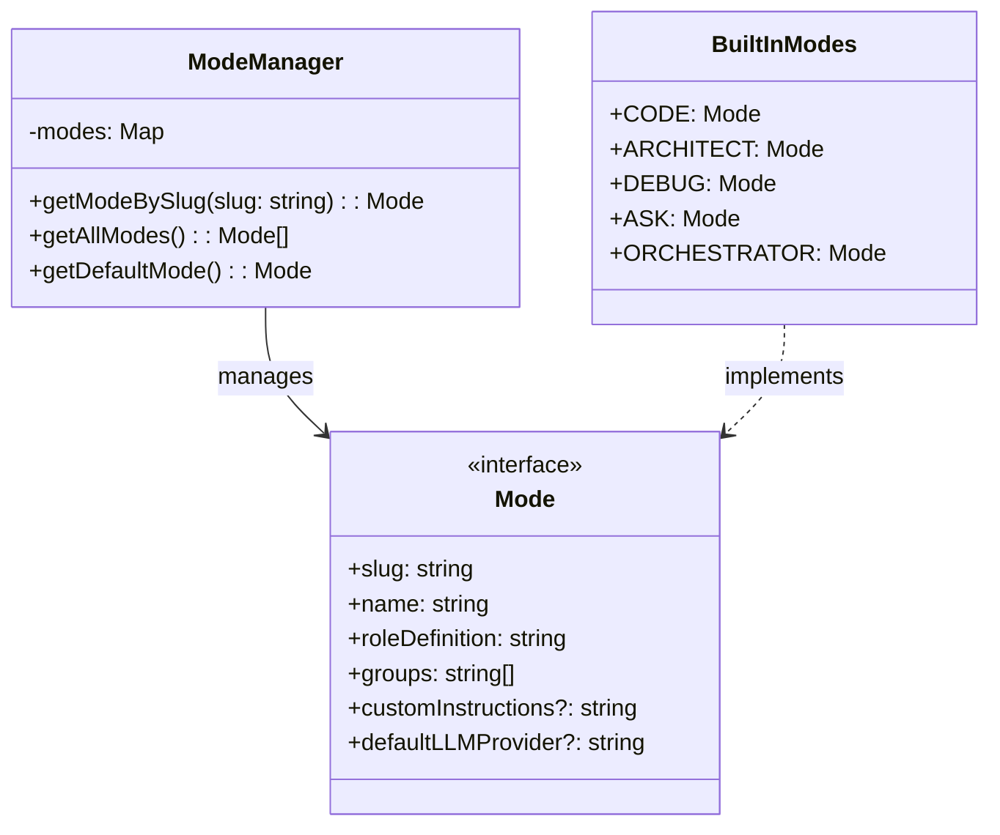

# フェーズ1.1: 組み込みモードシステム - 詳細設計

## 概要

組み込みモードシステムは、タスクの性質に応じて異なるAIの振る舞いを定義する基盤機能です。Code、Architect、Debug、Ask、Orchestratorの5つの組み込みモードを実装します。

**📌 参考実装**: RooCode（RooCline）のオーケストレーション実装を参考にしてください：
- GitHub: https://github.com/RooCodeInc/Roo-Code
- UIthub: https://uithub.com/RooCodeInc/Roo-Code
- DeepWiki: https://deepwiki.com/RooCodeInc/Roo-Code

**💡 重要な点**: RooCodeの実装パターンを参考にしつつ、Claude Code Actionの環境に適応させることが重要です。

## アーキテクチャ



## TDD実装計画

### タスク1.1.1: モード定義の作成

#### 実装: src/modes/types.ts

```typescript
export const VALID_GROUPS = [
  'file_operations',
  'git_operations',
  'code_analysis',
  'testing',
  'read_operations',
  'write_operations',
  'documentation',
  'analysis',
  'diagnostic_tools',
  'logging',
  'search',
  'task_management',
  'mode_switching',
  'context_optimization'
] as const;

export type ValidGroup = typeof VALID_GROUPS[number];

export interface Mode {
  slug: string;
  name: string;
  roleDefinition: string;
  groups: ValidGroup[];
  customInstructions?: string;
  defaultLLMProvider?: string;
}

export interface ModeContext {
  mode: Mode;
  previousResults?: string[];
  globalContext?: Record<string, any>;
}

export type ModeSlug = 'code' | 'architect' | 'debug' | 'ask' | 'orchestrator' | string;
```

### タスク1.1.2: 組み込みモードの実装

#### テストファースト: src/modes/built-in-modes.ts

```typescript
// test/modes/built-in-modes.test.ts
import { describe, test, expect } from 'bun:test';
import { BUILT_IN_MODES } from '../../src/modes/built-in-modes';

describe('Built-in Modes', () => {
  test('should define CODE mode correctly', () => {
    const codeMode = BUILT_IN_MODES.CODE;
    expect(codeMode.slug).toBe('code');
    expect(codeMode.name).toBe('Code');
    expect(codeMode.roleDefinition).toContain('expert software developer');
    expect(codeMode.groups).toContain('file_operations');
    expect(codeMode.groups).toContain('git_operations');
  });

  test('should define ARCHITECT mode correctly', () => {
    const architectMode = BUILT_IN_MODES.ARCHITECT;
    expect(architectMode.slug).toBe('architect');
    expect(architectMode.name).toBe('Architect');
    expect(architectMode.roleDefinition).toContain('system architect');
    expect(architectMode.groups).toContain('read_operations');
    expect(architectMode.groups).not.toContain('write_operations');
  });

  test('should define DEBUG mode correctly', () => {
    const debugMode = BUILT_IN_MODES.DEBUG;
    expect(debugMode.slug).toBe('debug');
    expect(debugMode.name).toBe('Debug');
    expect(debugMode.roleDefinition).toContain('debugging expert');
    expect(debugMode.groups).toContain('diagnostic_tools');
  });

  test('should define ASK mode correctly', () => {
    const askMode = BUILT_IN_MODES.ASK;
    expect(askMode.slug).toBe('ask');
    expect(askMode.name).toBe('Ask');
    expect(askMode.roleDefinition).toContain('knowledgeable assistant');
    expect(askMode.groups).toContain('read_operations');
  });

  test('should define ORCHESTRATOR mode correctly', () => {
    const orchestratorMode = BUILT_IN_MODES.ORCHESTRATOR;
    expect(orchestratorMode.slug).toBe('orchestrator');
    expect(orchestratorMode.name).toBe('Orchestrator');
    expect(orchestratorMode.roleDefinition).toContain('task orchestrator');
    expect(orchestratorMode.groups).toContain('task_management');
  });

  test('all modes should have required fields', () => {
    Object.values(BUILT_IN_MODES).forEach(mode => {
      expect(mode.slug).toBeTruthy();
      expect(mode.name).toBeTruthy();
      expect(mode.roleDefinition).toBeTruthy();
      expect(Array.isArray(mode.groups)).toBe(true);
      expect(mode.groups.length).toBeGreaterThan(0);
    });
  });
});
```

#### 実装: src/modes/built-in-modes.ts

```typescript
import type { Mode } from './types';

export const BUILT_IN_MODES = {
  CODE: {
    slug: 'code',
    name: 'Code',
    roleDefinition: `You are an expert software developer focused on implementation details.
    Your primary goal is to write clean, efficient, and maintainable code.
    You follow best practices and coding standards for the given language and framework.`,
    groups: ['file_operations', 'git_operations', 'code_analysis', 'testing'],
    customInstructions: `- Write idiomatic code for the target language
- Include appropriate error handling
- Follow existing code patterns in the repository
- Write tests when implementing new functionality`
  },

  ARCHITECT: {
    slug: 'architect',
    name: 'Architect',
    roleDefinition: `You are a system architect focused on high-level design and planning.
    You analyze requirements, design system architectures, and make strategic technical decisions.
    You prioritize scalability, maintainability, and alignment with business goals.`,
    groups: ['read_operations', 'documentation', 'analysis'],
    customInstructions: `- Focus on system design and architecture
- Consider scalability and performance implications
- Provide clear technical specifications
- Document architectural decisions and trade-offs`
  },

  DEBUG: {
    slug: 'debug',
    name: 'Debug',
    roleDefinition: `You are a debugging expert specialized in identifying and fixing issues.
    You systematically analyze problems, use diagnostic tools effectively, and provide clear explanations of root causes.
    You focus on not just fixing symptoms but addressing underlying issues.`,
    groups: ['file_operations', 'diagnostic_tools', 'logging', 'testing'],
    customInstructions: `- Systematically isolate the problem
- Use appropriate debugging tools and techniques
- Explain the root cause clearly
- Implement fixes that prevent recurrence`
  },

  ASK: {
    slug: 'ask',
    name: 'Ask',
    roleDefinition: `You are a knowledgeable assistant focused on providing clear, accurate information.
    You explain concepts clearly, provide relevant examples, and ensure understanding.
    You adapt your explanations to the user's level of expertise.`,
    groups: ['read_operations', 'documentation', 'search'],
    customInstructions: `- Provide clear, concise explanations
- Use examples to illustrate concepts
- Reference documentation when appropriate
- Admit uncertainty rather than speculate`
  },

  ORCHESTRATOR: {
    slug: 'orchestrator',
    name: 'Orchestrator',
    roleDefinition: `You are a task orchestrator responsible for breaking down complex tasks and delegating to appropriate modes.
    You analyze task complexity, identify subtasks, and coordinate their execution.
    You optimize for efficiency by providing each mode with focused, relevant context.`,
    groups: ['task_management', 'mode_switching', 'context_optimization'],
    customInstructions: `- Analyze task complexity and requirements
- Break down tasks into appropriate subtasks
- Select the optimal mode for each subtask
- Minimize context size while maintaining effectiveness
- Coordinate results between subtasks`
  }
} as const;

export type BuiltInModeSlug = keyof typeof BUILT_IN_MODES;
```

### タスク1.1.3: モード管理システム

#### テストファースト: src/modes/mode-manager.ts

```typescript
// test/modes/mode-manager.test.ts
import { describe, test, expect, beforeEach } from 'bun:test';
import { ModeManager } from '../../src/modes/mode-manager';
import { BUILT_IN_MODES } from '../../src/modes/built-in-modes';
import type { Mode } from '../../src/modes/types';

describe('ModeManager', () => {
  let manager: ModeManager;

  beforeEach(() => {
    manager = new ModeManager();
  });

  test('should initialize with built-in modes', () => {
    const allModes = manager.getAllModes();
    expect(allModes.length).toBe(5);

    const slugs = allModes.map(m => m.slug);
    expect(slugs).toContain('code');
    expect(slugs).toContain('architect');
    expect(slugs).toContain('debug');
    expect(slugs).toContain('ask');
    expect(slugs).toContain('orchestrator');
  });

  test('should get mode by slug', () => {
    const codeMode = manager.getModeBySlug('code');
    expect(codeMode).toEqual(BUILT_IN_MODES.CODE);

    const architectMode = manager.getModeBySlug('architect');
    expect(architectMode).toEqual(BUILT_IN_MODES.ARCHITECT);
  });

  test('should throw error for unknown mode', () => {
    expect(() => manager.getModeBySlug('unknown')).toThrow('Mode not found: unknown');
  });

  test('should get default mode', () => {
    const defaultMode = manager.getDefaultMode();
    expect(defaultMode.slug).toBe('code');
  });

});
```

#### 実装: src/modes/mode-manager.ts

```typescript
import type { Mode, ValidGroup } from './types';
import { BUILT_IN_MODES } from './built-in-modes';
import { VALID_GROUPS } from './types';

export class ModeManager {
  private modes: Map<string, Mode>;

  constructor() {
    this.modes = new Map();
    this.initializeBuiltInModes();
  }

  private initializeBuiltInModes(): void {
    Object.values(BUILT_IN_MODES).forEach(mode => {
      this.modes.set(mode.slug, mode);
    });
  }

  getModeBySlug(slug: string): Mode {
    const mode = this.modes.get(slug);
    if (!mode) {
      throw new Error(`Mode not found: ${slug}`);
    }
    return mode;
  }

  getAllModes(): Mode[] {
    return Array.from(this.modes.values());
  }

  getDefaultMode(): Mode {
    return this.getModeBySlug('code');
  }

  getBuiltInModes(): Mode[] {
    return Object.values(BUILT_IN_MODES);
  }
}

// Singleton instance
export const modeManager = new ModeManager();
```

## コミット計画

### コミット1: Mode型定義
```bash
# プリコミットチェック
bun test
bun run format:check
bun run typecheck

# 全てのチェックが通った場合のみコミット
git add src/modes/types.ts
git commit -m "feat(modes): add Mode interface and type definitions"
```

### コミット2: 組み込みモード
```bash
# プリコミットチェック
bun test
bun run format:check
bun run typecheck

# 全てのチェックが通った場合のみコミット
git add src/modes/built-in-modes.ts test/modes/built-in-modes.test.ts
git commit -m "feat(modes): implement built-in modes (Code, Architect, Debug, Ask, Orchestrator) with tests"
```

### コミット3: モードマネージャー
```bash
# プリコミットチェック
bun test
bun run format:check
bun run typecheck

# 全てのチェックが通った場合のみコミット
git add src/modes/mode-manager.ts test/modes/mode-manager.test.ts
git commit -m "feat(modes): implement ModeManager for built-in mode retrieval with tests"
```

### コミット4: エクスポート設定
```bash
# プリコミットチェック
bun test
bun run format:check
bun run typecheck

# 全てのチェックが通った場合のみコミット
git add src/modes/index.ts
git commit -m "feat(modes): add module exports for mode system"
```

## ディレクトリ構造

```
src/
└── modes/
    ├── types.ts           # Mode インターフェース定義
    ├── built-in-modes.ts  # 組み込みモード定義
    ├── mode-manager.ts    # モード管理システム
    └── index.ts          # エクスポート

test/
└── modes/
    ├── built-in-modes.test.ts
    └── mode-manager.test.ts
```

## index.tsの実装

```typescript
// src/modes/index.ts
export type { Mode, ModeContext, ModeSlug } from './types';
export { BUILT_IN_MODES, type BuiltInModeSlug } from './built-in-modes';
export { ModeManager, modeManager } from './mode-manager';
```

## 統合テスト

```typescript
// test/modes/integration.test.ts
import { describe, test, expect } from 'bun:test';
import { modeManager, type Mode } from '../../src/modes';

describe('Mode System Integration', () => {
  test('should handle mode switching workflow', () => {
    // デフォルトモードから開始
    const defaultMode = modeManager.getDefaultMode();
    expect(defaultMode.slug).toBe('code');

    // アーキテクトモードに切り替え
    const architectMode = modeManager.getModeBySlug('architect');
    expect(architectMode.groups).not.toContain('write_operations');

    // デバッグモードに切り替え
    const debugMode = modeManager.getModeBySlug('debug');
    expect(debugMode.groups).toContain('diagnostic_tools');
  });

});
```

## 実行手順

### 実行フロー
```bash
# 1. phase0-fork-update から作業ブランチを作成
git checkout phase0-fork-update
git pull origin phase0-fork-update # 念のため最新化
git checkout -b phase1-mode-system phase0-fork-update

# 2. AI実装（Claude Code、Cursor等）
# TDDに従ってテストファーストで実装 (プロジェクトルートで行う)

# 3. プリコミットチェック
bun test && bun run format:check && bun run typecheck

# 4. コミット
git add .
git commit -m "feat(mode-system): implement mode system" # コミットメッセージは適宜変更

# 5. プッシュしてPR作成
git push origin phase1-mode-system

# 6. GitHubでPR作成・レビュー・マージ
#    PRのターゲットブランチは phase0-fork-update とする

# 7. クリーンアップ (PRマージ後)
git checkout phase0-fork-update
git pull origin phase0-fork-update # リモートの変更を取り込み最新化
git branch -d phase1-mode-system # ローカルの作業ブランチを削除
# git push origin --delete phase1-mode-system # (任意) リモートの作業ブランチも削除する場合
```

### 詳細ステップ（TDD）
```bash
# 1. phase0-fork-update から作業ブランチ作成
git checkout phase0-fork-update
git pull origin phase0-fork-update # 念のため最新化
git checkout -b phase1-mode-system phase0-fork-update

# プロジェクトルートで作業を進める

# (テストファイル作成、テスト実行、実装、スクリプト実行などはドキュメントの各フェーズに従う)
# ... (省略) ...

# X. プリコミットチェック (実装完了後)
bun test && bun run format:check && bun run typecheck

# Y. コミット
git add .
git commit -m "feat(mode-system): implement mode system" # コミットメッセージは適宜変更

# Z. 統合 (PR経由でのマージ)
#    上記「実行フロー」のステップ5以降に従ってPRを作成し、マージする
git push origin phase1-mode-system
# GitHub上で phase0-fork-update をターゲットブランチとしてPRを作成・レビュー・マージ
# マージ後、ローカルブランチをクリーンアップ
git checkout phase0-fork-update
git pull origin phase0-fork-update
git branch -d phase1-mode-system
```

## 依存関係

このフェーズは独立して実装可能です。以下のフェーズに必要となります：
- フェーズ2.2: コンテキスト最適化（モード別の優先度設定）
- フェーズ3.1: プロンプト生成の拡張（モード固有のプロンプト）

## 次のステップ

1. このモードシステムを基に、フェーズ2でタスク分析エンジンを実装
2. フェーズ3でGitHub Actionsとの統合
