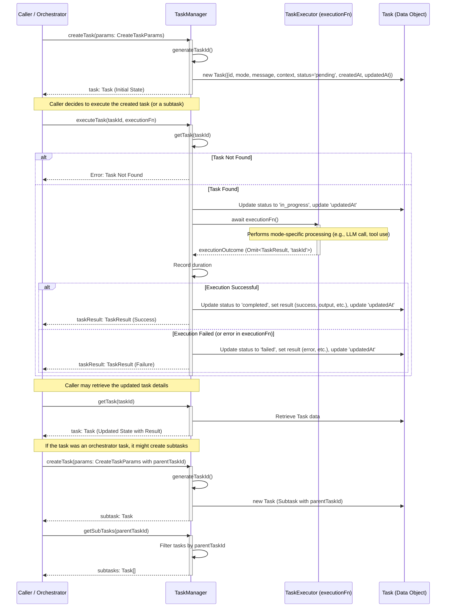

# フェーズ1.2: タスクシステム - 詳細設計

## 概要

タスクシステムは、オーケストレーション機能の核となる部分で、複雑なタスクの管理、分解、実行制御を行います。タスクのライフサイクル管理と、サブタスクの依存関係を処理します。

**📌 参考実装**: RooCode（RooCline）のオーケストレーション実装を参考にしてください：
- GitHub: https://github.com/RooCodeInc/Roo-Code
- UIthub: https://uithub.com/RooCodeInc/Roo-Code
- DeepWiki: https://deepwiki.com/RooCodeInc/Roo-Code

**💡 重要な点**: RooCodeの実装パターンを参考にしつつ、Claude Code Actionの環境に適応させることが重要です。

## アーキテクチャ

```mermaid
classDiagram
    class Task {
        <<interface>>
        +id: string
        +mode: string
        +message: string
        +parentTaskId?: string
        +context: TaskContext
        +status: TaskStatus
        +result?: TaskResult
    }

    class TaskContext {
        <<interface>>
        +previousResults: string[]
        +globalContext: Record<string, any>
        +modeSpecificContext: Record<string, any>
        +maxTokens: number
    }

    class TaskManager {
        -tasks: Map<string, Task>
        +createTask(params: CreateTaskParams): Task
        +getTask(id: string): Task
        +updateTaskStatus(id: string, status: TaskStatus): void
        +updateTaskResult(id: string, result: TaskResult): void
        +executeTask(id: string): Promise<TaskResult>
        +getSubTasks(parentId: string): Task[]
        +getAllTasks(): Task[]
        +getTasksByStatus(status: TaskStatus): Task[]
    }

    class TaskResult {
        <<interface>>
        +taskId: string
        +success: boolean
        +output?: string
        +error?: string
        +createdFiles?: string[]
        +modifiedFiles?: string[]
    }

    Task --> TaskContext : contains
    TaskManager --> Task : manages
    Task --> TaskResult : produces
```



## タスク処理シーケンス

以下は、`TaskManager` を中心とした主要なタスク処理のフローを示すシーケンス図です。



### シーケンス図の解説

1.  **タスク作成 (`createTask`)**:
    *   `Caller` (例: `AutoOrchestrator`) が `TaskManager` にタスク作成を要求します。
    *   `TaskManager` は新しいタスクIDを生成し、初期状態 (`status: 'pending'`) の `Task` オブジェクトを作成して返します。この際、コンストラクタで設定されたデフォルトコンテキストと、`params.context` で提供されたコンテキストがマージされます。

2.  **タスク実行 (`executeTask`)**:
    *   `Caller` が特定のタスクの実行を `TaskManager` に要求します。このとき、具体的な処理ロジックである `executionFn` を渡します。
    *   `TaskManager` は対象タスクを取得し、ステータスを `'in_progress'` に更新します。
    *   `TaskManager` は提供された `executionFn` を呼び出し、その完了を待ちます。`executionFn` は、タスクID以外の `TaskResult` に必要な情報（成功フラグ、出力、エラーメッセージなど）を返します。
    *   `executionFn` の結果に基づき、`TaskManager` は実行時間 (`duration`) を計算し、タスクのステータスを `'completed'` または `'failed'` に更新し、最終的な `TaskResult` をタスクオブジェクトに保存して `Caller` に返します。

3.  **タスク情報取得 (`getTask`, `getSubTasks`)**:
    *   `Caller` はいつでも `TaskManager` から最新のタスク情報や、特定の親タスクに紐づくサブタスクのリストを取得できます。

## TDD実装計画

### タスク1.2.1: タスク定義の作成

#### 実装: src/tasks/types.ts

```typescript
export type TaskStatus = 'pending' | 'in_progress' | 'completed' | 'failed';

export interface TaskContext {
  previousResults: string[];
  globalContext: Record<string, any>;
  modeSpecificContext: Record<string, any>;
  maxTokens: number;
}

export interface TaskResult {
  taskId: string;
  success: boolean;
  output?: string;
  error?: string;
  createdFiles?: string[];
  modifiedFiles?: string[];
  duration?: number;
  tokensUsed?: number;
}

export interface Task {
  id: string;
  mode: string;
  message: string;
  parentTaskId?: string;
  context: TaskContext;
  status: TaskStatus;
  result?: TaskResult;
  createdAt: Date;
  updatedAt: Date;
}

export interface CreateTaskParams {
  mode: string;
  message: string;
  parentTaskId?: string;
  context?: Partial<TaskContext>;
}
```

### タスク1.2.2: タスクマネージャーの実装

#### テストファースト: src/tasks/task-manager.ts

```typescript
// test/tasks/task-manager.test.ts
import { describe, test, expect, beforeEach } from 'bun:test';
import { TaskManager } from '../../src/tasks/task-manager';
import type { Task, CreateTaskParams } from '../../src/tasks/types';

describe('TaskManager', () => {
  let manager: TaskManager;

  beforeEach(() => {
    manager = new TaskManager();
  });

  test('should create a new task', () => {
    const params: CreateTaskParams = {
      mode: 'code',
      message: 'Implement feature A'
    };

    const task = manager.createTask(params);

    expect(task.id).toBeTruthy();
    expect(task.mode).toBe('code');
    expect(task.message).toBe('Implement feature A');
    expect(task.status).toBe('pending');
    expect(task.createdAt).toBeInstanceOf(Date);
  });

  test('should get task by id', () => {
    const params: CreateTaskParams = {
      mode: 'debug',
      message: 'Fix critical bug'
    };

    const task = manager.createTask(params);
    const retrieved = manager.getTask(task.id);

    expect(retrieved).toEqual(task);
  });

  test('should throw error for unknown task', () => {
    expect(() => manager.getTask('unknown-id')).toThrow('Task not found: unknown-id');
  });

  test('should update task status', () => {
    const task = manager.createTask({
      mode: 'code',
      message: 'Test task'
    });

    manager.updateTaskStatus(task.id, 'in_progress');
    const updated = manager.getTask(task.id);

    expect(updated.status).toBe('in_progress');
    expect(updated.updatedAt.getTime()).toBeGreaterThan(task.updatedAt.getTime());
  });

  test('should throw error when updating status of unknown task', () => {
    expect(() => manager.updateTaskStatus('unknown-id', 'in_progress')).toThrow('Task not found: unknown-id');
  });

  test('should throw error when updating result of unknown task', () => {
    expect(() => manager.updateTaskResult('unknown-id', { taskId: 'unknown-id', success: true })).toThrow('Task not found: unknown-id');
  });

  test('should create subtask with parent reference', () => {
    const parentTask = manager.createTask({
      mode: 'orchestrator',
      message: 'Complex feature implementation'
    });

    const subTask = manager.createTask({
      mode: 'code',
      message: 'Implement component X',
      parentTaskId: parentTask.id
    });

    expect(subTask.parentTaskId).toBe(parentTask.id);
  });

  test('should get subtasks by parent id', () => {
    const parentTask = manager.createTask({
      mode: 'orchestrator',
      message: 'Main task'
    });

    const subTask1 = manager.createTask({
      mode: 'code',
      message: 'Subtask 1',
      parentTaskId: parentTask.id
    });

    const subTask2 = manager.createTask({
      mode: 'debug',
      message: 'Subtask 2',
      parentTaskId: parentTask.id
    });

    const subTasks = manager.getSubTasks(parentTask.id);

    expect(subTasks.length).toBe(2);
    expect(subTasks.map(t => t.id)).toContain(subTask1.id);
    expect(subTasks.map(t => t.id)).toContain(subTask2.id);
  });

  test('should generate unique task ids', () => {
    const task1 = manager.createTask({ mode: 'code', message: 'Task 1' });
    const task2 = manager.createTask({ mode: 'code', message: 'Task 2' });

    expect(task1.id).not.toBe(task2.id);
  });

  test('should allow overriding default context in constructor', () => {
    const customManager = new TaskManager({ defaultMaxTokens: 5000 });
    const task = customManager.createTask({ mode: 'code', message: 'Test' });
    expect(task.context.maxTokens).toBe(5000);
  });

  test('should merge provided context with defaults', () => {
    const task = manager.createTask({
      mode: 'code',
      message: 'Test',
      context: { maxTokens: 3000, globalContext: { custom: 'value' } }
    });
    expect(task.context.maxTokens).toBe(3000);
    expect(task.context.globalContext.custom).toBe('value');
    expect(task.context.previousResults).toEqual([]); // デフォルトが維持される
  });

  // executeTaskのテスト (モックを使用)
  describe('executeTask', () => {
    // 実際のタスク実行ロジックはTaskManagerの責務外なので、
    // ここでは状態遷移と結果の記録のみをテストする。
    // 実際の実行は各Modeのエンジンが行う。

    test('should update task status to in_progress then completed on successful execution', async () => {
      const task = manager.createTask({ mode: 'code', message: 'Execute this' });
      // 実際の実行処理はモックする
      const mockExecution = async (): Promise<Omit<TaskResult, 'taskId'>> => {
        return { success: true, output: 'Execution successful' };
      };

      const result = await manager.executeTask(task.id, mockExecution);

      expect(result.success).toBe(true);
      expect(result.output).toBe('Execution successful');
      const updatedTask = manager.getTask(task.id);
      expect(updatedTask.status).toBe('completed');
      expect(updatedTask.result).toEqual(result);
    });

    test('should update task status to in_progress then failed on unsuccessful execution', async () => {
      const task = manager.createTask({ mode: 'code', message: 'Execute this' });
      const mockExecution = async (): Promise<Omit<TaskResult, 'taskId'>> => {
        return { success: false, error: 'Execution failed' };
      };

      const result = await manager.executeTask(task.id, mockExecution);

      expect(result.success).toBe(false);
      expect(result.error).toBe('Execution failed');
      const updatedTask = manager.getTask(task.id);
      expect(updatedTask.status).toBe('failed');
      expect(updatedTask.result).toEqual(result);
    });

    test('should throw error if task is not found', async () => {
      const mockExecution = async (): Promise<Omit<TaskResult, 'taskId'>> => {
        return { success: true };
      };
      await expect(manager.executeTask('unknown-id', mockExecution)).rejects.toThrow('Task not found: unknown-id');
    });
  });
});
```

#### 実装: src/tasks/task-manager.ts

```typescript
import type { Task, CreateTaskParams, TaskStatus, TaskResult } from './types';
import { v4 as uuidv4 } from 'uuid';

export class TaskManager {
  private tasks: Map<string, Task>;

  constructor() {
    this.tasks = new Map();
  }

  createTask(params: CreateTaskParams): Task {
    const now = new Date();
    const task: Task = {
      id: this.generateTaskId(),
      mode: params.mode,
      message: params.message,
      parentTaskId: params.parentTaskId,
      status: 'pending',
      context: {
        previousResults: [],
        globalContext: {},
        modeSpecificContext: {},
        maxTokens: 8000,
        ...params.context
      },
      createdAt: now,
      updatedAt: now
    };

    this.tasks.set(task.id, task);
    return task;
  }

  getTask(id: string): Task {
    const task = this.tasks.get(id);
    if (!task) {
      throw new Error(`Task not found: ${id}`);
    }
    return task;
  }

  updateTaskStatus(id: string, status: TaskStatus): void {
    const task = this.getTask(id);
    task.status = status;
    task.updatedAt = new Date();
    this.tasks.set(id, task);
  }

  updateTaskResult(id: string, result: TaskResult): void {
    const task = this.getTask(id);
    task.result = result;
    task.status = result.success ? 'completed' : 'failed';
    task.updatedAt = new Date();
    this.tasks.set(id, task);
  }

  getSubTasks(parentId: string): Task[] {
    return Array.from(this.tasks.values())
      .filter(task => task.parentTaskId === parentId)
      .sort((a, b) => a.createdAt.getTime() - b.createdAt.getTime());
  }

  getAllTasks(): Task[] {
    return Array.from(this.tasks.values())
      .sort((a, b) => a.createdAt.getTime() - b.createdAt.getTime());
  }

  getTasksByStatus(status: TaskStatus): Task[] {
    return Array.from(this.tasks.values())
      .filter(task => task.status === status)
      .sort((a, b) => a.createdAt.getTime() - b.createdAt.getTime());
  }

  private generateTaskId(): string {
    return `task-${uuidv4()}`;
  }
}

// Singleton instance
export const taskManager = new TaskManager();
```

## コミット計画

### コミット1: Task型定義
```bash
# プリコミットチェック
bun test
bun run format:check
bun run typecheck

# 全てのチェックが通った場合のみコミット
git add src/tasks/types.ts
git commit -m "feat(tasks): add Task interface and type definitions"
```

### コミット2: タスクマネージャー
```bash
# プリコミットチェック
bun test
bun run format:check
bun run typecheck

# 全てのチェックが通った場合のみコミット
git add src/tasks/task-manager.ts test/tasks/task-manager.test.ts
git commit -m "feat(tasks): implement TaskManager for task lifecycle management with tests"
```

### コミット3: エクスポート設定
```bash
# プリコミットチェック
bun test
bun run format:check
bun run typecheck

# 全てのチェックが通った場合のみコミット
git add src/tasks/index.ts
git commit -m "feat(tasks): add module exports for task system"
```

## ディレクトリ構造

```
src/
└── tasks/
    ├── types.ts           # Task インターフェース定義
    ├── task-manager.ts    # タスク管理システム
    └── index.ts          # エクスポート

test/
└── tasks/
    └── task-manager.test.ts
```

## index.tsの実装

```typescript
// src/tasks/index.ts
export type {
  Task,
  TaskContext,
  TaskResult,
  TaskStatus,
  CreateTaskParams,
} from './types';
export { TaskManager, taskManager } from './task-manager';
```

## 統合テスト

```typescript
// test/tasks/integration.test.ts
import { describe, test, expect } from 'bun:test';
import { taskManager, type Task } from '../../src/tasks';

describe('Task System Integration', () => {
  test('should handle task lifecycle workflow', () => {
    // 親タスク作成
    const parentTask = taskManager.createTask({
      mode: 'orchestrator',
      message: 'Implement user authentication system'
    });

    expect(parentTask.status).toBe('pending');

    // サブタスク作成
    const subTask1 = taskManager.createTask({
      mode: 'code',
      message: 'Create user model',
      parentTaskId: parentTask.id
    });

    const subTask2 = taskManager.createTask({
      mode: 'code',
      message: 'Implement login endpoint',
      parentTaskId: parentTask.id
    });

    // サブタスク取得
    const subTasks = taskManager.getSubTasks(parentTask.id);
    expect(subTasks.length).toBe(2);

    // タスク実行シミュレーション (executeTaskを使用)
    const subTask1FromManager = taskManager.getTask(subTask1.id); // 最新の状態を取得

    // モックの実行関数
    const mockExecutionFn = async (taskSuccess: boolean, outputMsg?: string, errorMsg?: string, files?: string[]): Promise<Omit<TaskResult, 'taskId'>> => {
      await new Promise(resolve => setTimeout(resolve, 10)); // 非同期処理をシミュレート
      if (taskSuccess) {
        return { success: true, output: outputMsg, createdFiles: files };
      } else {
        return { success: false, error: errorMsg };
      }
    };

    // subTask1 の実行 (成功ケース)
    await taskManager.executeTask(
      subTask1FromManager.id,
      () => mockExecutionFn(true, 'User model created successfully', undefined, ['src/models/user.ts'])
    );

    const completedTask = taskManager.getTask(subTask1.id);
    expect(completedTask.status).toBe('completed');
    expect(completedTask.result?.success).toBe(true);
    expect(completedTask.result?.createdFiles).toEqual(['src/models/user.ts']);
    expect(completedTask.result?.duration).toBeGreaterThanOrEqual(10);

    // subTask2 の実行 (失敗ケース)
    await taskManager.executeTask(
      subTask2.id,
      () => mockExecutionFn(false, undefined, 'Endpoint implementation failed')
    );
    const failedTask = taskManager.getTask(subTask2.id);
    expect(failedTask.status).toBe('failed');
    expect(failedTask.result?.success).toBe(false);
    expect(failedTask.result?.error).toBe('Endpoint implementation failed');
  });

  test('should support context passing between tasks', () => {
    const task = taskManager.createTask({
      mode: 'code',
      message: 'Process user data',
      context: {
        globalContext: { userId: '123' },
        modeSpecificContext: { validateInput: true },
        maxTokens: 4000
      }
    });

    expect(task.context.globalContext.userId).toBe('123');
    expect(task.context.modeSpecificContext.validateInput).toBe(true);
    expect(task.context.maxTokens).toBe(4000);
  });
});
```

## 実行手順

### 実行フロー
```bash
# 1. phase1-mode-system から作業ブランチを作成
git checkout phase1-mode-system
git pull origin phase1-mode-system # 念のため最新化
git checkout -b phase1-task-system phase1-mode-system

# 2. AI実装（Claude Code、Cursor等）
# TDDに従ってテストファーストで実装 (プロジェクトルートで行う)

# 3. プリコミットチェック
bun test && bun run format:check && bun run typecheck

# 4. コミット
git add .
git commit -m "feat(task-system): implement task system" # コミットメッセージは適宜変更

# 5. プッシュしてPR作成
git push origin phase1-task-system

# 6. GitHubでPR作成・レビュー・マージ
#    PRのターゲットブランチは phase1-mode-system とする

# 7. クリーンアップ (PRマージ後)
git checkout phase1-mode-system
git pull origin phase1-mode-system # リモートの変更を取り込み最新化
git branch -d phase1-task-system # ローカルの作業ブランチを削除
# git push origin --delete phase1-task-system # (任意) リモートの作業ブランチも削除する場合
```

### 詳細ステップ（TDD）
```bash
# 1. phase1-mode-system から作業ブランチ作成
git checkout phase1-mode-system
git pull origin phase1-mode-system # 念のため最新化
git checkout -b phase1-task-system phase1-mode-system

# プロジェクトルートで作業を進める

# (テストファイル作成、テスト実行、実装、スクリプト実行などはドキュメントの各フェーズに従う)
# ... (省略) ...

# X. プリコミットチェック (実装完了後)
bun test && bun run format:check && bun run typecheck

# Y. コミット
git add .
git commit -m "feat(task-system): implement task system" # コミットメッセージは適宜変更

# Z. 統合 (PR経由でのマージ)
#    上記「実行フロー」のステップ5以降に従ってPRを作成し、マージする
git push origin phase1-task-system
# GitHub上で phase1-mode-system をターゲットブランチとしてPRを作成・レビュー・マージ
# マージ後、ローカルブランチをクリーンアップ
git checkout phase1-mode-system
git pull origin phase1-mode-system
git branch -d phase1-task-system
```

## 依存関係

このフェーズはモードシステム（フェーズ1.1）完了後に実装してください。以下のフェーズに必要となります：
- フェーズ2.1: タスク分析エンジン（タスクの複雑度分析）
- フェーズ2.2: コンテキスト最適化（タスクコンテキストの管理）
- フェーズ3: GitHub Actionsとの統合

## 次のステップ

1. フェーズ2.1でタスク分析エンジンを実装（このタスクシステムを基盤として）
2. フェーズ2.2でコンテキスト最適化機能を追加
3. フェーズ3でGitHub Actionsとの統合
