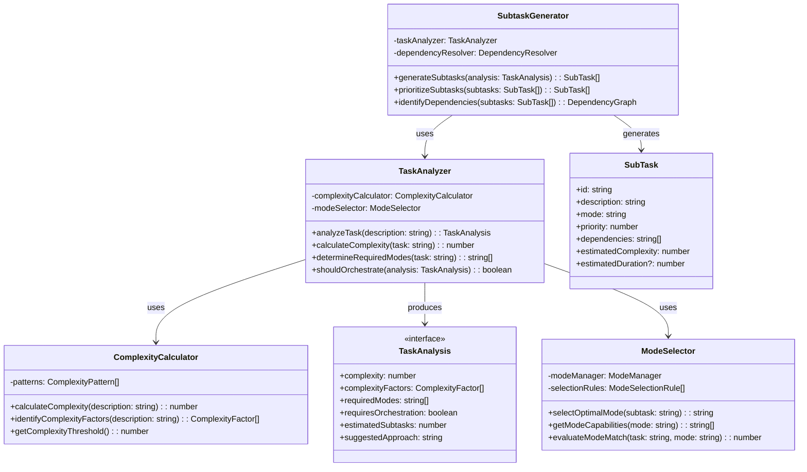

# フェーズ2.1: タスク分析エンジン - 詳細設計

## 概要

タスク分析エンジンは、複雑なタスクを適切なサブタスクに分解し、各サブタスクに最適なモードを割り当てるオーケストレーション機能の核心部分です。タスクの複雑度を分析し、分割が必要かを判定する機能を実装します。

**📌 参考実装**: RooCode（RooCline）のオーケストレーション実装を参考にしてください：

- GitHub: https://github.com/RooCodeInc/Roo-Code
- UIthub: https://uithub.com/RooCodeInc/Roo-Code
- DeepWiki: https://deepwiki.com/RooCodeInc/Roo-Code

**💡 重要な点**: RooCodeの実装パターンを参考にしつつ、Claude Code Actionの環境に適応させることが重要です。

## アーキテクチャ



## TDD実装計画

### タスク2.1.1: タスク分析型定義の作成

#### 実装: src/orchestration/types.ts

```typescript
export interface ComplexityFactor {
  type: ComplexityFactorType;
  weight: number;
  description: string;
}

export interface TaskAnalysis {
  complexity: number;
  complexityFactors: ComplexityFactor[];
  requiredModes: string[];
  requiresOrchestration: boolean;
  estimatedSubtasks: number;
  suggestedApproach: string;
}

export interface SubTask {
  id: string;
  description: string;
  mode: string;
  priority: number;
  dependencies: string[];
  estimatedComplexity: number;
  estimatedDuration?: number;
}

export interface DependencyGraph {
  nodes: SubTask[];
  edges: DependencyEdge[];
}

export interface DependencyEdge {
  from: string;
  to: string;
  type: "sequential" | "parallel" | "conditional";
}

export interface ModeSelectionRule {
  pattern: RegExp;
  mode: string;
  priority: number;
  conditions?: string[];
}

export type ComplexityFactorType =
  | "multi_step"
  | "cross_domain"
  | "file_complexity"
  | "integration_required"
  | "performance_critical"
  | "security_sensitive"
  | "legacy_code"
  | "external_dependencies";
```

### タスク2.1.2: 複雑度計算エンジンの実装

#### テストファースト: src/orchestration/complexity-calculator.ts

```typescript
// test/orchestration/complexity-calculator.test.ts
import { describe, test, expect, beforeEach } from "bun:test";
import { ComplexityCalculator } from "../../src/orchestration/complexity-calculator";

describe("ComplexityCalculator", () => {
  let calculator: ComplexityCalculator;

  beforeEach(() => {
    calculator = new ComplexityCalculator();
  });

  test("should calculate low complexity for simple tasks", () => {
    const simpleTask = "Fix typo in README.md";
    const complexity = calculator.calculateComplexity(simpleTask);

    expect(complexity).toBeLessThan(3.0);
  });

  test("should calculate high complexity for multi-step tasks", () => {
    const complexTask = `
      Implement a complete user authentication system with:
      - User registration and login
      - Password reset functionality
      - Email verification
      - JWT token management
      - Rate limiting
      - Integration with existing database
    `;

    const complexity = calculator.calculateComplexity(complexTask);

    expect(complexity).toBeGreaterThan(7.0);
  });

  test("should identify complexity factors correctly", () => {
    const task =
      "Refactor legacy payment processing system to support new payment methods";
    const factors = calculator.identifyComplexityFactors(task);

    const factorTypes = factors.map((f) => f.type);
    expect(factorTypes).toContain("legacy_code");
    expect(factorTypes).toContain("integration_required");
  });

  test("should use appropriate complexity threshold", () => {
    const threshold = calculator.getComplexityThreshold();
    expect(threshold).toBeGreaterThan(0);
    expect(threshold).toBeLessThan(10);
  });

  test("should handle edge cases gracefully", () => {
    expect(() => calculator.calculateComplexity("")).not.toThrow();
    expect(() => calculator.calculateComplexity("   ")).not.toThrow();
    expect(calculator.calculateComplexity("")).toBe(0);
  });

  test("should assign higher complexity to security-sensitive tasks", () => {
    const securityTask = "Implement OAuth2 authentication with PKCE flow";
    const regularTask = "Add logging to user service";

    const securityComplexity = calculator.calculateComplexity(securityTask);
    const regularComplexity = calculator.calculateComplexity(regularTask);

    expect(securityComplexity).toBeGreaterThan(regularComplexity);
  });
});
```

#### 実装: src/orchestration/complexity-calculator.ts

```typescript
import type {
  ComplexityFactor,
  ComplexityPattern,
  ComplexityFactorType,
} from "./types";

export class ComplexityCalculator {
  private readonly BASE_COMPLEXITY = 1.0;
  private readonly COMPLEXITY_THRESHOLD = 5.0;

  constructor() {}

  calculateComplexity(description: string): number {
    if (!description || description.trim().length === 0) {
      return 0;
    }

    const factors = this.identifyComplexityFactors(description);
    const baseComplexity = this.BASE_COMPLEXITY;

    // Calculate weighted complexity based on factors
    const factorComplexity = factors.reduce((total, factor) => {
      return total + factor.weight;
    }, 0);

    // Apply length multiplier for very detailed descriptions
    const lengthMultiplier = this.calculateLengthMultiplier(description);

    return Math.min(baseComplexity + factorComplexity * lengthMultiplier, 10.0);
  }

  identifyComplexityFactors(description: string): ComplexityFactor[] {
    const factors: ComplexityFactor[] = [];
    const lowerDesc = description.toLowerCase();

    // Multi-step complexity
    if (this.hasMultipleSteps(lowerDesc)) {
      factors.push({
        type: "multi_step",
        weight: 2.5,
        description: "Task requires multiple implementation steps",
      });
    }

    // Cross-domain complexity
    if (this.isCrossDomain(lowerDesc)) {
      factors.push({
        type: "cross_domain",
        weight: 2.0,
        description: "Task spans multiple knowledge domains",
      });
    }

    // File complexity
    if (this.hasFileComplexity(lowerDesc)) {
      factors.push({
        type: "file_complexity",
        weight: 1.5,
        description: "Multiple files need modification",
      });
    }

    // Integration complexity
    if (this.requiresIntegration(lowerDesc)) {
      factors.push({
        type: "integration_required",
        weight: 3.0,
        description: "Requires integration with external systems",
      });
    }

    // Security sensitivity
    if (this.isSecuritySensitive(lowerDesc)) {
      factors.push({
        type: "security_sensitive",
        weight: 2.5,
        description: "Involves security-critical functionality",
      });
    }

    // Legacy code complexity
    if (this.involvesLegacyCode(lowerDesc)) {
      factors.push({
        type: "legacy_code",
        weight: 2.0,
        description: "Involves working with legacy code",
      });
    }

    // Performance critical
    if (this.isPerformanceCritical(lowerDesc)) {
      factors.push({
        type: "performance_critical",
        weight: 1.8,
        description: "Performance optimization required",
      });
    }

    // External dependencies
    if (this.hasExternalDependencies(lowerDesc)) {
      factors.push({
        type: "external_dependencies",
        weight: 1.5,
        description: "Depends on external libraries or services",
      });
    }

    return factors;
  }

  getComplexityThreshold(): number {
    return this.COMPLEXITY_THRESHOLD;
  }

  private hasMultipleSteps(description: string): boolean {
    const stepIndicators = [
      /\b(and|then|also|additionally|furthermore)/gi,
      /\b(step|phase|stage)\s*\d+/gi,
      /\b(first|second|third|finally)/gi,
      /[•\-\*]\s/g, // bullet points
      /\d+\.\s/g, // numbered lists
    ];

    let stepCount = 0;
    for (const pattern of stepIndicators) {
      const matches = description.match(pattern);
      if (matches) {
        stepCount += matches.length;
      }
    }

    return stepCount >= 2;
  }

  private isCrossDomain(description: string): boolean {
    const domains = [
      "frontend",
      "backend",
      "database",
      "api",
      "ui",
      "ux",
      "testing",
      "deployment",
      "security",
    ];
    const mentionedDomains = domains.filter(
      (domain) =>
        description.includes(domain) ||
        description.includes(domain.toUpperCase()),
    );
    return mentionedDomains.length >= 2;
  }

  private hasFileComplexity(description: string): boolean {
    const fileIndicators = [
      /\bmultiple\s+(files|components|modules)/i,
      /\bseveral\s+(files|components|modules)/i,
      /\bacross\s+(files|components|modules)/i,
      /\brefactor\s+.*\s+(files|codebase)/i,
    ];

    return fileIndicators.some((pattern) => pattern.test(description));
  }

  private requiresIntegration(description: string): boolean {
    const integrationKeywords = [
      "integrate",
      "api",
      "webhook",
      "external",
      "third-party",
      "service",
      "database",
      "connect",
      "sync",
      "import",
      "export",
    ];

    return integrationKeywords.some((keyword) =>
      description.toLowerCase().includes(keyword),
    );
  }

  private isSecuritySensitive(description: string): boolean {
    const securityKeywords = [
      "auth",
      "authentication",
      "authorization",
      "security",
      "encrypt",
      "jwt",
      "token",
      "password",
      "oauth",
      "permission",
      "role",
      "access",
    ];

    return securityKeywords.some((keyword) =>
      description.toLowerCase().includes(keyword),
    );
  }

  private involvesLegacyCode(description: string): boolean {
    const legacyIndicators = [
      "legacy",
      "refactor",
      "migrate",
      "modernize",
      "upgrade",
      "replace",
    ];

    return legacyIndicators.some((keyword) =>
      description.toLowerCase().includes(keyword),
    );
  }

  private isPerformanceCritical(description: string): boolean {
    const performanceKeywords = [
      "performance",
      "optimize",
      "speed",
      "fast",
      "efficient",
      "cache",
      "memory",
      "cpu",
      "latency",
      "throughput",
      "scale",
    ];

    return performanceKeywords.some((keyword) =>
      description.toLowerCase().includes(keyword),
    );
  }

  private hasExternalDependencies(description: string): boolean {
    const dependencyIndicators = [
      "library",
      "package",
      "npm",
      "dependency",
      "external",
      "third-party",
      "framework",
      "tool",
      "service",
      "api",
    ];

    return dependencyIndicators.some((keyword) =>
      description.toLowerCase().includes(keyword),
    );
  }

  private calculateLengthMultiplier(description: string): number {
    const length = description.length;
    if (length < 100) return 1.0;
    if (length < 300) return 1.1;
    if (length < 500) return 1.2;
    return 1.3;
  }
}
```

### タスク2.1.3: タスク分析エンジンの実装

#### テストファースト: src/orchestration/task-analyzer.ts

```typescript
// test/orchestration/task-analyzer.test.ts
import { describe, test, expect, beforeEach } from "bun:test";
import { TaskAnalyzer } from "../../src/orchestration/task-analyzer";

describe("TaskAnalyzer", () => {
  let analyzer: TaskAnalyzer;

  beforeEach(() => {
    analyzer = new TaskAnalyzer();
  });

  test("should analyze simple task correctly", () => {
    const task = "Fix typo in documentation";
    const analysis = analyzer.analyzeTask(task);

    expect(analysis.complexity).toBeLessThan(3.0);
    expect(analysis.requiresOrchestration).toBe(false);
    expect(analysis.estimatedSubtasks).toBeLessThanOrEqual(1);
  });

  test("should analyze complex task correctly", () => {
    const task = `
      Implement a complete user management system with:
      1. User registration and authentication
      2. Role-based access control
      3. Email verification system
      4. Password reset functionality
      5. Admin dashboard for user management
      6. Integration with existing payment system
    `;

    const analysis = analyzer.analyzeTask(task);

    expect(analysis.complexity).toBeGreaterThan(7.0);
    expect(analysis.requiresOrchestration).toBe(true);
    expect(analysis.estimatedSubtasks).toBeGreaterThanOrEqual(4);
    expect(analysis.requiredModes.length).toBeGreaterThan(1);
  });

  test("should determine required modes correctly", () => {
    const designTask = "Design system architecture for microservices";
    const codeTask = "Implement user authentication API";
    const debugTask = "Fix memory leak in payment processor";

    const designAnalysis = analyzer.analyzeTask(designTask);
    const codeAnalysis = analyzer.analyzeTask(codeTask);
    const debugAnalysis = analyzer.analyzeTask(debugTask);

    expect(designAnalysis.requiredModes).toContain("architect");
    expect(codeAnalysis.requiredModes).toContain("code");
    expect(debugAnalysis.requiredModes).toContain("debug");
  });

  test("should decide orchestration necessity correctly", () => {
    const simpleTask = "Update package.json version";
    const complexTask =
      "Implement complete CI/CD pipeline with testing, building, and deployment";

    const simpleAnalysis = analyzer.analyzeTask(simpleTask);
    const complexAnalysis = analyzer.analyzeTask(complexTask);

    expect(analyzer.shouldOrchestrate(simpleAnalysis)).toBe(false);
    expect(analyzer.shouldOrchestrate(complexAnalysis)).toBe(true);
  });

  test("should provide meaningful suggested approach", () => {
    const task = "Migrate from REST API to GraphQL";
    const analysis = analyzer.analyzeTask(task);

    expect(analysis.suggestedApproach).toBeTruthy();
    expect(analysis.suggestedApproach.length).toBeGreaterThan(10);
  });

  test("should handle edge cases gracefully", () => {
    expect(() => analyzer.analyzeTask("")).not.toThrow();
    expect(() => analyzer.analyzeTask("   ")).not.toThrow();

    const emptyAnalysis = analyzer.analyzeTask("");
    expect(emptyAnalysis.complexity).toBe(0);
    expect(emptyAnalysis.requiresOrchestration).toBe(false);
  });
});
```

#### 実装: src/orchestration/task-analyzer.ts

```typescript
import { ComplexityCalculator } from "./complexity-calculator";
import { ModeSelector } from "./mode-selector";
import type { TaskAnalysis } from "./types";

export class TaskAnalyzer {
  private complexityCalculator: ComplexityCalculator;
  private modeSelector: ModeSelector;
  private readonly ORCHESTRATION_THRESHOLD = 5.0;

  constructor() {
    this.complexityCalculator = new ComplexityCalculator();
    this.modeSelector = new ModeSelector();
  }

  analyzeTask(description: string): TaskAnalysis {
    if (!description || description.trim().length === 0) {
      return this.createEmptyAnalysis();
    }

    const complexity =
      this.complexityCalculator.calculateComplexity(description);
    const complexityFactors =
      this.complexityCalculator.identifyComplexityFactors(description);
    const requiredModes = this.determineRequiredModes(description);
    const requiresOrchestration = complexity >= this.ORCHESTRATION_THRESHOLD;
    const estimatedSubtasks = this.estimateSubtaskCount(
      complexity,
      description,
    );
    const suggestedApproach = this.generateSuggestedApproach(
      description,
      complexity,
      requiredModes,
    );

    return {
      complexity,
      complexityFactors,
      requiredModes,
      requiresOrchestration,
      estimatedSubtasks,
      suggestedApproach,
    };
  }

  calculateComplexity(description: string): number {
    return this.complexityCalculator.calculateComplexity(description);
  }

  determineRequiredModes(description: string): string[] {
    const modes = new Set<string>();
    const lowerDesc = description.toLowerCase();

    // Architecture/Design indicators
    if (this.hasArchitectureKeywords(lowerDesc)) {
      modes.add("architect");
    }

    // Code implementation indicators
    if (this.hasCodeKeywords(lowerDesc)) {
      modes.add("code");
    }

    // Debugging indicators
    if (this.hasDebugKeywords(lowerDesc)) {
      modes.add("debug");
    }

    // Documentation/Knowledge indicators
    if (this.hasAskKeywords(lowerDesc)) {
      modes.add("ask");
    }

    // Complex tasks that need orchestration
    if (this.needsOrchestration(lowerDesc)) {
      modes.add("orchestrator");
    }

    // If no specific mode identified, default to code
    if (modes.size === 0) {
      modes.add("code");
    }

    return Array.from(modes);
  }

  shouldOrchestrate(analysis: TaskAnalysis): boolean {
    return analysis.requiresOrchestration;
  }

  private createEmptyAnalysis(): TaskAnalysis {
    return {
      complexity: 0,
      complexityFactors: [],
      requiredModes: [],
      requiresOrchestration: false,
      estimatedSubtasks: 0,
      suggestedApproach: "No task description provided",
    };
  }

  private hasArchitectureKeywords(description: string): boolean {
    const architectureKeywords = [
      "design",
      "architecture",
      "structure",
      "plan",
      "blueprint",
      "schema",
      "system design",
      "high-level",
      "overview",
      "strategy",
      "approach",
    ];
    return architectureKeywords.some((keyword) =>
      description.includes(keyword),
    );
  }

  private hasCodeKeywords(description: string): boolean {
    const codeKeywords = [
      "implement",
      "code",
      "develop",
      "build",
      "create",
      "function",
      "class",
      "method",
      "algorithm",
      "feature",
      "component",
      "module",
    ];
    return codeKeywords.some((keyword) => description.includes(keyword));
  }

  private hasDebugKeywords(description: string): boolean {
    const debugKeywords = [
      "fix",
      "bug",
      "error",
      "issue",
      "problem",
      "debug",
      "troubleshoot",
      "investigate",
      "diagnose",
      "resolve",
      "repair",
    ];
    return debugKeywords.some((keyword) => description.includes(keyword));
  }

  private hasAskKeywords(description: string): boolean {
    const askKeywords = [
      "explain",
      "how",
      "what",
      "why",
      "when",
      "where",
      "documentation",
      "understand",
      "clarify",
      "describe",
      "tell me",
      "help me understand",
    ];
    return askKeywords.some((keyword) => description.includes(keyword));
  }

  private needsOrchestration(description: string): boolean {
    const orchestrationIndicators = [
      "complete",
      "entire",
      "full",
      "comprehensive",
      "end-to-end",
      "multiple",
      "several",
      "various",
      "different",
      "across",
    ];
    return orchestrationIndicators.some((keyword) =>
      description.includes(keyword),
    );
  }

  private estimateSubtaskCount(
    complexity: number,
    description: string,
  ): number {
    // Base estimation from complexity
    let subtasks = Math.ceil(complexity / 2);

    // Adjust based on explicit indicators
    const stepMatches = description.match(/\b(step|phase|stage)\s*\d+/gi);
    if (stepMatches) {
      subtasks = Math.max(subtasks, stepMatches.length);
    }

    const listMatches =
      description.match(/[•\-\*]\s/g) || description.match(/\d+\.\s/g);
    if (listMatches) {
      subtasks = Math.max(subtasks, listMatches.length);
    }

    return Math.min(Math.max(subtasks, 1), 10); // Cap between 1 and 10
  }

  private generateSuggestedApproach(
    description: string,
    complexity: number,
    requiredModes: string[],
  ): string {
    if (complexity === 0) {
      return "No task description provided";
    }

    if (complexity < 3) {
      return `Simple task that can be completed directly with ${requiredModes[0] || "code"} mode.`;
    }

    if (complexity < 5) {
      return `Moderate complexity task. Consider breaking into 2-3 focused subtasks using ${requiredModes.join(" and ")} modes.`;
    }

    const approach = [];

    if (requiredModes.includes("architect")) {
      approach.push("Start with architectural design and planning");
    }

    if (requiredModes.includes("code")) {
      approach.push("Break implementation into focused, manageable components");
    }

    if (requiredModes.includes("debug")) {
      approach.push("Include systematic testing and debugging phases");
    }

    approach.push(
      "Use orchestration to coordinate between different modes and subtasks",
    );

    return approach.join(". ") + ".";
  }
}
```

### タスク2.1.4: モード選択エンジンの実装

#### テストファースト: src/orchestration/mode-selector.ts

```typescript
// test/orchestration/mode-selector.test.ts
import { describe, test, expect, beforeEach } from "bun:test";
import { ModeSelector } from "../../src/orchestration/mode-selector";

describe("ModeSelector", () => {
  let selector: ModeSelector;

  beforeEach(() => {
    selector = new ModeSelector();
  });

  test("should select architect mode for design tasks", () => {
    const designTasks = [
      "Design the overall system architecture",
      "Create a high-level plan for the microservices",
      "Plan the database schema for user management",
    ];

    designTasks.forEach((task) => {
      const mode = selector.selectOptimalMode(task);
      expect(mode).toBe("architect");
    });
  });

  test("should select code mode for implementation tasks", () => {
    const codeTasks = [
      "Implement user authentication API",
      "Create React component for user profile",
      "Develop payment processing service",
    ];

    codeTasks.forEach((task) => {
      const mode = selector.selectOptimalMode(task);
      expect(mode).toBe("code");
    });
  });

  test("should select debug mode for troubleshooting tasks", () => {
    const debugTasks = [
      "Fix memory leak in payment processor",
      "Debug authentication issues",
      "Resolve performance problems in search",
    ];

    debugTasks.forEach((task) => {
      const mode = selector.selectOptimalMode(task);
      expect(mode).toBe("debug");
    });
  });

  test("should select ask mode for informational tasks", () => {
    const askTasks = [
      "Explain how OAuth2 works",
      "What are the best practices for API design?",
      "How should we structure our TypeScript project?",
    ];

    askTasks.forEach((task) => {
      const mode = selector.selectOptimalMode(task);
      expect(mode).toBe("ask");
    });
  });

  test("should evaluate mode match scores correctly", () => {
    const task = "Implement user authentication with JWT tokens";

    const codeScore = selector.evaluateModeMatch(task, "code");
    const architectScore = selector.evaluateModeMatch(task, "architect");
    const debugScore = selector.evaluateModeMatch(task, "debug");

    expect(codeScore).toBeGreaterThan(architectScore);
    expect(codeScore).toBeGreaterThan(debugScore);
  });

  test("should get mode capabilities correctly", () => {
    const codeCapabilities = selector.getModeCapabilities("code");
    const architectCapabilities = selector.getModeCapabilities("architect");

    expect(codeCapabilities).toContain("implementation");
    expect(architectCapabilities).toContain("design");
  });

  test("should handle ambiguous tasks gracefully", () => {
    const ambiguousTask = "Work on the user system";
    const mode = selector.selectOptimalMode(ambiguousTask);

    // Should return a valid mode (defaulting to code if unclear)
    expect(["code", "architect", "debug", "ask", "orchestrator"]).toContain(
      mode,
    );
  });
});
```

#### 実装: src/orchestration/mode-selector.ts

```typescript
import { modeManager } from "../modes";
import type { ModeSelectionRule } from "./types";

export class ModeSelector {
  private selectionRules: ModeSelectionRule[];

  constructor() {
    this.selectionRules = this.initializeSelectionRules();
  }

  selectOptimalMode(subtask: string): string {
    const lowerTask = subtask.toLowerCase();
    let bestMatch = { mode: "code", score: 0 };

    // Evaluate each available mode
    const availableModes = modeManager.getAllModes();
    for (const mode of availableModes) {
      const score = this.evaluateModeMatch(subtask, mode.slug);
      if (score > bestMatch.score) {
        bestMatch = { mode: mode.slug, score };
      }
    }

    return bestMatch.mode;
  }

  evaluateModeMatch(task: string, mode: string): number {
    const lowerTask = task.toLowerCase();
    let score = 0;

    // Get mode-specific keywords and calculate match score
    const modeKeywords = this.getModeKeywords(mode);
    for (const keyword of modeKeywords) {
      if (lowerTask.includes(keyword.toLowerCase())) {
        score += keyword.length * 0.1; // Longer keywords = better match
      }
    }

    // Apply rule-based scoring
    for (const rule of this.selectionRules) {
      if (rule.mode === mode && rule.pattern.test(task)) {
        score += rule.priority;
      }
    }

    return score;
  }

  getModeCapabilities(mode: string): string[] {
    const capabilityMap: Record<string, string[]> = {
      code: [
        "implementation",
        "coding",
        "development",
        "programming",
        "feature creation",
        "component building",
        "algorithm implementation",
      ],
      architect: [
        "design",
        "planning",
        "architecture",
        "system design",
        "high-level planning",
        "technical specifications",
        "blueprints",
      ],
      debug: [
        "troubleshooting",
        "bug fixing",
        "problem solving",
        "diagnostics",
        "error resolution",
        "performance analysis",
        "investigation",
      ],
      ask: [
        "information",
        "explanation",
        "documentation",
        "guidance",
        "knowledge sharing",
        "clarification",
        "educational content",
      ],
      orchestrator: [
        "task coordination",
        "workflow management",
        "delegation",
        "complex task breakdown",
        "multi-mode coordination",
      ],
    };

    return capabilityMap[mode] || [];
  }

  private initializeSelectionRules(): ModeSelectionRule[] {
    return [
      // Architect mode rules
      {
        pattern:
          /\b(design|architecture|plan|blueprint|structure|schema|strategy)\b/i,
        mode: "architect",
        priority: 3,
      },
      {
        pattern: /\b(high-level|overview|system design|architectural)\b/i,
        mode: "architect",
        priority: 2,
      },

      // Code mode rules
      {
        pattern: /\b(implement|code|develop|build|create|write)\b/i,
        mode: "code",
        priority: 3,
      },
      {
        pattern: /\b(function|method|class|component|feature|api|endpoint)\b/i,
        mode: "code",
        priority: 2,
      },

      // Debug mode rules
      {
        pattern: /\b(fix|bug|error|issue|problem|debug|troubleshoot)\b/i,
        mode: "debug",
        priority: 3,
      },
      {
        pattern: /\b(resolve|investigate|diagnose|repair|performance)\b/i,
        mode: "debug",
        priority: 2,
      },

      // Ask mode rules
      {
        pattern: /\b(explain|how|what|why|when|where|documentation)\b/i,
        mode: "ask",
        priority: 3,
      },
      {
        pattern: /\b(understand|clarify|describe|help me|tell me)\b/i,
        mode: "ask",
        priority: 2,
      },

      // Orchestrator mode rules
      {
        pattern: /\b(complete|entire|full|comprehensive|end-to-end)\b/i,
        mode: "orchestrator",
        priority: 2,
      },
      {
        pattern: /\b(multiple|several|various|different|across)\b/i,
        mode: "orchestrator",
        priority: 1,
      },
    ];
  }

  private getModeKeywords(mode: string): string[] {
    const keywordMap: Record<string, string[]> = {
      architect: [
        "design",
        "architecture",
        "plan",
        "blueprint",
        "structure",
        "schema",
        "strategy",
        "high-level",
        "overview",
        "system design",
        "planning",
      ],
      code: [
        "implement",
        "code",
        "develop",
        "build",
        "create",
        "write",
        "function",
        "method",
        "class",
        "component",
        "feature",
        "api",
        "endpoint",
        "algorithm",
      ],
      debug: [
        "fix",
        "bug",
        "error",
        "issue",
        "problem",
        "debug",
        "troubleshoot",
        "resolve",
        "investigate",
        "diagnose",
        "repair",
        "performance",
      ],
      ask: [
        "explain",
        "how",
        "what",
        "why",
        "when",
        "where",
        "documentation",
        "understand",
        "clarify",
        "describe",
        "help",
        "tell",
        "guide",
      ],
      orchestrator: [
        "complete",
        "entire",
        "full",
        "comprehensive",
        "end-to-end",
        "multiple",
        "several",
        "various",
        "different",
        "across",
        "coordinate",
      ],
    };

    return keywordMap[mode] || [];
  }
}
```

## コミット計画

### コミット1: タスク分析型定義

```bash
# プリコミットチェック
bun test
bun run format:check
bun run typecheck

# 全てのチェックが通った場合のみコミット
git add src/orchestration/types.ts
git commit -m "feat(orchestration): add task analysis type definitions"
```

### コミット2: 複雑度計算エンジン

```bash
# プリコミットチェック
bun test
bun run format:check
bun run typecheck

# 全てのチェックが通った場合のみコミット
git add src/orchestration/complexity-calculator.ts test/orchestration/complexity-calculator.test.ts
git commit -m "feat(orchestration): implement complexity calculation engine with tests"
```

### コミット3: タスク分析エンジン

```bash
# プリコミットチェック
bun test
bun run format:check
bun run typecheck

# 全てのチェックが通った場合のみコミット
git add src/orchestration/task-analyzer.ts test/orchestration/task-analyzer.test.ts
git commit -m "feat(orchestration): implement task analysis engine with tests"
```

### コミット4: モード選択エンジン

```bash
# プリコミットチェック
bun test
bun run format:check
bun run typecheck

# 全てのチェックが通った場合のみコミット
git add src/orchestration/mode-selector.ts test/orchestration/mode-selector.test.ts
git commit -m "feat(orchestration): implement mode selection engine with tests"
```

### コミット5: エクスポート設定

```bash
# プリコミットチェック
bun test
bun run format:check
bun run typecheck

# 全てのチェックが通った場合のみコミット
git add src/orchestration/index.ts
git commit -m "feat(orchestration): add module exports for task analysis system"
```

## ディレクトリ構造

```
src/
└── orchestration/
    ├── types.ts                    # タスク分析型定義
    ├── complexity-calculator.ts    # 複雑度計算エンジン
    ├── task-analyzer.ts           # タスク分析エンジン
    ├── mode-selector.ts           # モード選択エンジン
    └── index.ts                   # エクスポート

test/
└── orchestration/
    ├── complexity-calculator.test.ts
    ├── task-analyzer.test.ts
    └── mode-selector.test.ts
```

## index.tsの実装

```typescript
// src/orchestration/index.ts
export type {
  TaskAnalysis,
  ComplexityFactor,
  SubTask,
  DependencyGraph,
  ModeSelectionRule,
  ComplexityFactorType,
} from "./types";
export { ComplexityCalculator } from "./complexity-calculator";
export { TaskAnalyzer } from "./task-analyzer";
export { ModeSelector } from "./mode-selector";
```

## 統合テスト

```typescript
// test/orchestration/integration.test.ts
import { describe, test, expect } from "bun:test";
import { TaskAnalyzer } from "../../src/orchestration";

describe("Task Analysis Integration", () => {
  test("should handle end-to-end task analysis workflow", () => {
    const analyzer = new TaskAnalyzer();

    const complexTask = `
      Create a complete e-commerce platform with:
      1. User authentication and registration
      2. Product catalog with search and filtering
      3. Shopping cart functionality
      4. Payment processing integration
      5. Order management system
      6. Admin dashboard for inventory management
      7. Email notification system
      8. Mobile responsive design
    `;

    const analysis = analyzer.analyzeTask(complexTask);

    expect(analysis.complexity).toBeGreaterThan(8.0);
    expect(analysis.requiresOrchestration).toBe(true);
    expect(analysis.requiredModes).toContain("orchestrator");
    expect(analysis.requiredModes).toContain("architect");
    expect(analysis.requiredModes).toContain("code");
    expect(analysis.estimatedSubtasks).toBeGreaterThanOrEqual(6);
    expect(analysis.complexityFactors.length).toBeGreaterThan(0);
    expect(analysis.suggestedApproach).toContain("orchestration");
  });

  test("should handle simple task analysis workflow", () => {
    const analyzer = new TaskAnalyzer();

    const simpleTask = "Fix typo in user profile component";
    const analysis = analyzer.analyzeTask(simpleTask);

    expect(analysis.complexity).toBeLessThan(3.0);
    expect(analysis.requiresOrchestration).toBe(false);
    expect(analysis.estimatedSubtasks).toBeLessThanOrEqual(1);
    expect(analysis.requiredModes).toContain("code");
  });

  test("should provide consistent analysis results", () => {
    const analyzer = new TaskAnalyzer();
    const task = "Implement OAuth2 authentication with PKCE flow";

    const analysis1 = analyzer.analyzeTask(task);
    const analysis2 = analyzer.analyzeTask(task);

    expect(analysis1.complexity).toBe(analysis2.complexity);
    expect(analysis1.requiresOrchestration).toBe(
      analysis2.requiresOrchestration,
    );
    expect(analysis1.requiredModes).toEqual(analysis2.requiredModes);
  });
});
```

## 実行手順

### 実行フロー

```bash
# 1. phase1-task-system から作業ブランチを作成
git checkout phase1-task-system
git pull origin phase1-task-system # 念のため最新化
git checkout -b phase2-task-analyzer phase1-task-system

# 2. AI実装（Claude Code、Cursor等）
# TDDに従ってテストファーストで実装 (プロジェクトルートで行う)

# 3. プリコミットチェック
bun test && bun run format:check && bun run typecheck

# 4. コミット
git add .
git commit -m "feat(task-analyzer): implement task analyzer" # コミットメッセージは適宜変更

# 5. プッシュしてPR作成
git push origin phase2-task-analyzer

# 6. GitHubでPR作成・レビュー・マージ
#    PRのターゲットブランチは phase1-task-system とする

# 7. クリーンアップ (PRマージ後)
git checkout phase1-task-system
git pull origin phase1-task-system # リモートの変更を取り込み最新化
git branch -d phase2-task-analyzer # ローカルの作業ブランチを削除
# git push origin --delete phase2-task-analyzer # (任意) リモートの作業ブランチも削除する場合
```

### 詳細ステップ（TDD）

```bash
# 1. phase1-task-system から作業ブランチ作成
git checkout phase1-task-system
git pull origin phase1-task-system # 念のため最新化
git checkout -b phase2-task-analyzer phase1-task-system

# プロジェクトルートで作業を進める

# (テストファイル作成、テスト実行、実装、スクリプト実行などはドキュメントの各フェーズに従う)
# ... (省略) ...

# X. プリコミットチェック (実装完了後)
bun test && bun run format:check && bun run typecheck

# Y. コミット
git add .
git commit -m "feat(task-analyzer): implement task analyzer" # コミットメッセージは適宜変更

# Z. 統合 (PR経由でのマージ)
#    上記「実行フロー」のステップ5以降に従ってPRを作成し、マージする
git push origin phase2-task-analyzer
# GitHub上で phase1-task-system をターゲットブランチとしてPRを作成・レビュー・マージ
# マージ後、ローカルブランチをクリーンアップ
git checkout phase1-task-system
git pull origin phase1-task-system
git branch -d phase2-task-analyzer
```

## 依存関係

このフェーズはフェーズ1（モードシステム、タスクシステム）完了後に実装してください。以下のフェーズに必要となります：

- フェーズ2.2: コンテキスト最適化（分析結果の活用）
- フェーズ3: GitHub Actionsとの統合
- フェーズ4: MCP拡張（new_taskツール）

## 次のステップ

1. フェーズ2.2でコンテキスト最適化エンジンを実装（このタスク分析結果を活用）
2. フェーズ3でGitHub Actionsとの統合
3. フェーズ4でMCPツールの拡張
