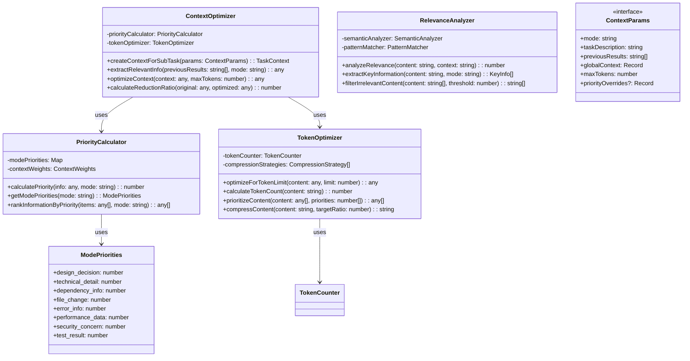

# フェーズ2.2: コンテキスト最適化 - 詳細設計

## 概要

コンテキスト最適化エンジンは、各モードに最適化されたコンテキストを生成し、トークン使用量を30-50%削減しながらAIの応答精度を向上させるシステムです。モード別の情報優先度に基づく動的コンテキスト生成機能を実装します。

**📌 参考実装**: RooCode（RooCline）のオーケストレーション実装を参考にしてください：
- GitHub: https://github.com/RooCodeInc/Roo-Code
- UIthub: https://uithub.com/RooCodeInc/Roo-Code
- DeepWiki: https://deepwiki.com/RooCodeInc/Roo-Code

**💡 重要な点**: RooCodeの実装パターンを参考にしつつ、Claude Code Actionの環境に適応させることが重要です。

## アーキテクチャ



## TDD実装計画

### タスク2.2.1: コンテキスト最適化型定義の作成

#### テストファースト: src/orchestration/context-types.ts

```typescript
// test/orchestration/context-
import { describe, test, expect } from 'bun:test';
import type {
  ContextParams,
  ModePriorities,
  ContextWeights,
  CompressionStrategy,
  KeyInfo
} from '../../src/orchestration/context-types';

describe('Context Optimization Types', () => {
  test('should define ContextParams interface correctly', () => {
    const params: ContextParams = {
      mode: 'code',
      taskDescription: 'Implement user authentication',
      previousResults: ['Design completed', 'Database schema created'],
      globalContext: {
        projectType: 'web-app',
        framework: 'React'
      },
      maxTokens: 4000,
      priorityOverrides: {
        'technical_detail': 0.9,
        'file_change': 0.8
      }
    };

    expect(params.mode).toBe('code');
    expect(params.previousResults.length).toBe(2);
    expect(params.globalContext.framework).toBe('React');
    expect(params.priorityOverrides?.['technical_detail']).toBe(0.9);
  });

  test('should define ModePriorities correctly', () => {
    const priorities: ModePriorities = {
      design_decision: 0.9,
      technical_detail: 0.8,
      dependency_info: 0.7,
      file_change: 0.6,
      error_info: 0.5,
      performance_data: 0.4,
      security_concern: 0.8,
      test_result: 0.3
    };

    expect(priorities.design_decision).toBe(0.9);
    expect(priorities.security_concern).toBe(0.8);
    expect(typeof priorities.test_result).toBe('number');
  });

  test('should define KeyInfo correctly', () => {
    const keyInfo: KeyInfo = {
      type: 'file_change',
      content: 'Modified src/auth/login.ts',
      relevanceScore: 0.85,
      tokens: 45,
      category: 'implementation'
    };

    expect(keyInfo.type).toBe('file_change');
    expect(keyInfo.relevanceScore).toBe(0.85);
    expect(keyInfo.tokens).toBe(45);
  });

  test('should define CompressionStrategy correctly', () => {
    const strategy: CompressionStrategy = {
      name: 'summarize_logs',
      applicableTypes: ['error_info', 'performance_data'],
      compressionRatio: 0.3,
      preserveKeywords: ['error', 'performance', 'critical']
    };

    expect(strategy.name).toBe('summarize_logs');
    expect(strategy.compressionRatio).toBe(0.3);
    expect(strategy.preserveKeywords).toContain('error');
  });
});
```

#### 実装: src/orchestration/context-types.ts

```typescript
export interface ContextParams {
  mode: string;
  taskDescription: string;
  previousResults: string[];
  globalContext: Record<string, any>;
  maxTokens: number;
  priorityOverrides?: Record<string, number>;
}

export interface ModePriorities {
  design_decision: number;
  technical_detail: number;
  dependency_info: number;
  file_change: number;
  error_info: number;
  performance_data: number;
  security_concern: number;
  test_result: number;
}

export interface ContextWeights {
  recency: number;          // How recent the information is
  relevance: number;        // How relevant to the current task
  specificity: number;      // How specific vs general the information
  actionability: number;    // How actionable the information is
}

export interface KeyInfo {
  type: string;
  content: string;
  relevanceScore: number;
  tokens: number;
  category: 'implementation' | 'design' | 'debugging' | 'testing' | 'documentation';
  timestamp?: Date;
}

export interface CompressionStrategy {
  name: string;
  applicableTypes: string[];
  compressionRatio: number;
  preserveKeywords: string[];
  algorithm?: 'summarize' | 'extract_key_points' | 'compress_logs' | 'deduplicate';
}

export interface OptimizationResult {
  originalTokens: number;
  optimizedTokens: number;
  reductionRatio: number;
  preservedInfo: KeyInfo[];
  removedInfo: string[];
  optimizationStrategies: string[];
}

export interface SemanticMatch {
  score: number;
  matchedKeywords: string[];
  context: string;
  confidence: number;
}

export type ContextCategory =
  | 'code_changes'
  | 'design_decisions'
  | 'error_logs'
  | 'test_results'
  | 'performance_metrics'
  | 'dependency_updates'
  | 'security_findings'
  | 'documentation_updates';

export type OptimizationLevel = 'aggressive' | 'balanced' | 'conservative';
```

### タスク2.2.2: 優先度計算エンジンの実装

#### テストファースト: src/orchestration/priority-calculator.ts

```typescript
// test/orchestration/priority-calculator.test.ts
import { describe, test, expect, beforeEach } from 'bun:test';
import { PriorityCalculator } from '../../src/orchestration/priority-calculator';

describe('PriorityCalculator', () => {
  let calculator: PriorityCalculator;

  beforeEach(() => {
    calculator = new PriorityCalculator();
  });

  test('should calculate correct priorities for code mode', () => {
    const codePriorities = calculator.getModePriorities('code');

    expect(codePriorities.technical_detail).toBeGreaterThan(codePriorities.design_decision);
    expect(codePriorities.file_change).toBeGreaterThan(codePriorities.performance_data);
    expect(codePriorities.error_info).toBeGreaterThan(codePriorities.test_result);
  });

  test('should calculate correct priorities for architect mode', () => {
    const architectPriorities = calculator.getModePriorities('architect');

    expect(architectPriorities.design_decision).toBeGreaterThan(architectPriorities.technical_detail);
    expect(architectPriorities.dependency_info).toBeGreaterThan(architectPriorities.file_change);
  });

  test('should calculate correct priorities for debug mode', () => {
    const debugPriorities = calculator.getModePriorities('debug');

    expect(debugPriorities.error_info).toBeGreaterThan(debugPriorities.design_decision);
    expect(debugPriorities.performance_data).toBeGreaterThan(debugPriorities.test_result);
  });

  test('should calculate priority scores for information items', () => {
    const fileChangeInfo = {
      type: 'file_change',
      content: 'Modified src/components/UserProfile.tsx',
      category: 'implementation'
    };

    const codeScore = calculator.calculatePriority(fileChangeInfo, 'code');
    const architectScore = calculator.calculatePriority(fileChangeInfo, 'architect');

    expect(codeScore).toBeGreaterThan(architectScore);
  });

  test('should rank information by priority correctly', () => {
    const items = [
      { type: 'design_decision', content: 'Chose React for frontend' },
      { type: 'file_change', content: 'Updated user.ts' },
      { type: 'error_info', content: 'TypeError in login function' },
      { type: 'test_result', content: 'All tests passing' }
    ];

    const rankedForCode = calculator.rankInformationByPriority(items, 'code');
    const rankedForDebug = calculator.rankInformationByPriority(items, 'debug');

    // For code mode, file changes should be high priority
    expect(rankedForCode[0].type).toBe('file_change');

    // For debug mode, error info should be highest priority
    expect(rankedForDebug[0].type).toBe('error_info');
  });

  test('should handle unknown information types gracefully', () => {
    const unknownInfo = {
      type: 'unknown_type',
      content: 'Some unknown information'
    };

    const score = calculator.calculatePriority(unknownInfo, 'code');
    expect(score).toBeGreaterThanOrEqual(0);
    expect(score).toBeLessThanOrEqual(1);
  });

  test('should apply recency weighting correctly', () => {
    const oldInfo = {
      type: 'file_change',
      content: 'Old change',
      timestamp: new Date('2023-01-01')
    };

    const newInfo = {
      type: 'file_change',
      content: 'Recent change',
      timestamp: new Date()
    };

    const oldScore = calculator.calculatePriority(oldInfo, 'code');
    const newScore = calculator.calculatePriority(newInfo, 'code');

    expect(newScore).toBeGreaterThan(oldScore);
  });
});
```

#### 実装: src/orchestration/priority-calculator.ts

```typescript
import type { ModePriorities, ContextWeights, KeyInfo } from './context-types';

export class PriorityCalculator {
  private modePriorities: Map<string, ModePriorities>;
  private contextWeights: ContextWeights;

  constructor() {
    this.modePriorities = this.initializeModePriorities();
    this.contextWeights = {
      recency: 0.3,
      relevance: 0.4,
      specificity: 0.2,
      actionability: 0.1
    };
  }

  calculatePriority(info: any, mode: string): number {
    const modePriorities = this.getModePriorities(mode);
    const infoType = this.normalizeInfoType(info.type);

    // Base priority from mode-specific weights
    let basePriority = modePriorities[infoType as keyof ModePriorities] || 0.1;

    // Apply context weights
    const recencyWeight = this.calculateRecencyWeight(info.timestamp);
    const relevanceWeight = this.calculateRelevanceWeight(info, mode);
    const specificityWeight = this.calculateSpecificityWeight(info);
    const actionabilityWeight = this.calculateActionabilityWeight(info, mode);

    const finalPriority = basePriority * (
      this.contextWeights.recency * recencyWeight +
      this.contextWeights.relevance * relevanceWeight +
      this.contextWeights.specificity * specificityWeight +
      this.contextWeights.actionability * actionabilityWeight
    );

    return Math.min(Math.max(finalPriority, 0), 1);
  }

  getModePriorities(mode: string): ModePriorities {
    return this.modePriorities.get(mode) || this.modePriorities.get('code')!;
  }

  rankInformationByPriority(items: any[], mode: string): any[] {
    return items
      .map(item => ({
        ...item,
        priority: this.calculatePriority(item, mode)
      }))
      .sort((a, b) => b.priority - a.priority);
  }

  updateModePriorities(mode: string, overrides: Partial<ModePriorities>): void {
    const current = this.getModePriorities(mode);
    const updated = { ...current, ...overrides };
    this.modePriorities.set(mode, updated);
  }

  private initializeModePriorities(): Map<string, ModePriorities> {
    const map = new Map<string, ModePriorities>();

    // Code mode priorities
    map.set('code', {
      design_decision: 0.4,
      technical_detail: 0.9,
      dependency_info: 0.7,
      file_change: 0.8,
      error_info: 0.8,
      performance_data: 0.5,
      security_concern: 0.7,
      test_result: 0.6
    });

    // Architect mode priorities
    map.set('architect', {
      design_decision: 0.9,
      technical_detail: 0.6,
      dependency_info: 0.8,
      file_change: 0.3,
      error_info: 0.4,
      performance_data: 0.7,
      security_concern: 0.8,
      test_result: 0.3
    });

    // Debug mode priorities
    map.set('debug', {
      design_decision: 0.2,
      technical_detail: 0.7,
      dependency_info: 0.6,
      file_change: 0.5,
      error_info: 0.9,
      performance_data: 0.8,
      security_concern: 0.6,
      test_result: 0.7
    });

    // Ask mode priorities
    map.set('ask', {
      design_decision: 0.7,
      technical_detail: 0.8,
      dependency_info: 0.6,
      file_change: 0.2,
      error_info: 0.3,
      performance_data: 0.4,
      security_concern: 0.5,
      test_result: 0.4
    });

    // Orchestrator mode priorities
    map.set('orchestrator', {
      design_decision: 0.8,
      technical_detail: 0.5,
      dependency_info: 0.9,
      file_change: 0.4,
      error_info: 0.6,
      performance_data: 0.6,
      security_concern: 0.7,
      test_result: 0.5
    });

    return map;
  }

  private normalizeInfoType(type: string): string {
    const typeMapping: Record<string, string> = {
      'code_change': 'file_change',
      'file_modification': 'file_change',
      'architecture': 'design_decision',
      'design': 'design_decision',
      'bug': 'error_info',
      'exception': 'error_info',
      'perf': 'performance_data',
      'benchmark': 'performance_data',
      'security': 'security_concern',
      'vulnerability': 'security_concern',
      'test': 'test_result',
      'spec': 'test_result'
    };

    return typeMapping[type] || type;
  }

  private calculateRecencyWeight(timestamp?: Date): number {
    if (!timestamp) return 0.5; // Default for items without timestamp

    const now = new Date();
    const ageInHours = (now.getTime() - timestamp.getTime()) / (1000 * 60 * 60);

    // More recent = higher weight
    if (ageInHours < 1) return 1.0;
    if (ageInHours < 24) return 0.8;
    if (ageInHours < 168) return 0.6; // 1 week
    return 0.3;
  }

  private calculateRelevanceWeight(info: any, mode: string): number {
    const content = (info.content || '').toLowerCase();
    const modeKeywords = this.getModeKeywords(mode);

    let relevanceScore = 0;
    for (const keyword of modeKeywords) {
      if (content.includes(keyword.toLowerCase())) {
        relevanceScore += 0.1;
      }
    }

    return Math.min(relevanceScore, 1.0);
  }

  private calculateSpecificityWeight(info: any): number {
    const content = info.content || '';

    // More specific content has higher weight
    const hasNumbers = /\d/.test(content);
    const hasFileNames = /\.[a-z]{2,4}/.test(content);
    const hasSpecificTerms = /\b(function|class|variable|method|component)\b/i.test(content);

    let specificity = 0.3; // Base specificity
    if (hasNumbers) specificity += 0.2;
    if (hasFileNames) specificity += 0.3;
    if (hasSpecificTerms) specificity += 0.2;

    return Math.min(specificity, 1.0);
  }

  private calculateActionabilityWeight(info: any, mode: string): number {
    const content = (info.content || '').toLowerCase();

    // Different modes have different actionability indicators
    const actionableIndicators = this.getActionableIndicators(mode);

    let actionabilityScore = 0.2; // Base score
    for (const indicator of actionableIndicators) {
      if (content.includes(indicator)) {
        actionabilityScore += 0.2;
      }
    }

    return Math.min(actionabilityScore, 1.0);
  }

  private getModeKeywords(mode: string): string[] {
    const keywordMap: Record<string, string[]> = {
      'code': ['implement', 'function', 'class', 'method', 'algorithm', 'code'],
      'architect': ['design', 'architecture', 'pattern', 'structure', 'system'],
      'debug': ['error', 'bug', 'exception', 'fix', 'problem', 'issue'],
      'ask': ['explain', 'how', 'what', 'why', 'documentation', 'guide'],
      'orchestrator': ['coordinate', 'manage', 'organize', 'workflow', 'process']
    };

    return keywordMap[mode] || [];
  }

  private getActionableIndicators(mode: string): string[] {
    const indicatorMap: Record<string, string[]> = {
      'code': ['todo', 'implement', 'fix', 'update', 'create'],
      'architect': ['design', 'plan', 'decide', 'choose', 'define'],
      'debug': ['investigate', 'reproduce', 'fix', 'test', 'verify'],
      'ask': ['research', 'document', 'explain', 'clarify', 'define'],
      'orchestrator': ['coordinate', 'assign', 'delegate', 'schedule', 'prioritize']
    };

    return indicatorMap[mode] || [];
  }
}
```

### タスク2.2.3: トークン最適化エンジンの実装

#### テストファースト: src/orchestration/token-optimizer.ts

```typescript
// test/orchestration/token-optimizer.test.ts
import { describe, test, expect, beforeEach } from 'bun:test';
import { TokenOptimizer } from '../../src/orchestration/token-optimizer';

describe('TokenOptimizer', () => {
  let optimizer: TokenOptimizer;

  beforeEach(() => {
    optimizer = new TokenOptimizer();
  });

  test('should calculate token count approximately correctly', () => {
    const shortText = "Hello world";
    const longText = "This is a much longer text that contains many more words and should result in a higher token count than the shorter text.";

    const shortTokens = optimizer.calculateTokenCount(shortText);
    const longTokens = optimizer.calculateTokenCount(longText);

    expect(shortTokens).toBeLessThan(longTokens);
    expect(shortTokens).toBeGreaterThan(0);
  });

  test('should optimize content for token limit', () => {
    const content = {
      messages: [
        "This is a very long message that contains lots of detailed information about the implementation",
        "Short message",
        "Another long message with extensive details about architecture and design decisions that might not be necessary",
        "Critical error message"
      ],
      priorities: [0.3, 0.8, 0.2, 0.9]
    };

    const optimized = optimizer.optimizeForTokenLimit(content, 100);

    expect(optimized.messages.length).toBeLessThanOrEqual(content.messages.length);
    // High priority items should be preserved
    expect(optimized.messages).toContain("Short message");
    expect(optimized.messages).toContain("Critical error message");
  });

  test('should prioritize content correctly', () => {
    const content = [
      { text: "Low priority item", id: 1 },
      { text: "High priority item", id: 2 },
      { text: "Medium priority item", id: 3 }
    ];
    const priorities = [0.2, 0.9, 0.5];

    const prioritized = optimizer.prioritizeContent(content, priorities);

    expect(prioritized[0].id).toBe(2); // High priority first
    expect(prioritized[1].id).toBe(3); // Medium priority second
    expect(prioritized[2].id).toBe(1); // Low priority last
  });

  test('should compress content while preserving key information', () => {
    const verbose = `
      The user authentication system needs to be implemented with the following requirements:
      1. It should support email and password login
      2. It should include password reset functionality
      3. It should have rate limiting to prevent brute force attacks
      4. It should use JWT tokens for session management
      5. It should integrate with the existing user database
    `;

    const compressed = optimizer.compressContent(verbose, 0.5);

    expect(compressed.length).toBeLessThan(verbose.length);
    expect(compressed).toContain("authentication");
    expect(compressed).toContain("JWT");
    expect(compressed).toContain("password");
  });

  test('should handle edge cases gracefully', () => {
    expect(() => optimizer.calculateTokenCount("")).not.toThrow();
    expect(() => optimizer.optimizeForTokenLimit({}, 0)).not.toThrow();
    expect(() => optimizer.compressContent("", 0.5)).not.toThrow();

    expect(optimizer.calculateTokenCount("")).toBe(0);
  });

  test('should preserve essential keywords during compression', () => {
    const content = "Implement user authentication with secure password hashing and JWT token management";
    const compressed = optimizer.compressContent(content, 0.3);

    // Essential keywords should be preserved
    const essentialKeywords = ['authentication', 'password', 'JWT', 'secure'];
    const preservedCount = essentialKeywords.filter(keyword =>
      compressed.toLowerCase().includes(keyword.toLowerCase())
    ).length;

    expect(preservedCount).toBeGreaterThan(essentialKeywords.length * 0.5);
  });
});
```

#### 実装: src/orchestration/token-optimizer.ts

```typescript
import type { CompressionStrategy, OptimizationResult } from './context-types';

interface TokenCounter {
  count(text: string): number;
}

export class TokenOptimizer {
  private tokenCounter: TokenCounter;
  private compressionStrategies: CompressionStrategy[];

  constructor() {
    this.tokenCounter = new SimpleTokenCounter();
    this.compressionStrategies = this.initializeCompressionStrategies();
  }

  optimizeForTokenLimit(content: any, limit: number): any {
    if (!content || limit <= 0) {
      return content;
    }

    const currentTokens = this.calculateContentTokens(content);
    if (currentTokens <= limit) {
      return content;
    }

    // Apply optimization strategies in order of effectiveness
    let optimizedContent = content;

    // 1. Remove low priority items first
    optimizedContent = this.removeLowPriorityItems(optimizedContent, limit);

    // 2. Compress verbose content
    optimizedContent = this.compressVerboseContent(optimizedContent, limit);

    // 3. Apply summarization
    optimizedContent = this.applySummarization(optimizedContent, limit);

    return optimizedContent;
  }

  calculateTokenCount(content: string): number {
    if (!content) return 0;
    return this.tokenCounter.count(content);
  }

  prioritizeContent(content: any[], priorities: number[]): any[] {
    if (content.length !== priorities.length) {
      return content;
    }

    const indexed = content.map((item, index) => ({
      item,
      priority: priorities[index],
      index
    }));

    return indexed
      .sort((a, b) => b.priority - a.priority)
      .map(({ item }) => item);
  }

  compressContent(content: string, targetRatio: number): string {
    if (!content || targetRatio >= 1) {
      return content;
    }

    const targetLength = Math.floor(content.length * targetRatio);

    // Extract key sentences and phrases
    const sentences = this.extractSentences(content);
    const keyPhrases = this.extractKeyPhrases(content);

    // Rank sentences by importance
    const rankedSentences = this.rankSentencesByImportance(sentences, keyPhrases);

    // Select sentences until we reach target length
    let compressedLength = 0;
    const selectedSentences: string[] = [];

    for (const sentence of rankedSentences) {
      if (compressedLength + sentence.length <= targetLength) {
        selectedSentences.push(sentence);
        compressedLength += sentence.length;
      } else {
        break;
      }
    }

    return selectedSentences.join(' ').trim();
  }

  generateOptimizationReport(original: any, optimized: any): OptimizationResult {
    const originalTokens = this.calculateContentTokens(original);
    const optimizedTokens = this.calculateContentTokens(optimized);
    const reductionRatio = (originalTokens - optimizedTokens) / originalTokens;

    return {
      originalTokens,
      optimizedTokens,
      reductionRatio,
      preservedInfo: [], // TODO: Track preserved information
      removedInfo: [], // TODO: Track removed information
      optimizationStrategies: [] // TODO: Track applied strategies
    };
  }

  private calculateContentTokens(content: any): number {
    if (typeof content === 'string') {
      return this.calculateTokenCount(content);
    }

    if (Array.isArray(content)) {
      return content.reduce((total, item) => total + this.calculateContentTokens(item), 0);
    }

    if (typeof content === 'object' && content !== null) {
      return Object.values(content).reduce((total, value) => total + this.calculateContentTokens(value), 0);
    }

    return 0;
  }

  private removeLowPriorityItems(content: any, limit: number): any {
    if (Array.isArray(content) && content.length > 0 && typeof content[0] === 'object') {
      // If content has priority information, filter by priority
      const sortedByPriority = content
        .filter(item => item.priority !== undefined)
        .sort((a, b) => b.priority - a.priority);

      const result = [];
      let currentTokens = 0;

      for (const item of sortedByPriority) {
        const itemTokens = this.calculateContentTokens(item);
        if (currentTokens + itemTokens <= limit) {
          result.push(item);
          currentTokens += itemTokens;
        }
      }

      return result;
    }

    return content;
  }

  private compressVerboseContent(content: any, limit: number): any {
    if (typeof content === 'string') {
      const currentTokens = this.calculateTokenCount(content);
      if (currentTokens > limit) {
        const targetRatio = limit / currentTokens;
        return this.compressContent(content, targetRatio);
      }
    }

    if (typeof content === 'object' && content !== null) {
      const compressed: any = {};
      for (const [key, value] of Object.entries(content)) {
        compressed[key] = this.compressVerboseContent(value, Math.floor(limit * 0.3));
      }
      return compressed;
    }

    return content;
  }

  private applySummarization(content: any, limit: number): any {
    // Apply summarization strategies
    for (const strategy of this.compressionStrategies) {
      if (this.calculateContentTokens(content) <= limit) {
        break;
      }
      content = this.applyCompressionStrategy(content, strategy);
    }

    return content;
  }

  private extractSentences(content: string): string[] {
    return content
      .split(/[.!?]+/)
      .map(s => s.trim())
      .filter(s => s.length > 0);
  }

  private extractKeyPhrases(content: string): string[] {
    // Simple key phrase extraction
    const keywords = [
      'implement', 'create', 'design', 'fix', 'error', 'function',
      'component', 'service', 'authentication', 'database', 'api',
      'security', 'performance', 'test', 'user', 'system'
    ];

    return keywords.filter(keyword =>
      content.toLowerCase().includes(keyword.toLowerCase())
    );
  }

  private rankSentencesByImportance(sentences: string[], keyPhrases: string[]): string[] {
    return sentences
      .map(sentence => ({
        sentence,
        score: this.calculateSentenceScore(sentence, keyPhrases)
      }))
      .sort((a, b) => b.score - a.score)
      .map(item => item.sentence);
  }

  private calculateSentenceScore(sentence: string, keyPhrases: string[]): number {
    let score = 0;
    const lowerSentence = sentence.toLowerCase();

    // Score based on key phrase presence
    for (const phrase of keyPhrases) {
      if (lowerSentence.includes(phrase.toLowerCase())) {
        score += 1;
      }
    }

    // Bonus for sentences with numbers (often specific)
    if (/\d/.test(sentence)) {
      score += 0.5;
    }

    // Bonus for sentences with technical terms
    if (/\b(function|class|method|api|database|component)\b/i.test(sentence)) {
      score += 0.3;
    }

    return score;
  }

  private applyCompressionStrategy(content: any, strategy: CompressionStrategy): any {
    // Apply specific compression strategies
    switch (strategy.algorithm) {
      case 'summarize':
        return this.summarizeContent(content, strategy);
      case 'extract_key_points':
        return this.extractKeyPoints(content, strategy);
      case 'deduplicate':
        return this.deduplicateContent(content, strategy);
      default:
        return content;
    }
  }

  private summarizeContent(content: any, strategy: CompressionStrategy): any {
    if (typeof content === 'string') {
      return this.compressContent(content, strategy.compressionRatio);
    }
    return content;
  }

  private extractKeyPoints(content: any, strategy: CompressionStrategy): any {
    if (typeof content === 'string') {
      const sentences = this.extractSentences(content);
      const keyPhrases = strategy.preserveKeywords;

      const importantSentences = sentences.filter(sentence =>
        keyPhrases.some(keyword =>
          sentence.toLowerCase().includes(keyword.toLowerCase())
        )
      );

      return importantSentences.slice(0, Math.ceil(sentences.length * strategy.compressionRatio)).join('. ');
    }
    return content;
  }

  private deduplicateContent(content: any, strategy: CompressionStrategy): any {
    if (Array.isArray(content)) {
      const seen = new Set();
      return content.filter(item => {
        const key = JSON.stringify(item);
        if (seen.has(key)) {
          return false;
        }
        seen.add(key);
        return true;
      });
    }
    return content;
  }

  private initializeCompressionStrategies(): CompressionStrategy[] {
    return [
      {
        name: 'remove_duplicates',
        applicableTypes: ['all'],
        compressionRatio: 0.9,
        preserveKeywords: [],
        algorithm: 'deduplicate'
      },
      {
        name: 'summarize_verbose',
        applicableTypes: ['design_decision', 'technical_detail'],
        compressionRatio: 0.6,
        preserveKeywords: ['important', 'critical', 'key', 'main'],
        algorithm: 'summarize'
      },
      {
        name: 'extract_error_essentials',
        applicableTypes: ['error_info'],
        compressionRatio: 0.4,
        preserveKeywords: ['error', 'exception', 'failed', 'critical'],
        algorithm: 'extract_key_points'
      }
    ];
  }
}

// Simple token counter implementation
class SimpleTokenCounter implements TokenCounter {
  count(text: string): number {
    if (!text) return 0;

    // Rough approximation: ~4 characters per token for English text
    // This is a simplified approach; in production, use a proper tokenizer
    const words = text.trim().split(/\s+/).length;
    const chars = text.length;

    // Estimate tokens based on word count and character count
    return Math.ceil(Math.max(words * 0.75, chars / 4));
  }
}
```

### タスク2.2.4: コンテキスト最適化エンジンの統合

#### テストファースト: src/orchestration/context-optimizer.ts

```typescript
// test/orchestration/context-optimizer.test.ts
import { describe, test, expect, beforeEach } from 'bun:test';
import { ContextOptimizer } from '../../src/orchestration/context-optimizer';
import type { ContextParams } from '../../src/orchestration/context-types';

describe('ContextOptimizer', () => {
  let optimizer: ContextOptimizer;

  beforeEach(() => {
    optimizer = new ContextOptimizer();
  });

  test('should create optimized context for code mode', () => {
    const params: ContextParams = {
      mode: 'code',
      taskDescription: 'Implement user login functionality',
      previousResults: [
        'Database schema created with user table',
        'Password hashing utility implemented',
        'JWT token service created'
      ],
      globalContext: {
        framework: 'React',
        backend: 'Node.js',
        database: 'PostgreSQL'
      },
      maxTokens: 2000
    };

    const context = optimizer.createContextForSubTask(params);

    expect(context.maxTokens).toBeLessThanOrEqual(2000);
    expect(context.modeSpecificContext).toBeDefined();
    expect(context.previousResults.length).toBeGreaterThan(0);
  });

  test('should prioritize relevant information for different modes', () => {
    const previousResults = [
      'System architecture designed with microservices',
      'Database schema created',
      'Authentication API implemented',
      'Critical bug found in payment processing',
      'Performance tests show 95% improvement'
    ];

    const codeRelevant = optimizer.extractRelevantInfo(previousResults, 'code');
    const debugRelevant = optimizer.extractRelevantInfo(previousResults, 'debug');
    const architectRelevant = optimizer.extractRelevantInfo(previousResults, 'architect');

    // Code mode should prioritize implementation details
    expect(JSON.stringify(codeRelevant)).toContain('implemented');

    // Debug mode should prioritize error information
    expect(JSON.stringify(debugRelevant)).toContain('bug');

    // Architect mode should prioritize design information
    expect(JSON.stringify(architectRelevant)).toContain('architecture');
  });

  test('should achieve significant token reduction', () => {
    const verboseContext = {
      longDescription: 'This is a very long description '.repeat(100),
      detailedLogs: 'Detailed log entry '.repeat(50),
      extensiveDocumentation: 'Documentation paragraph '.repeat(30)
    };

    const optimized = optimizer.optimizeContext(verboseContext, 500);

    const originalSize = JSON.stringify(verboseContext).length;
    const optimizedSize = JSON.stringify(optimized).length;
    const reduction = (originalSize - optimizedSize) / originalSize;

    expect(reduction).toBeGreaterThan(0.3); // At least 30% reduction
  });

  test('should calculate reduction ratio correctly', () => {
    const original = { content: 'This is a very long content '.repeat(20) };
    const optimized = { content: 'Short content' };

    const ratio = optimizer.calculateReductionRatio(original, optimized);

    expect(ratio).toBeGreaterThan(0);
    expect(ratio).toBeLessThanOrEqual(1);
  });

  test('should preserve high priority information', () => {
    const params: ContextParams = {
      mode: 'debug',
      taskDescription: 'Fix critical authentication bug',
      previousResults: [
        'User reported login failures',
        'System shows 500 errors in auth service',
        'Database connection is stable',
        'Previous bug fix implemented for payments'
      ],
      globalContext: {},
      maxTokens: 200,
      priorityOverrides: {
        'error_info': 0.95
      }
    };

    const context = optimizer.createContextForSubTask(params);
    const contextStr = JSON.stringify(context);

    // Should preserve error-related information
    expect(contextStr).toContain('error');
    expect(contextStr).toContain('auth');
  });

  test('should handle edge cases gracefully', () => {
    expect(() => optimizer.createContextForSubTask({
      mode: 'code',
      taskDescription: '',
      previousResults: [],
      globalContext: {},
      maxTokens: 0
    })).not.toThrow();

    expect(() => optimizer.optimizeContext(null, 100)).not.toThrow();
    expect(() => optimizer.extractRelevantInfo([], 'unknown_mode')).not.toThrow();
  });
});
```

#### 実装: src/orchestration/context-optimizer.ts

```typescript
import { PriorityCalculator } from './priority-calculator';
import { TokenOptimizer } from './token-optimizer';
import type { ContextParams, OptimizationResult, KeyInfo } from './context-types';
import type { TaskContext } from '../tasks/types';

export class ContextOptimizer {
  private priorityCalculator: PriorityCalculator;
  private tokenOptimizer: TokenOptimizer;

  constructor() {
    this.priorityCalculator = new PriorityCalculator();
    this.tokenOptimizer = new TokenOptimizer();
  }

  createContextForSubTask(params: ContextParams): TaskContext {
    // Apply priority overrides if provided
    if (params.priorityOverrides) {
      this.priorityCalculator.updateModePriorities(params.mode, params.priorityOverrides);
    }

    // Extract and prioritize relevant information
    const relevantInfo = this.extractRelevantInfo(params.previousResults, params.mode);

    // Create mode-specific context
    const modeSpecificContext = this.createModeSpecificContext(params);

    // Optimize for token limit
    const optimizedInfo = this.optimizeContext({
      relevantInfo,
      modeSpecificContext,
      globalContext: params.globalContext
    }, params.maxTokens);

    return {
      previousResults: optimizedInfo.relevantInfo || [],
      globalContext: optimizedInfo.globalContext || {},
      modeSpecificContext: optimizedInfo.modeSpecificContext || {},
      maxTokens: params.maxTokens
    };
  }

  extractRelevantInfo(previousResults: string[], mode: string): string[] {
    if (!previousResults || previousResults.length === 0) {
      return [];
    }

    // Convert results to info objects for prioritization
    const infoObjects = previousResults.map((result, index) => ({
      type: this.classifyInformation(result),
      content: result,
      timestamp: new Date(Date.now() - index * 60000), // Simulate recency
      category: this.categorizeForMode(result, mode)
    }));

    // Rank by priority for the given mode
    const ranked = this.priorityCalculator.rankInformationByPriority(infoObjects, mode);

    // Return the content of top-ranked items
    return ranked.map(item => item.content);
  }

  optimizeContext(context: any, maxTokens: number): any {
    if (maxTokens <= 0) {
      return context;
    }

    const currentTokens = this.calculateContextTokens(context);
    if (currentTokens <= maxTokens) {
      return context;
    }

    // Use token optimizer to reduce size
    return this.tokenOptimizer.optimizeForTokenLimit(context, maxTokens);
  }

  calculateReductionRatio(original: any, optimized: any): number {
    const originalTokens = this.calculateContextTokens(original);
    const optimizedTokens = this.calculateContextTokens(optimized);

    if (originalTokens === 0) return 0;

    return Math.max(0, (originalTokens - optimizedTokens) / originalTokens);
  }

  generateOptimizationReport(original: any, optimized: any): OptimizationResult {
    const originalTokens = this.calculateContextTokens(original);
    const optimizedTokens = this.calculateContextTokens(optimized);
    const reductionRatio = this.calculateReductionRatio(original, optimized);

    return {
      originalTokens,
      optimizedTokens,
      reductionRatio,
      preservedInfo: this.extractPreservedInfo(original, optimized),
      removedInfo: this.extractRemovedInfo(original, optimized),
      optimizationStrategies: ['prioritization', 'token_optimization', 'relevance_filtering']
    };
  }

  private createModeSpecificContext(params: ContextParams): Record<string, any> {
    const { mode, taskDescription } = params;

    const baseContext = {
      mode,
      taskDescription,
      optimizationLevel: this.determineOptimizationLevel(params.maxTokens)
    };

    // Add mode-specific optimizations
    switch (mode) {
      case 'code':
        return {
          ...baseContext,
          focusAreas: ['implementation_details', 'file_changes', 'technical_requirements'],
          excludeTypes: ['high_level_design', 'business_requirements']
        };

      case 'architect':
        return {
          ...baseContext,
          focusAreas: ['system_design', 'dependencies', 'architecture_decisions'],
          excludeTypes: ['implementation_details', 'low_level_bugs']
        };

      case 'debug':
        return {
          ...baseContext,
          focusAreas: ['error_information', 'performance_data', 'system_logs'],
          excludeTypes: ['design_decisions', 'future_planning']
        };

      case 'ask':
        return {
          ...baseContext,
          focusAreas: ['documentation', 'explanations', 'knowledge_base'],
          excludeTypes: ['implementation_specifics', 'error_logs']
        };

      case 'orchestrator':
        return {
          ...baseContext,
          focusAreas: ['task_dependencies', 'coordination_requirements', 'overall_progress'],
          excludeTypes: ['implementation_details']
        };

      default:
        return baseContext;
    }
  }

  private classifyInformation(content: string): string {
    const lowerContent = content.toLowerCase();

    if (this.containsKeywords(lowerContent, ['error', 'exception', 'failed', 'bug'])) {
      return 'error_info';
    }

    if (this.containsKeywords(lowerContent, ['design', 'architecture', 'decided', 'plan'])) {
      return 'design_decision';
    }

    if (this.containsKeywords(lowerContent, ['implemented', 'created', 'added', 'modified', 'file'])) {
      return 'file_change';
    }

    if (this.containsKeywords(lowerContent, ['performance', 'speed', 'memory', 'cpu', 'latency'])) {
      return 'performance_data';
    }

    if (this.containsKeywords(lowerContent, ['test', 'spec', 'passed', 'failed', 'coverage'])) {
      return 'test_result';
    }

    if (this.containsKeywords(lowerContent, ['security', 'auth', 'permission', 'vulnerability'])) {
      return 'security_concern';
    }

    if (this.containsKeywords(lowerContent, ['dependency', 'library', 'package', 'import'])) {
      return 'dependency_info';
    }

    return 'technical_detail';
  }

  private categorizeForMode(content: string, mode: string): 'implementation' | 'design' | 'debugging' | 'testing' | 'documentation' {
    const lowerContent = content.toLowerCase();

    if (mode === 'architect' || this.containsKeywords(lowerContent, ['design', 'architecture', 'plan'])) {
      return 'design';
    }

    if (mode === 'debug' || this.containsKeywords(lowerContent, ['error', 'bug', 'fix', 'debug'])) {
      return 'debugging';
    }

    if (this.containsKeywords(lowerContent, ['test', 'spec', 'coverage', 'verify'])) {
      return 'testing';
    }

    if (this.containsKeywords(lowerContent, ['document', 'explain', 'guide', 'readme'])) {
      return 'documentation';
    }

    return 'implementation';
  }

  private containsKeywords(content: string, keywords: string[]): boolean {
    return keywords.some(keyword => content.includes(keyword));
  }

  private determineOptimizationLevel(maxTokens: number): 'aggressive' | 'balanced' | 'conservative' {
    if (maxTokens < 1000) return 'aggressive';
    if (maxTokens < 3000) return 'balanced';
    return 'conservative';
  }

  private calculateContextTokens(context: any): number {
    return this.tokenOptimizer.calculateTokenCount(JSON.stringify(context));
  }

  private extractPreservedInfo(original: any, optimized: any): KeyInfo[] {
    // Simplified implementation - in practice, this would track actual preserved information
    return [];
  }

  private extractRemovedInfo(original: any, optimized: any): string[] {
    // Simplified implementation - in practice, this would track removed information
    return [];
  }
}
```

## コミット計画

### コミット1: コンテキスト最適化型定義
```bash
# プリコミットチェック
bun test
bun run format:check
bun run typecheck

# 全てのチェックが通った場合のみコミット
git add src/orchestration/context-types.ts test/orchestration/context-types.test.ts
git commit -m "feat(orchestration): add context optimization type definitions with tests"
```

### コミット2: 優先度計算エンジン
```bash
# プリコミットチェック
bun test
bun run format:check
bun run typecheck

# 全てのチェックが通った場合のみコミット
git add src/orchestration/priority-calculator.ts test/orchestration/priority-calculator.test.ts
git commit -m "feat(orchestration): implement priority calculation engine with tests"
```

### コミット3: トークン最適化エンジン
```bash
# プリコミットチェック
bun test
bun run format:check
bun run typecheck

# 全てのチェックが通った場合のみコミット
git add src/orchestration/token-optimizer.ts test/orchestration/token-optimizer.test.ts
git commit -m "feat(orchestration): implement token optimization engine with tests"
```

### コミット4: コンテキスト最適化エンジン
```bash
# プリコミットチェック
bun test
bun run format:check
bun run typecheck

# 全てのチェックが通った場合のみコミット
git add src/orchestration/context-optimizer.ts test/orchestration/context-optimizer.test.ts
git commit -m "feat(orchestration): implement context optimization engine with tests"
```

### コミット5: エクスポート更新
```bash
# プリコミットチェック
bun test
bun run format:check
bun run typecheck

# 全てのチェックが通った場合のみコミット
git add src/orchestration/index.ts
git commit -m "feat(orchestration): add context optimization exports"
```

## ディレクトリ構造

```
src/
└── orchestration/
    ├── types.ts                    # タスク分析型定義
    ├── context-types.ts           # コンテキスト最適化型定義
    ├── complexity-calculator.ts    # 複雑度計算エンジン
    ├── task-analyzer.ts           # タスク分析エンジン
    ├── mode-selector.ts           # モード選択エンジン
    ├── priority-calculator.ts     # 優先度計算エンジン
    ├── token-optimizer.ts         # トークン最適化エンジン
    ├── context-optimizer.ts       # コンテキスト最適化エンジン
    └── index.ts                   # エクスポート

test/
└── orchestration/
    ├── context-types.test.ts
    ├── complexity-calculator.test.ts
    ├── task-analyzer.test.ts
    ├── mode-selector.test.ts
    ├── priority-calculator.test.ts
    ├── token-optimizer.test.ts
    └── context-optimizer.test.ts
```

## index.tsの更新

```typescript
// src/orchestration/index.ts
export type {
  TaskAnalysis,
  ComplexityFactor,
  SubTask,
  DependencyGraph,
  ModeSelectionRule,
  ComplexityPattern,
  ComplexityFactorType
} from './types';

export type {
  ContextParams,
  ModePriorities,
  ContextWeights,
  KeyInfo,
  CompressionStrategy,
  OptimizationResult,
  SemanticMatch,
  ContextCategory,
  OptimizationLevel
} from './context-types';

export { ComplexityCalculator } from './complexity-calculator';
export { TaskAnalyzer } from './task-analyzer';
export { ModeSelector } from './mode-selector';
export { PriorityCalculator } from './priority-calculator';
export { TokenOptimizer } from './token-optimizer';
export { ContextOptimizer } from './context-optimizer';
```

## 統合テスト

```typescript
// test/orchestration/context-integration.test.ts
import { describe, test, expect } from 'bun:test';
import { ContextOptimizer, TaskAnalyzer } from '../../src/orchestration';

describe('Context Optimization Integration', () => {
  test('should handle complete context optimization workflow', () => {
    const analyzer = new TaskAnalyzer();
    const optimizer = new ContextOptimizer();

    const complexTask = `
      Implement a complete user management system with:
      1. Authentication with JWT tokens
      2. Role-based access control
      3. Password reset functionality
      4. Email verification
      5. User profile management
      6. Admin dashboard
    `;

    // Analyze task complexity
    const analysis = analyzer.analyzeTask(complexTask);
    expect(analysis.requiresOrchestration).toBe(true);

    // Create optimized context for a subtask
    const contextParams = {
      mode: 'code',
      taskDescription: 'Implement JWT authentication',
      previousResults: [
        'System architecture designed with microservices approach',
        'Database schema created with user, role, and session tables',
        'Password hashing service implemented using bcrypt',
        'Email service configured with SendGrid',
        'Basic user registration endpoint created',
        'Input validation middleware implemented',
        'Error handling framework established'
      ],
      globalContext: {
        framework: 'Express.js',
        database: 'PostgreSQL',
        authStrategy: 'JWT',
        emailProvider: 'SendGrid'
      },
      maxTokens: 1500
    };

    const optimizedContext = optimizer.createContextForSubTask(contextParams);

    // Verify optimization
    expect(optimizedContext.maxTokens).toBe(1500);
    expect(optimizedContext.previousResults.length).toBeGreaterThan(0);
    expect(optimizedContext.modeSpecificContext.mode).toBe('code');

    // Verify relevant information is prioritized
    const contextStr = JSON.stringify(optimizedContext);
    expect(contextStr).toContain('JWT');
    expect(contextStr).toContain('auth');
  });

  test('should achieve target token reduction', () => {
    const optimizer = new ContextOptimizer();

    const verboseContext = {
      previousResults: [
        'This is a very detailed explanation of how the authentication system was designed with extensive documentation about the security considerations and implementation details that goes on for many sentences and includes lots of technical jargon and specific implementation details that might not be relevant for the current task',
        'Database schema created',
        'Password hashing implemented',
        'Email service configured'
      ],
      globalContext: {
        detailedDescription: 'This is another very long description that contains lots of information about the project setup and configuration that might not be directly relevant to the current subtask but was included for completeness'
      }
    };

    const original = JSON.stringify(verboseContext);
    const optimized = optimizer.optimizeContext(verboseContext, 500);
    const optimizedStr = JSON.stringify(optimized);

    const reductionRatio = (original.length - optimizedStr.length) / original.length;
    expect(reductionRatio).toBeGreaterThan(0.3); // At least 30% reduction
  });

  test('should maintain context quality across modes', () => {
    const optimizer = new ContextOptimizer();

    const previousResults = [
      'System architecture designed with microservices',
      'Critical authentication bug discovered in login flow',
      'User interface components created for login page',
      'Database performance optimized with indexing',
      'Unit tests written for authentication service'
    ];

    const modes = ['code', 'architect', 'debug'];

    for (const mode of modes) {
      const contextParams = {
        mode,
        taskDescription: `${mode} mode task`,
        previousResults,
        globalContext: {},
        maxTokens: 800
      };

      const context = optimizer.createContextForSubTask(contextParams);

      expect(context.previousResults.length).toBeGreaterThan(0);
      expect(context.modeSpecificContext.mode).toBe(mode);

      // Each mode should prioritize different information
      const contextStr = JSON.stringify(context);
      if (mode === 'debug') {
        expect(contextStr).toContain('bug');
      } else if (mode === 'architect') {
        expect(contextStr).toContain('architecture');
      }
    }
  });
});
```

## 実行手順

### 実行フロー
```bash
# 1. phase2-task-analyzer から作業ブランチを作成
git checkout phase2-task-analyzer
git pull origin phase2-task-analyzer # 念のため最新化
git checkout -b phase2-context-optimizer phase2-task-analyzer

# 2. AI実装（Claude Code、Cursor等）
# TDDに従ってテストファーストで実装 (プロジェクトルートで行う)

# 3. プリコミットチェック
bun test && bun run format:check && bun run typecheck

# 4. コミット
git add .
git commit -m "feat(context-optimizer): implement context optimizer" # コミットメッセージは適宜変更

# 5. プッシュしてPR作成
git push origin phase2-context-optimizer

# 6. GitHubでPR作成・レビュー・マージ
#    PRのターゲットブランチは phase2-task-analyzer とする

# 7. クリーンアップ (PRマージ後)
git checkout phase2-task-analyzer
git pull origin phase2-task-analyzer # リモートの変更を取り込み最新化
git branch -d phase2-context-optimizer # ローカルの作業ブランチを削除
# git push origin --delete phase2-context-optimizer # (任意) リモートの作業ブランチも削除する場合
```

### 詳細ステップ（TDD）
```bash
# 1. phase2-task-analyzer から作業ブランチ作成
git checkout phase2-task-analyzer
git pull origin phase2-task-analyzer # 念のため最新化
git checkout -b phase2-context-optimizer phase2-task-analyzer

# プロジェクトルートで作業を進める

# (テストファイル作成、テスト実行、実装、スクリプト実行などはドキュメントの各フェーズに従う)
# ... (省略) ...

# X. プリコミットチェック (実装完了後)
bun test && bun run format:check && bun run typecheck

# Y. コミット
git add .
git commit -m "feat(context-optimizer): implement context optimizer" # コミットメッセージは適宜変更

# Z. 統合 (PR経由でのマージ)
#    上記「実行フロー」のステップ5以降に従ってPRを作成し、マージする
git push origin phase2-context-optimizer
# GitHub上で phase2-task-analyzer をターゲットブランチとしてPRを作成・レビュー・マージ
# マージ後、ローカルブランチをクリーンアップ
git checkout phase2-task-analyzer
git pull origin phase2-task-analyzer
git branch -d phase2-context-optimizer
```

## 依存関係

このフェーズはフェーズ2.1（タスク分析エンジン）完了後に実装してください。以下のフェーズに必要となります：
- フェーズ3: GitHub Actionsとの統合（最適化されたコンテキストの活用）
- フェーズ4: MCP拡張（コンテキスト最適化の活用）

## 次のステップ

1. フェーズ3でGitHub Actionsとの統合（この最適化システムを活用）
2. フェーズ4でMCPツールの拡張
