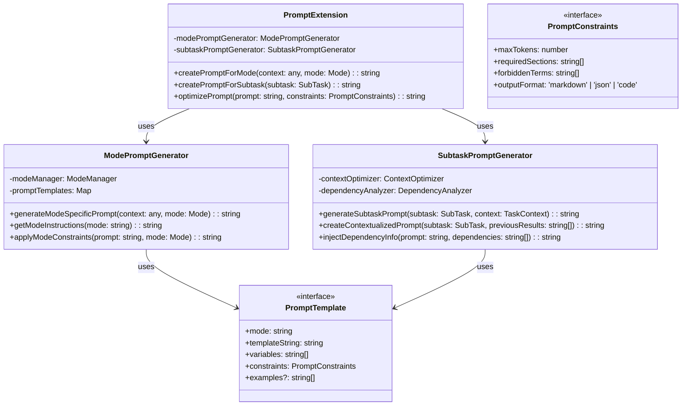

# フェーズ3.1: プロンプト生成拡張 - 詳細設計

## 概要

プロンプト生成拡張は、既存のプロンプト作成システムを拡張し、モード別・サブタスク別に最適化されたプロンプトを生成する機能を実装します。オーケストレーション機能との統合により、各サブタスクに最適なコンテキストとプロンプトを提供します。

**📌 参考実装**: RooCode（RooCline）のオーケストレーション実装を参考にしてください：

- GitHub: https://github.com/RooCodeInc/Roo-Code
- UIthub: https://uithub.com/RooCodeInc/Roo-Code
- DeepWiki: https://deepwiki.com/RooCodeInc/Roo-Code

**💡 重要な点**: RooCodeの実装パターンを参考にしつつ、Claude Code Actionの環境に適応させることが重要です。

## アーキテクチャ



## TDD実装計画

### タスク3.1.1: プロンプト拡張型定義の作成

#### 実装: src/create-prompt/types.ts

```typescript
import type { Mode } from "../modes/types";
import type { SubTask, TaskContext } from "../tasks/types";

export interface PromptTemplate {
  mode: string;
  templateString: string;
  variables: string[];
  constraints: PromptConstraints;
  examples?: string[];
  priority?: number;
}

export interface PromptConstraints {
  maxTokens: number;
  requiredSections: string[];
  forbiddenTerms: string[];
  outputFormat: "markdown" | "json" | "code" | "yaml";
  styleGuidelines?: string[];
}

export interface QualityScore {
  overall: number;
  clarity: number;
  completeness: number;
  specificity: number;
  tokenEfficiency: number;
  contextRelevance?: number;
}

export interface ModePromptContext {
  mode: string;
  taskDescription: string;
  globalContext: Record<string, any>;
  previousResults: string[];
  constraints: PromptConstraints;
  modeSpecificData?: Record<string, any>;
}

export interface SubtaskPromptContext extends ModePromptContext {
  subtask: SubTask;
  dependencies: string[];
  parentTaskId?: string;
  executionOrder: number;
}

export interface PromptGenerationResult {
  prompt: string;
  metadata: PromptMetadata;
  qualityScore: QualityScore;
  warnings?: string[];
}

export interface PromptMetadata {
  mode: string;
  templateUsed: string;
  tokensUsed: number;
  optimizationApplied: string[];
  generationTime: number;
}

export type PromptVariableResolver = (
  variableName: string,
  context: any,
) => string;

export interface PromptValidationResult {
  isValid: boolean;
  errors: string[];
  warnings: string[];
  suggestions: string[];
}
```

### タスク3.1.2: モード別プロンプト生成エンジンの実装

#### テストファースト: src/create-prompt/mode-prompt-generator.ts

```typescript
// test/create-prompt/mode-prompt-generator.test.ts
import { describe, test, expect, beforeEach } from "bun:test";
import { ModePromptGenerator } from "../../src/create-prompt/mode-prompt-generator";
import { modeManager } from "../../src/modes";

describe("ModePromptGenerator", () => {
  let generator: ModePromptGenerator;

  beforeEach(() => {
    generator = new ModePromptGenerator();
  });

  test("should generate code mode specific prompt", () => {
    const context = {
      mode: "code",
      taskDescription: "Implement user authentication API",
      globalContext: {
        framework: "Express.js",
        database: "MongoDB",
      },
      previousResults: ["Database schema designed"],
      constraints: {
        maxTokens: 4000,
        requiredSections: ["implementation", "testing"],
        forbiddenTerms: [],
        outputFormat: "markdown" as const,
      },
    };

    const result = generator.generateModeSpecificPrompt(context);

    expect(result.prompt).toContain("implementation");
    expect(result.prompt).toContain("Express.js");
    expect(result.prompt).toContain("MongoDB");
    expect(result.metadata.mode).toBe("code");
    expect(result.qualityScore.overall).toBeGreaterThan(0.7);
  });

  test("should generate architect mode specific prompt", () => {
    const context = {
      mode: "architect",
      taskDescription: "Design microservices architecture",
      globalContext: {
        scale: "enterprise",
        requirements: "high availability",
      },
      previousResults: [],
      constraints: {
        maxTokens: 5000,
        requiredSections: ["overview", "components", "interactions"],
        forbiddenTerms: [],
        outputFormat: "markdown" as const,
      },
    };

    const result = generator.generateModeSpecificPrompt(context);

    expect(result.prompt).toContain("architecture");
    expect(result.prompt).toContain("microservices");
    expect(result.prompt).toContain("high availability");
    expect(result.metadata.mode).toBe("architect");
  });

  test("should apply mode constraints correctly", () => {
    const mode = modeManager.getModeBySlug("debug");
    const basePrompt = "Debug the authentication issue";

    const constrainedPrompt = generator.applyModeConstraints(basePrompt, mode);

    expect(constrainedPrompt).toContain("troubleshoot");
    expect(constrainedPrompt).toContain("analyze");
    expect(constrainedPrompt.length).toBeGreaterThan(basePrompt.length);
  });

  test("should get mode-specific instructions", () => {
    const codeInstructions = generator.getModeInstructions("code");
    const architectInstructions = generator.getModeInstructions("architect");

    expect(codeInstructions).toContain("implement");
    expect(architectInstructions).toContain("design");
    expect(codeInstructions).not.toBe(architectInstructions);
  });

  test("should handle unknown mode gracefully", () => {
    const context = {
      mode: "unknown_mode",
      taskDescription: "Some task",
      globalContext: {},
      previousResults: [],
      constraints: {
        maxTokens: 2000,
        requiredSections: [],
        forbiddenTerms: [],
        outputFormat: "markdown" as const,
      },
    };

    const result = generator.generateModeSpecificPrompt(context);

    expect(result.prompt).toBeTruthy();
    expect(result.metadata.mode).toBe("code"); // fallback to default
    expect(result.warnings).toContain(
      "Unknown mode, falling back to code mode",
    );
  });
});
```

#### 実装: src/create-prompt/mode-prompt-generator.ts

```typescript
import { modeManager } from "../modes";
import type { Mode } from "../modes/types";
import type {
  ModePromptContext,
  PromptTemplate,
  PromptGenerationResult,
  PromptMetadata,
  QualityScore,
} from "./types";

export class ModePromptGenerator {
  private promptTemplates: Map<string, PromptTemplate>;

  constructor() {
    this.promptTemplates = this.initializePromptTemplates();
  }

  generateModeSpecificPrompt(
    context: ModePromptContext,
  ): PromptGenerationResult {
    const startTime = Date.now();
    const mode =
      modeManager.getModeBySlug(context.mode) ||
      modeManager.getModeBySlug("code")!;
    const template = this.getTemplateForMode(context.mode);

    const warnings: string[] = [];
    if (!modeManager.getModeBySlug(context.mode)) {
      warnings.push("Unknown mode, falling back to code mode");
    }

    // Generate base prompt from template
    let prompt = this.expandTemplate(template, context);

    // Apply mode-specific constraints and instructions
    prompt = this.applyModeConstraints(prompt, mode);

    // Add mode-specific instructions
    const modeInstructions = this.getModeInstructions(context.mode);
    prompt = this.injectModeInstructions(prompt, modeInstructions);

    // Optimize for token limit
    if (context.constraints.maxTokens) {
      prompt = this.optimizeForTokenLimit(
        prompt,
        context.constraints.maxTokens,
      );
    }

    const metadata: PromptMetadata = {
      mode: mode.slug,
      templateUsed: template.mode,
      tokensUsed: this.estimateTokens(prompt),
      optimizationApplied: ["mode_constraints", "token_optimization"],
      generationTime: Date.now() - startTime,
    };

    const qualityScore = this.calculateQualityScore(prompt, context);

    return {
      prompt,
      metadata,
      qualityScore,
      warnings: warnings.length > 0 ? warnings : undefined,
    };
  }

  getModeInstructions(mode: string): string {
    const instructionMap: Record<string, string> = {
      code: `
## Implementation Guidelines
- Focus on clean, maintainable code
- Include error handling and edge cases
- Provide comprehensive testing approach
- Follow established coding standards
- Consider performance implications
      `,
      architect: `
## Design Guidelines
- Consider scalability and maintainability
- Define clear component boundaries
- Specify integration patterns
- Address non-functional requirements
- Provide migration strategy if needed
      `,
      debug: `
## Debugging Guidelines
- Systematically analyze the problem
- Identify root causes, not just symptoms
- Provide step-by-step troubleshooting
- Include diagnostic commands and tools
- Suggest preventive measures
      `,
      ask: `
## Information Guidelines
- Provide clear, comprehensive explanations
- Include relevant examples and use cases
- Reference authoritative sources
- Structure information logically
- Anticipate follow-up questions
      `,
      orchestrator: `
## Orchestration Guidelines
- Break down complex tasks systematically
- Identify dependencies and execution order
- Delegate to appropriate specialized modes
- Coordinate between different components
- Monitor overall progress and quality
      `,
    };

    return instructionMap[mode] || instructionMap["code"];
  }

  applyModeConstraints(prompt: string, mode: Mode): string {
    // Add mode-specific role and context
    const roleDefinition = mode.roleDefinition;
    const customInstructions = mode.customInstructions || "";

    let enhancedPrompt = `${roleDefinition}\n\n`;

    if (customInstructions) {
      enhancedPrompt += `${customInstructions}\n\n`;
    }

    enhancedPrompt += prompt;

    // Apply mode-specific formatting and constraints
    switch (mode.slug) {
      case "code":
        enhancedPrompt +=
          "\n\nPlease provide implementation details, including code examples and testing approaches.";
        break;
      case "architect":
        enhancedPrompt +=
          "\n\nPlease provide architectural diagrams, component descriptions, and integration patterns.";
        break;
      case "debug":
        enhancedPrompt +=
          "\n\nPlease provide step-by-step debugging analysis and specific solutions.";
        break;
      case "ask":
        enhancedPrompt +=
          "\n\nPlease provide comprehensive explanations with examples and references.";
        break;
    }

    return enhancedPrompt;
  }

  private initializePromptTemplates(): Map<string, PromptTemplate> {
    const templates = new Map<string, PromptTemplate>();

    templates.set("code", {
      mode: "code",
      templateString: `
# Implementation Task: {task}

## Context
{context}

## Previous Work
{previousResults}

## Requirements
{requirements}

## Technical Constraints
{technicalConstraints}

Please implement the solution following best practices.
      `,
      variables: [
        "task",
        "context",
        "previousResults",
        "requirements",
        "technicalConstraints",
      ],
      constraints: {
        maxTokens: 4000,
        requiredSections: ["implementation", "testing"],
        forbiddenTerms: [],
        outputFormat: "markdown",
      },
    });

    templates.set("architect", {
      mode: "architect",
      templateString: `
# Architecture Design: {task}

## System Context
{context}

## Background
{previousResults}

## Requirements
{requirements}

## Constraints
{constraints}

Please design a comprehensive architecture solution.
      `,
      variables: [
        "task",
        "context",
        "previousResults",
        "requirements",
        "constraints",
      ],
      constraints: {
        maxTokens: 5000,
        requiredSections: ["overview", "components", "interactions"],
        forbiddenTerms: [],
        outputFormat: "markdown",
      },
    });

    templates.set("debug", {
      mode: "debug",
      templateString: `
# Debugging Task: {task}

## Problem Description
{context}

## Investigation History
{previousResults}

## System Information
{systemInfo}

## Error Details
{errorDetails}

Please provide systematic debugging analysis.
      `,
      variables: [
        "task",
        "context",
        "previousResults",
        "systemInfo",
        "errorDetails",
      ],
      constraints: {
        maxTokens: 3500,
        requiredSections: ["analysis", "solution", "prevention"],
        forbiddenTerms: [],
        outputFormat: "markdown",
      },
    });

    templates.set("orchestrator", {
      mode: "orchestrator",
      templateString: `
# Orchestration Plan: {task}

## Goal
{goal}

## Main Steps
{mainSteps}

## Key Considerations
{considerations}

## Coordination Strategy
{coordination}

Please outline a detailed orchestration plan.
      `,
      variables: [
        "task",
        "goal",
        "mainSteps",
        "considerations",
        "coordination",
      ],
      constraints: {
        maxTokens: 4500,
        requiredSections: ["plan", "steps", "dependencies", "monitoring"],
        forbiddenTerms: [],
        outputFormat: "markdown",
      },
    });

    return templates;
  }

  private getTemplateForMode(mode: string): PromptTemplate {
    return this.promptTemplates.get(mode) || this.promptTemplates.get("code")!;
  }

  private expandTemplate(
    template: PromptTemplate,
    context: ModePromptContext,
  ): string {
    let prompt = template.templateString;

    const variableMap: Record<string, string> = {
      task: context.taskDescription,
      context: this.formatContext(context.globalContext),
      previousResults: this.formatPreviousResults(context.previousResults),
      requirements: this.extractRequirements(context),
      technicalConstraints: this.formatConstraints(context.constraints),
      constraints: this.formatConstraints(context.constraints),
      systemInfo: this.formatSystemInfo(context.globalContext),
      errorDetails: this.extractErrorDetails(context),
    };

    for (const [variable, value] of Object.entries(variableMap)) {
      const regex = new RegExp(`{${variable}}`, "g");
      prompt = prompt.replace(regex, value || "");
    }

    return prompt;
  }

  private formatContext(globalContext: Record<string, any>): string {
    if (!globalContext || Object.keys(globalContext).length === 0) {
      return "No specific context provided.";
    }

    return Object.entries(globalContext)
      .map(([key, value]) => `- ${key}: ${value}`)
      .join("\n");
  }

  private formatPreviousResults(results: string[]): string {
    if (!results || results.length === 0) {
      return "No previous work completed.";
    }

    return results.map((result, index) => `${index + 1}. ${result}`).join("\n");
  }

  private extractRequirements(context: ModePromptContext): string {
    const sections = context.constraints.requiredSections;
    if (!sections || sections.length === 0) {
      return "General implementation requirements apply.";
    }

    return `Please ensure the following sections are included:\n${sections.map((s) => `- ${s}`).join("\n")}`;
  }

  private formatConstraints(constraints: any): string {
    if (!constraints) return "No specific constraints.";

    const items = [];
    if (constraints.maxTokens)
      items.push(`Maximum tokens: ${constraints.maxTokens}`);
    if (constraints.outputFormat)
      items.push(`Output format: ${constraints.outputFormat}`);
    if (constraints.forbiddenTerms?.length > 0) {
      items.push(`Avoid terms: ${constraints.forbiddenTerms.join(", ")}`);
    }

    return items.length > 0 ? items.join("\n") : "No specific constraints.";
  }

  private formatSystemInfo(context: Record<string, any>): string {
    const systemKeys = [
      "os",
      "framework",
      "database",
      "version",
      "environment",
    ];
    const systemInfo = systemKeys
      .filter((key) => context[key])
      .map((key) => `${key}: ${context[key]}`)
      .join("\n");

    return systemInfo || "System information not provided.";
  }

  private extractErrorDetails(context: ModePromptContext): string {
    if (context.modeSpecificData?.error) {
      return context.modeSpecificData.error;
    }
    return "Error details to be investigated.";
  }

  private injectModeInstructions(prompt: string, instructions: string): string {
    return `${prompt}\n\n${instructions}`;
  }

  private optimizeForTokenLimit(prompt: string, maxTokens: number): string {
    const estimatedTokens = this.estimateTokens(prompt);

    if (estimatedTokens <= maxTokens) {
      return prompt;
    }

    // Simple optimization: truncate sections that are too verbose
    const lines = prompt.split("\n");
    const targetRatio = maxTokens / estimatedTokens;
    const targetLines = Math.floor(lines.length * targetRatio);

    return (
      lines.slice(0, targetLines).join("\n") +
      "\n\n[Content optimized for token limit]"
    );
  }

  // estimateTokensメソッドは、複数のクラスで共通のロジックを使用しています。
  // 実際の開発時には、このロジックを src/create-prompt/utils.ts のような共通ユーティリティファイルに集約し、
  // 各クラスからインポートして使用することを推奨します。
  // これにより、コードの重複を避け、メンテナンス性を向上させることができます。
  private estimateTokens(text: string): number {
    const words = text.split(/\s+/).length;
    const chars = text.length;
    const wordBasedTokens = words * 0.75;
    const charBasedTokens = chars / 4;
    return Math.ceil((wordBasedTokens + charBasedTokens) / 2);
  }

  private calculateQualityScore(
    prompt: string,
    context: ModePromptContext,
  ): QualityScore {
    // Simple quality metrics
    const hasRequiredSections = context.constraints.requiredSections.every(
      (section) => prompt.toLowerCase().includes(section.toLowerCase()),
    );

    const hasContext = prompt.includes(context.taskDescription);
    const appropriateLength = prompt.length > 200 && prompt.length < 8000;
    const hasModeSpecificTerms = this.containsModeSpecificTerms(
      prompt,
      context.mode,
    );

    const completeness = hasRequiredSections ? 0.9 : 0.6;
    const specificity = hasContext ? 0.8 : 0.5;
    const clarity = appropriateLength ? 0.8 : 0.6;
    const contextRelevance = hasModeSpecificTerms ? 0.85 : 0.7;
    const tokenEfficiency = this.calculateTokenEfficiency(
      prompt,
      context.constraints.maxTokens,
    );

    const overall =
      (completeness +
        specificity +
        clarity +
        contextRelevance +
        tokenEfficiency) /
      5;

    return {
      overall,
      clarity,
      completeness,
      specificity,
      tokenEfficiency,
      contextRelevance,
    };
  }

  private containsModeSpecificTerms(prompt: string, mode: string): boolean {
    const modeTerms: Record<string, string[]> = {
      code: ["implement", "function", "class", "method", "test"],
      architect: ["design", "architecture", "component", "system", "pattern"],
      debug: ["debug", "analyze", "troubleshoot", "investigate", "fix"],
      ask: ["explain", "describe", "clarify", "understand", "information"],
    };

    const terms = modeTerms[mode] || [];
    return terms.some((term) => prompt.toLowerCase().includes(term));
  }

  private calculateTokenEfficiency(prompt: string, maxTokens: number): number {
    const estimatedTokens = this.estimateTokens(prompt);
    const efficiency = Math.min(estimatedTokens / maxTokens, 1.0);

    // Penalize if too close to limit (less room for response)
    if (efficiency > 0.8) return efficiency * 0.8;
    return efficiency;
  }
}
```

### タスク3.1.3: サブタスクプロンプト生成エンジンの実装

#### テストファースト: src/create-prompt/subtask-prompt-generator.ts

```typescript
// test/create-prompt/subtask-prompt-generator.test.ts
import { describe, test, expect, beforeEach } from "bun:test";
import { SubtaskPromptGenerator } from "../../src/create-prompt/subtask-prompt-generator";
import type { SubTask, TaskContext } from "../../src/tasks/types";

describe("SubtaskPromptGenerator", () => {
  let generator: SubtaskPromptGenerator;

  beforeEach(() => {
    generator = new SubtaskPromptGenerator();
  });

  test("should generate prompt for independent subtask", () => {
    const subtask: SubTask = {
      id: "subtask-1",
      description: "Implement user authentication API endpoints",
      mode: "code",
      priority: 1,
      dependencies: [],
      estimatedComplexity: 6.5,
    };

    const context: TaskContext = {
      previousResults: [],
      globalContext: {
        framework: "Express.js",
        database: "MongoDB",
      },
      modeSpecificContext: {
        implementationFocus: "security",
      },
      maxTokens: 4000,
    };

    const result = generator.generateSubtaskPrompt(subtask, context);

    expect(result.prompt).toContain("authentication");
    expect(result.prompt).toContain("Express.js");
    expect(result.metadata.mode).toBe("code");
    expect(result.qualityScore.overall).toBeGreaterThan(0.7);
  });

  test("should generate prompt for dependent subtask", () => {
    const subtask: SubTask = {
      id: "subtask-3",
      description: "Implement password reset functionality",
      mode: "code",
      priority: 3,
      dependencies: ["subtask-1", "subtask-2"],
      estimatedComplexity: 4.0,
    };

    const context: TaskContext = {
      previousResults: [
        "User registration API completed",
        "Email service integration completed",
      ],
      globalContext: {
        framework: "Express.js",
        emailProvider: "SendGrid",
      },
      modeSpecificContext: {},
      maxTokens: 3500,
    };

    const result = generator.generateSubtaskPrompt(subtask, context);

    expect(result.prompt).toContain("password reset");
    expect(result.prompt).toContain("registration API completed");
    expect(result.prompt).toContain("Email service integration");
    expect(result.metadata.tokensUsed).toBeLessThan(3500);
  });

  test("should create contextualized prompt with previous results", () => {
    const subtask: SubTask = {
      id: "subtask-2",
      description: "Create user profile management",
      mode: "code",
      priority: 2,
      dependencies: ["subtask-1"],
      estimatedComplexity: 5.0,
    };

    const previousResults = [
      "Database schema created with user table",
      "Authentication middleware implemented",
      "JWT token generation working",
    ];

    const prompt = generator.createContextualizedPrompt(
      subtask,
      previousResults,
    );

    expect(prompt).toContain("profile management");
    expect(prompt).toContain("Database schema created");
    expect(prompt).toContain("Authentication middleware");
    expect(prompt).toContain("JWT token generation");
  });

  test("should inject dependency information correctly", () => {
    const basePrompt = "Implement the feature as described.";
    const dependencies = ["User authentication system", "Database connection"];

    const enhancedPrompt = generator.injectDependencyInfo(
      basePrompt,
      dependencies,
    );

    expect(enhancedPrompt).toContain("authentication system");
    expect(enhancedPrompt).toContain("Database connection");
    expect(enhancedPrompt).toContain("Dependencies");
  });

  test("should handle subtask without dependencies", () => {
    const subtask: SubTask = {
      id: "subtask-1",
      description: "Setup project structure",
      mode: "code",
      priority: 1,
      dependencies: [],
      estimatedComplexity: 2.0,
    };

    const context: TaskContext = {
      previousResults: [],
      globalContext: {},
      modeSpecificContext: {},
      maxTokens: 2000,
    };

    const result = generator.generateSubtaskPrompt(subtask, context);

    expect(result.prompt).toContain("project structure");
    expect(result.prompt).not.toContain("Dependencies");
    expect(result.warnings).toBeUndefined();
  });
});
```

#### 実装: src/create-prompt/subtask-prompt-generator.ts

```typescript
import type { SubTask, TaskContext } from "../tasks/types";
import type {
  SubtaskPromptContext,
  PromptGenerationResult,
  PromptMetadata,
  QualityScore,
} from "./types";
import { ModePromptGenerator } from "./mode-prompt-generator";

export class SubtaskPromptGenerator {
  private modePromptGenerator: ModePromptGenerator;

  constructor() {
    this.modePromptGenerator = new ModePromptGenerator();
  }

  generateSubtaskPrompt(
    subtask: SubTask,
    context: TaskContext,
  ): PromptGenerationResult {
    const startTime = Date.now();

    // Create enhanced context for subtask
    const subtaskContext: SubtaskPromptContext = {
      mode: subtask.mode,
      taskDescription: subtask.description,
      globalContext: context.globalContext,
      previousResults: context.previousResults,
      constraints: {
        maxTokens: context.maxTokens,
        requiredSections: this.getRequiredSectionsForMode(subtask.mode),
        forbiddenTerms: [],
        outputFormat: "markdown",
      },
      subtask,
      dependencies: subtask.dependencies,
      parentTaskId: subtask.parentTaskId,
      executionOrder: subtask.priority,
    };

    // Generate base prompt using mode generator
    const baseResult =
      this.modePromptGenerator.generateModeSpecificPrompt(subtaskContext);

    // Enhance with subtask-specific context
    let enhancedPrompt = this.enhanceWithSubtaskContext(
      baseResult.prompt,
      subtask,
      context,
    );

    // Add dependency information if present
    if (subtask.dependencies.length > 0) {
      enhancedPrompt = this.injectDependencyInfo(
        enhancedPrompt,
        this.resolveDependencies(subtask.dependencies, context),
      );
    }

    // Add execution context
    enhancedPrompt = this.addExecutionContext(enhancedPrompt, subtask, context);

    const metadata: PromptMetadata = {
      ...baseResult.metadata,
      tokensUsed: this.estimateTokens(enhancedPrompt),
      optimizationApplied: [
        ...baseResult.metadata.optimizationApplied,
        "subtask_context",
        "dependency_injection",
      ],
      generationTime: Date.now() - startTime,
    };

    const qualityScore = this.calculateSubtaskQualityScore(
      enhancedPrompt,
      subtaskContext,
    );

    return {
      prompt: enhancedPrompt,
      metadata,
      qualityScore,
      warnings: baseResult.warnings,
    };
  }

  createContextualizedPrompt(
    subtask: SubTask,
    previousResults: string[],
  ): string {
    let prompt = `## Subtask: ${subtask.description}\n\n`;

    if (previousResults.length > 0) {
      prompt += `### Previous Work Completed\n`;
      previousResults.forEach((result, index) => {
        prompt += `${index + 1}. ${result}\n`;
      });
      prompt += "\n";
    }

    prompt += `### Current Task Requirements\n`;
    prompt += `- Mode: ${subtask.mode}\n`;
    prompt += `- Priority: ${subtask.priority}\n`;
    prompt += `- Estimated Complexity: ${subtask.estimatedComplexity}/10\n\n`;

    if (subtask.dependencies.length > 0) {
      prompt += `### Dependencies\n`;
      prompt += `This task depends on: ${subtask.dependencies.join(", ")}\n\n`;
    }

    prompt += `### Task Description\n${subtask.description}\n\n`;

    return prompt;
  }

  injectDependencyInfo(prompt: string, dependencies: string[]): string {
    if (dependencies.length === 0) return prompt;

    const dependencySection = `
### Dependencies and Prerequisites

The following components must be available and functioning before implementing this task:

${dependencies.map((dep, index) => `${index + 1}. ${dep}`).join("\n")}

Please ensure your implementation builds upon these existing components and maintains compatibility.

---

`;

    return dependencySection + prompt;
  }

  private enhanceWithSubtaskContext(
    basePrompt: string,
    subtask: SubTask,
    context: TaskContext,
  ): string {
    let enhanced = basePrompt;

    // Add subtask-specific metadata
    enhanced += `\n## Subtask Information\n`;
    enhanced += `- **Subtask ID**: ${subtask.id}\n`;
    enhanced += `- **Execution Priority**: ${subtask.priority}\n`;
    enhanced += `- **Estimated Complexity**: ${subtask.estimatedComplexity}/10\n`;

    if (subtask.estimatedDuration) {
      enhanced += `- **Estimated Duration**: ${subtask.estimatedDuration} minutes\n`;
    }

    // Add mode-specific context if available
    if (
      context.modeSpecificContext &&
      Object.keys(context.modeSpecificContext).length > 0
    ) {
      enhanced += `\n## Mode-Specific Context\n`;
      Object.entries(context.modeSpecificContext).forEach(([key, value]) => {
        enhanced += `- **${key}**: ${value}\n`;
      });
    }

    return enhanced;
  }

  private addExecutionContext(
    prompt: string,
    subtask: SubTask,
    context: TaskContext,
  ): string {
    let enhanced = prompt;

    enhanced += `\n## Execution Guidelines\n`;

    // Add complexity-based guidance
    if (subtask.estimatedComplexity > 7) {
      enhanced += `- **High Complexity Task**: Break down into smaller steps and validate each step\n`;
      enhanced += `- **Quality Focus**: Prioritize thorough testing and documentation\n`;
    } else if (subtask.estimatedComplexity > 4) {
      enhanced += `- **Moderate Complexity**: Ensure clear implementation with adequate testing\n`;
    } else {
      enhanced += `- **Straightforward Task**: Focus on clean, efficient implementation\n`;
    }

    // Add priority-based guidance
    if (subtask.priority === 1) {
      enhanced += `- **Critical Priority**: This task blocks other work - complete accurately and promptly\n`;
    } else if (subtask.priority <= 3) {
      enhanced += `- **High Priority**: Important for project progress\n`;
    }

    // Add dependency guidance
    if (subtask.dependencies.length > 0) {
      enhanced += `- **Dependency Aware**: Ensure compatibility with completed prerequisite tasks\n`;
    }

    enhanced += `\nPlease provide a complete implementation that addresses all requirements and maintains quality standards.`;

    return enhanced;
  }

  private resolveDependencies(
    dependencyIds: string[],
    context: TaskContext,
  ): string[] {
    // In a full implementation, this would resolve dependency IDs to their descriptions
    // For now, we'll use the previous results as proxy for dependencies
    const resolvedDependencies: string[] = [];

    dependencyIds.forEach((depId, index) => {
      if (index < context.previousResults.length) {
        resolvedDependencies.push(context.previousResults[index]);
      } else {
        resolvedDependencies.push(
          `Dependency ${depId} (details to be resolved)`,
        );
      }
    });

    return resolvedDependencies;
  }

  private getRequiredSectionsForMode(mode: string): string[] {
    const sectionMap: Record<string, string[]> = {
      code: ["implementation", "testing", "documentation"],
      architect: ["overview", "components", "interactions", "considerations"],
      debug: ["analysis", "investigation", "solution", "prevention"],
      ask: ["explanation", "examples", "references"],
      orchestrator: ["breakdown", "coordination", "monitoring"],
    };

    return sectionMap[mode] || sectionMap["code"];
  }

  private calculateSubtaskQualityScore(
    prompt: string,
    context: SubtaskPromptContext,
  ): QualityScore {
    const baseScore = this.modePromptGenerator.calculateQualityScore(
      prompt,
      context,
    );

    // Additional subtask-specific quality factors
    const hasDependencyInfo =
      context.dependencies.length === 0 || prompt.includes("Dependencies");
    const hasExecutionGuidance = prompt.includes("Execution Guidelines");
    const hasSubtaskMetadata = prompt.includes("Subtask Information");

    const subtaskSpecificity =
      ((hasDependencyInfo ? 1 : 0) +
        (hasExecutionGuidance ? 1 : 0) +
        (hasSubtaskMetadata ? 1 : 0)) /
      3;

    return {
      ...baseScore,
      specificity: (baseScore.specificity + subtaskSpecificity) / 2,
      overall: (baseScore.overall + subtaskSpecificity) / 2,
    };
  }

  // estimateTokensメソッドは、複数のクラスで共通のロジックを使用しています。
  // 実際の開発時には、このロジックを src/create-prompt/utils.ts のような共通ユーティリティファイルに集約し、
  // 各クラスからインポートして使用することを推奨します。
  // これにより、コードの重複を避け、メンテナンス性を向上させることができます。
  private estimateTokens(text: string): number {
    const words = text.split(/\s+/).length;
    const chars = text.length;
    const wordBasedTokens = words * 0.75;
    const charBasedTokens = chars / 4;
    return Math.ceil((wordBasedTokens + charBasedTokens) / 2);
  }
}
```

### タスク3.1.4: プロンプト拡張統合クラスの実装

#### テストファースト: src/create-prompt/prompt-extension.ts

```typescript
// test/create-prompt/prompt-extension.test.ts
import { describe, test, expect, beforeEach } from "bun:test";
import { PromptExtension } from "../../src/create-prompt/prompt-extension";
import type { Mode } from "../../src/modes/types";
import type { SubTask, TaskContext } from "../../src/tasks/types";

describe("PromptExtension", () => {
  let promptExtension: PromptExtension;

  beforeEach(() => {
    promptExtension = new PromptExtension();
  });

  test("should create prompt for specific mode", () => {
    const context = {
      mode: "code",
      taskDescription: "Implement JWT authentication",
      globalContext: { framework: "Express.js" },
      previousResults: [],
      constraints: {
        maxTokens: 4000,
        requiredSections: ["implementation"],
        forbiddenTerms: [],
        outputFormat: "markdown" as const,
      },
    };

    const mode: Mode = {
      slug: "code",
      name: "Code Implementation",
      roleDefinition: "You are an expert software developer",
      groups: ["file_operations", "code_generation"],
    };

    const result = promptExtension.createPromptForMode(context, mode);

    expect(result.prompt).toContain("JWT authentication");
    expect(result.prompt).toContain("Express.js");
    expect(result.metadata.mode).toBe("code");
    expect(result.qualityScore.overall).toBeGreaterThan(0.7);
  });

  test("should create prompt for subtask", () => {
    const subtask: SubTask = {
      id: "subtask-1",
      description: "Implement user registration endpoint",
      mode: "code",
      priority: 1,
      dependencies: [],
      estimatedComplexity: 5.0,
    };

    const context: TaskContext = {
      previousResults: [],
      globalContext: {
        framework: "Express.js",
        database: "MongoDB",
      },
      modeSpecificContext: {},
      maxTokens: 3000,
    };

    const result = promptExtension.createPromptForSubtask(subtask, context);

    expect(result.prompt).toContain("user registration");
    expect(result.prompt).toContain("Express.js");
    expect(result.metadata.tokensUsed).toBeLessThan(3000);
  });

  test("should optimize prompt for constraints", () => {
    const longPrompt =
      "Very long prompt content that exceeds token limits. ".repeat(200);
    const constraints = {
      maxTokens: 1000,
      requiredSections: ["summary"],
      forbiddenTerms: ["harmful"],
      outputFormat: "markdown" as const,
    };

    const optimized = promptExtension.optimizePrompt(longPrompt, constraints);

    expect(optimized.length).toBeLessThan(longPrompt.length);
    expect(optimized).not.toContain("harmful");
    expect(promptExtension.estimateTokens(optimized)).toBeLessThan(1000);
  });

  test("should integrate with existing prompt creation system", () => {
    const existingPrompt = "This is an existing system prompt.";
    const enhancement = {
      mode: "code",
      taskDescription: "Add authentication",
      globalContext: {},
      previousResults: [],
      constraints: {
        maxTokens: 2000,
        requiredSections: [],
        forbiddenTerms: [],
        outputFormat: "markdown" as const,
      },
    };

    const result = promptExtension.enhanceExistingPrompt(
      existingPrompt,
      enhancement,
    );

    expect(result.prompt).toContain("existing system prompt");
    expect(result.prompt).toContain("authentication");
    expect(result.metadata.optimizationApplied).toContain(
      "existing_prompt_enhancement",
    );
  });
});
```

#### 実装: src/create-prompt/prompt-extension.ts

```typescript
import { ModePromptGenerator } from "./mode-prompt-generator";
import { SubtaskPromptGenerator } from "./subtask-prompt-generator";
import type { Mode } from "../modes/types";
import type { SubTask, TaskContext } from "../tasks/types";
import type {
  ModePromptContext,
  PromptConstraints,
  PromptGenerationResult,
  PromptValidationResult,
} from "./types";

export class PromptExtension {
  private modePromptGenerator: ModePromptGenerator;
  private subtaskPromptGenerator: SubtaskPromptGenerator;

  constructor() {
    this.modePromptGenerator = new ModePromptGenerator();
    this.subtaskPromptGenerator = new SubtaskPromptGenerator();
  }

  createPromptForMode(
    context: ModePromptContext,
    mode: Mode,
  ): PromptGenerationResult {
    // Ensure mode is correctly set in context
    const enhancedContext = {
      ...context,
      mode: mode.slug,
    };

    return this.modePromptGenerator.generateModeSpecificPrompt(enhancedContext);
  }

  createPromptForSubtask(
    subtask: SubTask,
    context: TaskContext,
  ): PromptGenerationResult {
    return this.subtaskPromptGenerator.generateSubtaskPrompt(subtask, context);
  }

  optimizePrompt(prompt: string, constraints: PromptConstraints): string {
    let optimized = prompt;

    // Remove forbidden terms
    if (constraints.forbiddenTerms && constraints.forbiddenTerms.length > 0) {
      constraints.forbiddenTerms.forEach((term) => {
        const regex = new RegExp(term, "gi");
        optimized = optimized.replace(regex, "[TERM_REMOVED]");
      });
    }

    // Optimize for token limit
    if (constraints.maxTokens) {
      const estimatedTokens = this.estimateTokens(optimized);
      if (estimatedTokens > constraints.maxTokens) {
        optimized = this.truncateToTokenLimit(optimized, constraints.maxTokens);
      }
    }

    // Ensure required sections are present
    if (
      constraints.requiredSections &&
      constraints.requiredSections.length > 0
    ) {
      optimized = this.ensureRequiredSections(
        optimized,
        constraints.requiredSections,
      );
    }

    // Apply output format
    optimized = this.applyOutputFormat(optimized, constraints.outputFormat);

    return optimized;
  }

  enhanceExistingPrompt(
    existingPrompt: string,
    enhancement: ModePromptContext,
  ): PromptGenerationResult {
    const startTime = Date.now();

    // Generate mode-specific enhancement
    const modeResult =
      this.modePromptGenerator.generateModeSpecificPrompt(enhancement);

    // Combine existing prompt with enhancement
    const combinedPrompt = this.combinePrompts(
      existingPrompt,
      modeResult.prompt,
    );

    // Optimize the combined prompt
    const optimizedPrompt = this.optimizePrompt(
      combinedPrompt,
      enhancement.constraints,
    );

    return {
      prompt: optimizedPrompt,
      metadata: {
        ...modeResult.metadata,
        optimizationApplied: [
          ...modeResult.metadata.optimizationApplied,
          "existing_prompt_enhancement",
        ],
        generationTime: Date.now() - startTime,
      },
      qualityScore: modeResult.qualityScore,
      warnings: modeResult.warnings,
    };
  }

  validatePrompt(
    prompt: string,
    constraints: PromptConstraints,
  ): PromptValidationResult {
    const errors: string[] = [];
    const warnings: string[] = [];
    const suggestions: string[] = [];

    // Check token limit
    const tokenCount = this.estimateTokens(prompt);
    if (tokenCount > constraints.maxTokens) {
      errors.push(
        `Prompt exceeds token limit: ${tokenCount} > ${constraints.maxTokens}`,
      );
    } else if (tokenCount > constraints.maxTokens * 0.9) {
      warnings.push("Prompt is close to token limit, consider optimization");
    }

    // Check required sections
    if (constraints.requiredSections) {
      const missingSections = constraints.requiredSections.filter(
        (section) => !prompt.toLowerCase().includes(section.toLowerCase()),
      );
      if (missingSections.length > 0) {
        errors.push(`Missing required sections: ${missingSections.join(", ")}`);
      }
    }

    // Check forbidden terms
    if (constraints.forbiddenTerms) {
      const foundTerms = constraints.forbiddenTerms.filter((term) =>
        prompt.toLowerCase().includes(term.toLowerCase()),
      );
      if (foundTerms.length > 0) {
        errors.push(`Contains forbidden terms: ${foundTerms.join(", ")}`);
      }
    }

    // Quality suggestions
    if (prompt.length < 100) {
      suggestions.push("Prompt might be too short for effective guidance");
    }
    if (prompt.length > 10000) {
      suggestions.push(
        "Prompt might be too long, consider breaking into sections",
      );
    }
    if (!prompt.includes("task") && !prompt.includes("Task")) {
      suggestions.push("Consider making the task description more explicit");
    }

    return {
      isValid: errors.length === 0,
      errors,
      warnings,
      suggestions,
    };
  }

  // estimateTokensメソッドは、複数のクラスで共通のロジックを使用しています。
  // 実際の開発時には、このロジックを src/create-prompt/utils.ts のような共通ユーティリティファイルに集約し、
  // 各クラスからインポートして使用することを推奨します。
  // これにより、コードの重複を避け、メンテナンス性を向上させることができます。
  estimateTokens(text: string): number {
    const words = text.split(/\s+/).length;
    const chars = text.length;
    const wordBasedTokens = words * 0.75;
    const charBasedTokens = chars / 4;
    return Math.ceil((wordBasedTokens + charBasedTokens) / 2);
  }

  private truncateToTokenLimit(prompt: string, maxTokens: number): string {
    const targetChars = maxTokens * 4; // Rough estimation

    if (prompt.length <= targetChars) {
      return prompt;
    }

    // Truncate at sentence boundaries when possible
    const sentences = prompt.split(/[.!?]+/);
    let result = "";

    for (const sentence of sentences) {
      if ((result + sentence).length > targetChars - 100) {
        // Leave buffer
        break;
      }
      result += sentence + ".";
    }

    return result + "\n\n[Content truncated to fit token limit]";
  }

  private ensureRequiredSections(
    prompt: string,
    requiredSections: string[],
  ): string {
    let enhanced = prompt;

    const missingSections = requiredSections.filter(
      (section) => !prompt.toLowerCase().includes(section.toLowerCase()),
    );

    if (missingSections.length > 0) {
      enhanced += "\n\n## Required Sections\n";
      enhanced += "Please ensure your response includes:\n";
      missingSections.forEach((section) => {
        enhanced += `- ${section}\n`;
      });
    }

    return enhanced;
  }

  private applyOutputFormat(prompt: string, format: string): string {
    switch (format) {
      case "json":
        return `${prompt}\n\nPlease provide your response in valid JSON format.`;
      case "yaml":
        return `${prompt}\n\nPlease provide your response in YAML format.`;
      case "code":
        return `${prompt}\n\nPlease provide your response primarily as code with minimal explanatory text.`;
      case "markdown":
      default:
        return `${prompt}\n\nPlease provide your response in well-formatted Markdown.`;
    }
  }

  private combinePrompts(existing: string, enhancement: string): string {
    return `${existing}\n\n---\n\n## Additional Context\n\n${enhancement}`;
  }
}
```

## コミット計画

### コミット1: プロンプト拡張型定義

```bash
# プリコミットチェック
bun test
bun run format:check
bun run typecheck

# 全てのチェックが通った場合のみコミット
git add src/create-prompt/types.ts
git commit -m "feat(create-prompt): add prompt extension type definitions"
```

### コミット2: モード別プロンプト生成エンジン

```bash
# プリコミットチェック
bun test
bun run format:check
bun run typecheck

# 全てのチェックが通った場合のみコミット
git add src/create-prompt/mode-prompt-generator.ts test/create-prompt/mode-prompt-generator.test.ts
git commit -m "feat(create-prompt): implement mode-specific prompt generation engine with tests"
```

### コミット3: サブタスクプロンプト生成エンジン

```bash
# プリコミットチェック
bun test
bun run format:check
bun run typecheck

# 全てのチェックが通った場合のみコミット
git add src/create-prompt/subtask-prompt-generator.ts test/create-prompt/subtask-prompt-generator.test.ts
git commit -m "feat(create-prompt): implement subtask prompt generation engine with tests"
```

### コミット4: プロンプト拡張統合クラス

```bash
# プリコミットチェック
bun test
bun run format:check
bun run typecheck

# 全てのチェックが通った場合のみコミット
git add src/create-prompt/prompt-extension.ts test/create-prompt/prompt-extension.test.ts
git commit -m "feat(create-prompt): implement prompt extension integration class with tests"
```

### コミット5: エクスポート更新

```bash
# プリコミットチェック
bun test
bun run format:check
bun run typecheck

# 全てのチェックが通った場合のみコミット
git add src/create-prompt/index.ts
git commit -m "feat(create-prompt): add prompt extension exports"
```

## ディレクトリ構造

```
src/
└── create-prompt/
    ├── index.ts                     # 既存のプロンプト生成（拡張）
    ├── types.ts                     # プロンプト拡張型定義
    ├── mode-prompt-generator.ts     # モード別プロンプト生成エンジン
    ├── subtask-prompt-generator.ts  # サブタスクプロンプト生成エンジン
    └── prompt-extension.ts          # プロンプト拡張統合クラス

test/
└── create-prompt/
    ├── mode-prompt-generator.test.ts
    ├── subtask-prompt-generator.test.ts
    └── prompt-extension.test.ts
```

## index.tsの更新

```typescript
// src/create-prompt/index.ts

// 既存のエクスポート（変更なし）
export { createPrompt } from "./prompt-creator"; // 既存の関数

// 新しいプロンプト拡張エクスポート
export type {
  PromptTemplate,
  PromptConstraints,
  QualityScore,
  ModePromptContext,
  SubtaskPromptContext,
  PromptGenerationResult,
  PromptMetadata,
  PromptValidationResult,
} from "./types";

export { ModePromptGenerator } from "./mode-prompt-generator";
export { SubtaskPromptGenerator } from "./subtask-prompt-generator";
export { PromptExtension } from "./prompt-extension";
```

## 統合テスト

```typescript
// test/create-prompt/integration.test.ts
import { describe, test, expect } from "bun:test";
import { PromptExtension } from "../../src/create-prompt/prompt-extension";
import { TaskAnalyzer } from "../../src/orchestration/task-analyzer";

describe("Prompt Extension Integration", () => {
  test("should integrate with orchestration system", () => {
    const promptExtension = new PromptExtension();
    const taskAnalyzer = new TaskAnalyzer();

    // Analyze a complex task
    const complexTask = `
      Create a complete user management system with:
      1. User registration and authentication
      2. Profile management
      3. Admin dashboard
      4. Email notifications
    `;

    const analysis = taskAnalyzer.analyzeTask(complexTask);
    expect(analysis.requiresOrchestration).toBe(true);

    // Generate prompts for each required mode
    analysis.requiredModes.forEach((mode) => {
      const context = {
        mode,
        taskDescription: complexTask,
        globalContext: { framework: "React", backend: "Node.js" },
        previousResults: [],
        constraints: {
          maxTokens: 4000,
          requiredSections: ["implementation", "testing"],
          forbiddenTerms: [],
          outputFormat: "markdown" as const,
        },
      };

      const modeObj = {
        slug: mode,
        name: mode,
        roleDefinition: "",
        groups: [],
      };
      const result = promptExtension.createPromptForMode(context, modeObj);

      expect(result.prompt).toBeTruthy();
      expect(result.metadata.mode).toBe(mode);
      expect(result.qualityScore.overall).toBeGreaterThan(0.6);
    });
  });

  test("should optimize prompts for token constraints", () => {
    const promptExtension = new PromptExtension();

    const longContext = {
      mode: "code",
      taskDescription: "Implement feature " + "with many details ".repeat(100),
      globalContext: { detail: "very long context ".repeat(50) },
      previousResults: ["result ".repeat(30)],
      constraints: {
        maxTokens: 1000,
        requiredSections: ["implementation"],
        forbiddenTerms: [],
        outputFormat: "markdown" as const,
      },
    };

    const modeObj = {
      slug: "code",
      name: "Code",
      roleDefinition: "",
      groups: [],
    };
    const result = promptExtension.createPromptForMode(longContext, modeObj);

    expect(promptExtension.estimateTokens(result.prompt)).toBeLessThan(1000);
    expect(result.metadata.optimizationApplied).toContain("token_optimization");
  });
});
```

## 実行手順

### 実行フロー

```bash
# 1. phase2-context-optimizer から作業ブランチを作成
git checkout phase2-context-optimizer
git pull origin phase2-context-optimizer # 念のため最新化
git checkout -b phase3-prompt-extension phase2-context-optimizer

# 2. AI実装（Claude Code、Cursor等）
# TDDに従ってテストファイトで実装 (プロジェクトルートで行う)

# 3. プリコミットチェック
bun test && bun run format:check && bun run typecheck

# 4. コミット
git add .
git commit -m "feat(prompt-extension): implement prompt extension" # コミットメッセージは適宜変更

# 5. プッシュしてPR作成
git push origin phase3-prompt-extension

# 6. GitHubでPR作成・レビュー・マージ
#    PRのターゲットブランチは phase2-context-optimizer とする

# 7. クリーンアップ (PRマージ後)
git checkout phase2-context-optimizer
git pull origin phase2-context-optimizer
git branch -d phase3-prompt-extension
```

### 詳細ステップ（TDD）

```bash
# 1. phase2-context-optimizer から作業ブランチ作成
git checkout phase2-context-optimizer
git pull origin phase2-context-optimizer # 念のため最新化
git checkout -b phase3-prompt-extension phase2-context-optimizer

# プロジェクトルートで作業を進める

# (テストファイル作成、テスト実行、実装、スクリプト実行などはドキュメントの各フェーズに従う)
# ... (省略) ...

# X. プリコミットチェック (実装完了後)
bun test && bun run format:check && bun run typecheck

# Y. コミット
git add .
git commit -m "feat(prompt-extension): implement prompt extension" # コミットメッセージは適宜変更

# Z. 統合 (PR経由でのマージ)
#    上記「実行フロー」のステップ5以降に従ってPRを作成し、マージする
git push origin phase3-prompt-extension
# GitHub上で phase2-context-optimizer をターゲットブランチとしてPRを作成・レビュー・マージ
# マージ後、ローカルブランチをクリーンアップ
git checkout phase2-context-optimizer
git pull origin phase2-context-optimizer
git branch -d phase3-prompt-extension
```

## 依存関係

このフェーズはフェーズ2（タスク分析、コンテキスト最適化）完了後に実装してください。以下のフェーズに必要となります：

- フェーズ3.2: GitHub Actions統合（拡張されたプロンプト生成の活用）
- フェーズ4: MCP拡張（プロンプト生成ツール）

## 次のステップ

1. フェーズ3.2でGitHub Actionsとの統合（この拡張プロンプト生成を活用）
2. フェーズ4でMCPツールの拡張

**💡 重要な点**: 既存のプロンプト生成システムとの互換性を保ちながら、モード別・サブタスク別の最適化を提供することで、AI応答の精度と効率を向上させることが重要です。
