# フェーズ3.2: GitHub Actions統合 - 詳細設計

## 概要

GitHub Actions統合では、オーケストレーション機能をGitHub Actionsワークフローに組み込み、サブタスクの実行管理とプログレストラッキングを実装します。既存のGitHub Actionsインフラを拡張し、複雑なタスクの分解と並列/順次実行を可能にします。

**📌 参考実装**: RooCode（RooCline）のオーケストレーション実装を参考にしてください：

- GitHub: https://github.com/RooCodeInc/Roo-Code
- UIthub: https://uithub.com/RooCodeInc/Roo-Code
- DeepWiki: https://deepwiki.com/RooCodeInc/Roo-Code

**💡 重要な点**: RooCodeの実装パターンを参考にしつつ、Claude Code Actionの環境に適応させることが重要です。

## アーキテクチャ

```mermaid
classDiagram
    class OrchestrationEntrypoint {
        -githubContext: GitHubContext
        -taskManager: TaskManager
        -orchestrator: AutoOrchestrator
        -progressTracker: ProgressTracker
        +prepare(): Promise<void>
        +execute(): Promise<void>
        +updateComment(result: OrchestrationResult): Promise<void>
        +handleError(error: Error): Promise<void>
    }

    class TaskManager {
        // TaskManagerのフィールドやメソッド (必要に応じて追記)
    }

    class AutoOrchestrator {
        -taskManager: TaskManager
        -taskAnalyzer: TaskAnalyzer
        -contextOptimizer: ContextOptimizer
        -modeManager: ModeManager
        -executionManager: SubtaskExecutionManager
        +orchestrateTask(taskDescription: string): Promise<OrchestrationResult>
        +executeSubTasks(analysis: TaskAnalysis): Promise<TaskResult[]>
        +handleBoomerangTask(request: BoomerangRequest): Promise<TaskResult>
        +coordinateExecution(subtasks: SubTask[]): Promise<ExecutionPlan>
    }

    class TaskAnalyzer {
        // TaskAnalyzerのフィールドやメソッド (必要に応じて追記)
    }
    class ContextOptimizer {
        // ContextOptimizerのフィールドやメソッド (必要に応じて追記)
    }
    class ModeManager {
        // ModeManagerのフィールドやメソッド (必要に応じて追記)
    }

    class SubtaskExecutionManager {
        -executionQueue: ExecutionQueue
        -dependencyResolver: DependencyResolver
        -resultAggregator: ResultAggregator
        +executeParallel(subtasks: SubTask[]): Promise<TaskResult[]>
        +executeSequential(subtasks: SubTask[]): Promise<TaskResult[]>
        +executeDependencyGraph(graph: DependencyGraph): Promise<TaskResult[]>
        +monitorProgress(taskId: string): ProgressUpdate
    }

    class ExecutionQueue {
        // ExecutionQueueのフィールドやメソッド (必要に応じて追記)
    }
    class DependencyResolver {
        // DependencyResolverのフィールドやメソッド (必要に応じて追記)
    }
    class ResultAggregator {
        // ResultAggregatorのフィールドやメソッド (必要に応じて追記)
    }

    class ProgressTracker {
        -commentManager: CommentManager
        -statusFormatter: StatusFormatter
        +createInitialComment(taskInfo: TaskInfo): Promise<string>
        +updateProgress(taskId: string, progress: ProgressUpdate): Promise<void>
        +finalizeComment(result: OrchestrationResult): Promise<void>
    }

    class CommentManager {
        -githubClient: GitHubClient
        -templateEngine: TemplateEngine
        +createComment(content: string): Promise<number>
        +updateComment(commentId: number, content: string): Promise<void>
        +formatProgressCheckboxes(tasks: SubTask[]): string
    }

    OrchestrationEntrypoint o-- TaskManager : aggregates
    OrchestrationEntrypoint --> AutoOrchestrator : uses
    OrchestrationEntrypoint --> ProgressTracker : uses

    AutoOrchestrator o-- TaskManager : aggregates
    AutoOrchestrator o-- TaskAnalyzer : aggregates
    AutoOrchestrator o-- ContextOptimizer : aggregates
    AutoOrchestrator o-- ModeManager : aggregates
    AutoOrchestrator --> SubtaskExecutionManager : delegates

    SubtaskExecutionManager *-- ExecutionQueue : composes
    SubtaskExecutionManager *-- DependencyResolver : composes
    SubtaskExecutionManager *-- ResultAggregator : composes

    ProgressTracker --> CommentManager : uses
```



## TDD実装計画

### タスク3.2.1: GitHub統合型定義の作成

#### テストファースト: src/github/operations/orchestration-types.ts

```typescript
// test/github/operations/orchestration-types.test.ts
import { describe, test, expect } from "bun:test";
import type {
  OrchestrationResult,
  ExecutionPlan,
  ProgressUpdate,
  TaskInfo,
  BoomerangRequest,
  BoomerangResult,
  ErrorRecoveryInfo,
  ExecutionMetrics,
} from "../../../src/github/operations/orchestration-types";

describe("Orchestration Types", () => {
  test("should define OrchestrationResult correctly", () => {
    const result: OrchestrationResult = {
      success: true,
      taskId: "main-task-1",
      subtaskResults: [
        {
          taskId: "subtask-1",
          success: true,
          output: "Component implemented",
          duration: 120,
          tokensUsed: 1500,
        },
      ],
      totalDuration: 300,
      totalTokensUsed: 5000,
      summary: "All subtasks completed successfully",
    };

    expect(result.success).toBe(true);
    expect(result.subtaskResults.length).toBe(1);
    expect(result.totalTokensUsed).toBe(5000);
  });

  test("should define ExecutionPlan correctly", () => {
    const plan: ExecutionPlan = {
      phases: [
        {
          phaseId: "phase-1",
          name: "Initial Setup",
          subtasks: ["subtask-1", "subtask-2"],
          executionType: "parallel",
          estimatedDuration: 60,
        },
      ],
      dependencies: {
        "subtask-3": ["subtask-1", "subtask-2"],
        "subtask-4": ["subtask-3"],
      },
      estimatedTotalDuration: 180,
      criticalPath: ["subtask-1", "subtask-3", "subtask-4"],
    };

    expect(plan.phases.length).toBe(1);
    expect(plan.phases[0].executionType).toBe("parallel");
    expect(plan.criticalPath.length).toBe(3);
  });

  test("should define ProgressUpdate correctly", () => {
    const progress: ProgressUpdate = {
      taskId: "subtask-1",
      status: "in_progress",
      percentComplete: 75,
      currentStep: "Running tests",
      startTime: new Date(),
      estimatedTimeRemaining: 30,
    };

    expect(progress.status).toBe("in_progress");
    expect(progress.percentComplete).toBe(75);
    expect(progress.currentStep).toBe("Running tests");
  });

  test("should define BoomerangRequest correctly", () => {
    const request: BoomerangRequest = {
      task: "Refactor component X",
      targetMode: "code-refactor",
      returnContext: true,
      preserveResults: false,
    };
    expect(request.targetMode).toBe("code-refactor");
    expect(request.preserveResults).toBe(false);
  });

  test("should define BoomerangResult correctly", () => {
    const result: BoomerangResult = {
      success: true,
      delegatedMode: "code-refactor",
      result: "Component X refactored successfully.",
      tokensUsed: 250,
      duration: 60,
    };
    expect(result.success).toBe(true);
    expect(result.tokensUsed).toBe(250);
  });

  test("should define ErrorRecoveryInfo correctly", () => {
    const recoveryInfo: ErrorRecoveryInfo = {
      strategy: "retry",
      attempts: 3,
      recoveredTasks: ["task-A"],
      unrecoverableTasks: ["task-B"],
    };
    expect(recoveryInfo.strategy).toBe("retry");
    expect(recoveryInfo.recoveredTasks.length).toBe(1);
  });

  test("should define ExecutionMetrics correctly", () => {
    const metrics: ExecutionMetrics = {
      startTime: new Date(),
      tokensUsed: 1200,
      subtasksCompleted: 3,
      subtasksFailed: 0,
    };
    // endTime, duration, parallelizationEfficiency はオプショナルなので、必須項目のみテスト
    expect(metrics.tokensUsed).toBe(1200);
    expect(metrics.subtasksFailed).toBe(0);
  });
});
```

#### 実装: src/github/operations/orchestration-types.ts

```typescript
import type { TaskResult } from "../../tasks/types";

export interface OrchestrationResult {
  success: boolean;
  taskId: string;
  subtaskResults: TaskResult[];
  totalDuration: number;
  totalTokensUsed: number;
  summary: string;
  errors?: string[];
  partialSuccess?: boolean;
  completedSubtasks?: TaskResult[];
  failedSubtasks?: TaskResult[];
  errorRecovery?: ErrorRecoveryInfo;
}

export interface ExecutionPlan {
  phases: ExecutionPhase[];
  dependencies: Record<string, string[]>;
  estimatedTotalDuration: number;
  criticalPath: string[];
}

export interface ExecutionPhase {
  phaseId: string;
  name: string;
  subtasks: string[];
  executionType: "parallel" | "sequential";
  estimatedDuration: number;
}

export interface ProgressUpdate {
  taskId: string;
  status: "pending" | "in_progress" | "completed" | "failed";
  percentComplete: number;
  currentStep?: string;
  startTime?: Date;
  endTime?: Date;
  estimatedTimeRemaining?: number;
}

export interface TaskInfo {
  id: string;
  title: string;
  description: string;
  issueNumber: number;
  repository: {
    owner: string;
    name: string;
  };
}

export interface BoomerangRequest {
  task: string;
  targetMode: string;
  returnContext: boolean;
  preserveResults?: boolean;
}

export interface BoomerangResult {
  success: boolean;
  delegatedMode: string;
  result: string;
  tokensUsed: number;
  duration: number;
}

export interface ErrorRecoveryInfo {
  strategy: "retry" | "skip" | "fallback";
  attempts: number;
  recoveredTasks: string[];
  unrecoverableTasks: string[];
}

export interface ExecutionMetrics {
  startTime: Date;
  endTime?: Date;
  duration?: number;
  tokensUsed: number;
  subtasksCompleted: number;
  subtasksFailed: number;
  parallelizationEfficiency?: number;
}
```

### タスク3.2.2: オーケストレーションエントリーポイントの実装

#### テストファースト: src/entrypoints/orchestrate.ts

```typescript
// test/entrypoints/orchestrate.test.ts
import { describe, test, expect, beforeEach, mock } from "bun:test";
import { OrchestrationEntrypoint } from "../../src/entrypoints/orchestrate";
import type { GitHubContext } from "../../src/github/context";
import { ProgressTracker } from "../../src/github/operations/progress-tracker";

describe("OrchestrationEntrypoint", () => {
  let entrypoint: OrchestrationEntrypoint;
  let mockContext: GitHubContext;

  beforeEach(() => {
    mockContext = {
      eventType: "issue_comment",
      repository: { owner: "test", name: "repo" },
      issue: { number: 1, title: "Test Issue" },
      comment: { id: 123, body: "/claude orchestrate complex task" },
    } as GitHubContext;

    entrypoint = new OrchestrationEntrypoint(mockContext);
  });

  test("should prepare orchestration environment", async () => {
    await entrypoint.prepare();

    // Verify MCP server installation, mode system initialization, etc.
    expect(entrypoint.isReady()).toBe(true);
  });

  test("should execute orchestration for complex task", async () => {
    await entrypoint.prepare();

    const result = await entrypoint.execute();

    expect(result.success).toBe(true);
    expect(result.subtaskResults.length).toBeGreaterThan(0);
  });

  test("should update comment with progress", async () => {
    const progressUpdatePayload = {
      taskId: "subtask-1",
      status: "completed" as const,
      percentComplete: 100,
    };
    await entrypoint.updateProgress(progressUpdatePayload);

    const mockedProgressTrackerInstance =
      ProgressTracker.mock.results[0]?.value;
    if (mockedProgressTrackerInstance) {
      expect(mockedProgressTrackerInstance.updateProgress).toHaveBeenCalledWith(
        progressUpdatePayload.taskId,
        progressUpdatePayload,
      );
    }
  });

  test("should handle errors gracefully", async () => {
    const error = new Error("Orchestration failed");

    await entrypoint.handleError(error);

    // Should update comment with error message
    expect(entrypoint.getLastComment()).toContain("Error");
  });
});
```

#### 実装: src/entrypoints/orchestrate.ts

```typescript
import { GitHubContext } from "../github/context";
import { TaskManager } from "../tasks/task-manager";
import { TaskAnalyzer } from "../orchestration/task-analyzer";
import { ContextOptimizer } from "../orchestration/context-optimizer";
import { modeManager } from "../modes/mode-manager";
import { SubtaskExecutionManager } from "../github/operations/subtask-execution";
import { ProgressTracker } from "../github/operations/progress-tracker";
import type {
  OrchestrationResult,
  ProgressUpdate,
} from "../github/operations/orchestration-types";

export class OrchestrationEntrypoint {
  private githubContext: GitHubContext;
  private taskManager: TaskManager;
  private orchestrator: AutoOrchestrator;
  private progressTracker: ProgressTracker;
  private isInitialized: boolean = false;

  constructor(context: GitHubContext) {
    this.githubContext = context;
    this.taskManager = new TaskManager();
    this.progressTracker = new ProgressTracker(context);
  }

  async prepare(): Promise<void> {
    // Initialize MCP server
    await this.initializeMCPServer();

    // Initialize orchestrator
    this.orchestrator = new AutoOrchestrator(
      this.taskManager,
      new TaskAnalyzer(),
      new ContextOptimizer(),
      modeManager, // Note: When testing AutoOrchestrator, modeManager will need to be mocked
      // or a test-specific instance provided to control its behavior and
      // dependencies, especially for methods like getModeBySlug.
    );

    this.isInitialized = true;
  }

  async execute(): Promise<OrchestrationResult> {
    if (!this.isInitialized) {
      throw new Error("Orchestration not initialized. Call prepare() first.");
    }

    try {
      // Create initial progress comment
      const taskInfo = this.extractTaskInfo();
      await this.progressTracker.createInitialComment(taskInfo);

      // Extract task description from issue/comment
      const taskDescription = this.extractTaskDescription();

      // Orchestrate the task
      const result = await this.orchestrator.orchestrateTask(taskDescription);

      // Update final comment
      await this.progressTracker.finalizeComment(result);

      return result;
    } catch (error) {
      await this.handleError(error as Error);
      throw error;
    }
  }

  async updateProgress(progress: ProgressUpdate): Promise<void> {
    await this.progressTracker.updateProgress(progress.taskId, progress);
  }

  async handleError(error: Error): Promise<void> {
    const errorMessage = `❌ Orchestration failed: ${error.message}`;
    await this.progressTracker.updateWithError(errorMessage);
  }

  isReady(): boolean {
    return this.isInitialized;
  }

  setCommentUpdater(updater: (content: string) => void): void {
    this.progressTracker.setCommentUpdater(updater);
  }

  getLastComment(): string {
    return this.progressTracker.getLastComment();
  }

  private async initializeMCPServer(): Promise<void> {
    // Initialize MCP server with orchestration tools
    // Implementation details...
  }

  private extractTaskInfo(): TaskInfo {
    return {
      id: `task-${Date.now()}`,
      title: this.githubContext.issue?.title || "Task",
      description: this.githubContext.issue?.body || "",
      issueNumber: this.githubContext.issue?.number || 0,
      repository: {
        owner: this.githubContext.repository.owner,
        name: this.githubContext.repository.name,
      },
    };
  }

  private extractTaskDescription(): string {
    const issueBody = this.githubContext.issue?.body || "";
    const commentBody = this.githubContext.comment?.body || "";
    return `${issueBody}\n\n${commentBody}`;
  }
}

export class AutoOrchestrator {
  constructor(
    private taskManager: TaskManager,
    private taskAnalyzer: TaskAnalyzer,
    private contextOptimizer: ContextOptimizer,
    private modeManager: typeof modeManager,
  ) {}

  async orchestrateTask(taskDescription: string): Promise<OrchestrationResult> {
    const startTime = Date.now();
    const analysis = this.taskAnalyzer.analyzeTask(taskDescription);

    if (!analysis.requiresOrchestration) {
      // Simple task - execute directly
      return this.executeSingleTask(taskDescription, analysis.requiredModes[0]);
    }

    // Complex task - create subtasks and execution plan
    const subtasks = await this.generateSubtasks(analysis);
    const executionPlan = await this.coordinateExecution(subtasks);

    // Execute subtasks according to plan
    const executionManager = new SubtaskExecutionManager();
    const results = await executionManager.executeDependencyGraph({
      nodes: subtasks,
      edges: this.createDependencyEdges(executionPlan),
    });

    return {
      success: results.every((r) => r.success),
      taskId: `main-${Date.now()}`,
      subtaskResults: results,
      totalDuration: Date.now() - startTime,
      totalTokensUsed: results.reduce((sum, r) => sum + (r.tokensUsed || 0), 0),
      summary: this.generateSummary(results),
    };
  }

  async executeSubTasks(analysis: TaskAnalysis): Promise<TaskResult[]> {
    const subtasks = await this.generateSubtasks(analysis);
    const executionManager = new SubtaskExecutionManager();

    // Group subtasks by dependencies
    const independentTasks = subtasks.filter(
      (t) => t.dependencies.length === 0,
    );
    const dependentTasks = subtasks.filter((t) => t.dependencies.length > 0);

    // Execute independent tasks in parallel
    const independentResults =
      await executionManager.executeParallel(independentTasks);

    // Execute dependent tasks sequentially
    const dependentResults =
      await executionManager.executeSequential(dependentTasks);

    return [...independentResults, ...dependentResults];
  }

  async handleBoomerangTask(request: BoomerangRequest): Promise<TaskResult> {
    const mode = this.modeManager.getModeBySlug(request.targetMode);
    const context = this.contextOptimizer.createContextForSubTask({
      mode: request.targetMode,
      taskDescription: request.task,
      previousResults: [],
      globalContext: {},
      maxTokens: 4000,
    });

    // Execute task in specified mode
    const result = await this.executeInMode(request.task, mode, context);

    return {
      taskId: `boomerang-${Date.now()}`,
      success: true,
      output: result,
      duration: 0,
      tokensUsed: 0,
    };
  }

  async coordinateExecution(subtasks: SubTask[]): Promise<ExecutionPlan> {
    // Analyze dependencies and create execution phases
    const phases = this.createExecutionPhases(subtasks);
    const criticalPath = this.calculateCriticalPath(subtasks);

    return {
      phases,
      dependencies: this.extractDependencies(subtasks),
      estimatedTotalDuration: this.estimateTotalDuration(phases),
      criticalPath,
    };
  }

  // Private helper methods...
  // Note: The following private methods (executeSingleTask, generateSubtasks,
  // createDependencyEdges, generateSummary, executeInMode, createExecutionPhases,
  // calculateCriticalPath, extractDependencies, estimateTotalDuration) may contain
  // complex logic. Consider strategies for testing these methods, such as:
  // 1. Making them package-private or protected if language allows, for direct testing.
  // 2. Refactoring them into separate, testable helper classes.
  // 3. Ensuring comprehensive coverage through AutoOrchestrator's public methods tests.
}
```

### タスク3.2.3: サブタスク実行管理の実装

#### テストファースト: src/github/operations/subtask-execution.ts

```typescript
// test/github/operations/subtask-execution.test.ts
import { describe, test, expect, beforeEach } from "bun:test";
import { SubtaskExecutionManager } from "../../../src/github/operations/subtask-execution";
import type { SubTask } from "../../../src/orchestration/types";

describe("SubtaskExecutionManager", () => {
  let manager: SubtaskExecutionManager;

  beforeEach(() => {
    manager = new SubtaskExecutionManager();
  });

  test("should execute independent subtasks in parallel", async () => {
    const subtasks: SubTask[] = [
      {
        id: "subtask-1",
        description: "Task 1",
        mode: "code",
        priority: 1,
        dependencies: [],
        estimatedComplexity: 3,
      },
      {
        id: "subtask-2",
        description: "Task 2",
        mode: "code",
        priority: 1,
        dependencies: [],
        estimatedComplexity: 3,
      },
    ];

    const startTime = Date.now();
    const results = await manager.executeParallel(subtasks);
    const duration = Date.now() - startTime;

    expect(results.length).toBe(2);
    expect(results.every((r) => r.success)).toBe(true);
    // Parallel execution should be faster than sequential
    expect(duration).toBeLessThan(subtasks.length * 1000);
  });

  test("should execute dependent subtasks sequentially", async () => {
    const subtasks: SubTask[] = [
      {
        id: "subtask-1",
        description: "Base task",
        mode: "code",
        priority: 1,
        dependencies: [],
        estimatedComplexity: 3,
      },
      {
        id: "subtask-2",
        description: "Dependent task",
        mode: "code",
        priority: 2,
        dependencies: ["subtask-1"],
        estimatedComplexity: 3,
      },
    ];

    const results = await manager.executeSequential(subtasks);

    expect(results.length).toBe(2);
    expect(results[0].taskId).toBe("subtask-1");
    expect(results[1].taskId).toBe("subtask-2");
  });

  test("should execute dependency graph correctly", async () => {
    const graph = {
      nodes: [
        { id: "A", mode: "code", dependencies: [] },
        { id: "B", mode: "code", dependencies: ["A"] },
        { id: "C", mode: "code", dependencies: ["A"] },
        { id: "D", mode: "code", dependencies: ["B", "C"] },
      ],
      edges: [
        { from: "A", to: "B", type: "sequential" },
        { from: "A", to: "C", type: "sequential" },
        { from: "B", to: "D", type: "sequential" },
        { from: "C", to: "D", type: "sequential" },
      ],
    };

    const results = await manager.executeDependencyGraph(graph);

    expect(results.length).toBe(4);
    // A should complete before B and C
    const aIndex = results.findIndex((r) => r.taskId === "A");
    const bIndex = results.findIndex((r) => r.taskId === "B");
    const cIndex = results.findIndex((r) => r.taskId === "C");
    const dIndex = results.findIndex((r) => r.taskId === "D");

    expect(aIndex).toBeLessThan(bIndex);
    expect(aIndex).toBeLessThan(cIndex);
    expect(dIndex).toBe(3); // D should be last
  });

  test("should monitor progress during execution", async () => {
    const subtask: SubTask = {
      id: "subtask-1",
      description: "Monitored task",
      mode: "code",
      priority: 1,
      dependencies: [],
      estimatedComplexity: 5,
    };

    let progressUpdates: ProgressUpdate[] = [];
    manager.onProgress((update) => {
      progressUpdates.push(update);
    });

    await manager.executeParallel([subtask]);

    expect(progressUpdates.length).toBeGreaterThan(0);
    expect(progressUpdates.some((u) => u.status === "in_progress")).toBe(true);
    expect(progressUpdates.some((u) => u.status === "completed")).toBe(true);
  });
});
```

#### 実装: src/github/operations/subtask-execution.ts

```typescript
import type {
  SubTask,
  TaskResult,
  DependencyGraph,
} from "../../orchestration/types";
import type { ProgressUpdate } from "./orchestration-types";
import { PromptExtension } from "../../create-prompt/prompt-extension";
import { taskManager } from "../../tasks/task-manager";

export class SubtaskExecutionManager {
  private executionQueue: ExecutionQueue;
  private dependencyResolver: DependencyResolver;
  private resultAggregator: ResultAggregator;
  private progressCallbacks: ((update: ProgressUpdate) => void)[] = [];

  constructor() {
    this.executionQueue = new ExecutionQueue();
    this.dependencyResolver = new DependencyResolver();
    this.resultAggregator = new ResultAggregator();
  }

  async executeParallel(subtasks: SubTask[]): Promise<TaskResult[]> {
    const promises = subtasks.map((subtask) => this.executeSubtask(subtask));
    return Promise.all(promises);
  }

  async executeSequential(subtasks: SubTask[]): Promise<TaskResult[]> {
    const results: TaskResult[] = [];

    for (const subtask of subtasks) {
      const result = await this.executeSubtask(subtask);
      results.push(result);

      // Pass result to next subtask's context
      if (subtask.dependencies.length > 0) {
        this.resultAggregator.addResult(subtask.id, result);
      }
    }

    return results;
  }

  async executeDependencyGraph(graph: DependencyGraph): Promise<TaskResult[]> {
    const results: TaskResult[] = [];
    const completed = new Set<string>();
    const executing = new Map<string, Promise<TaskResult>>();

    const executeNode = async (nodeId: string): Promise<TaskResult> => {
      const node = graph.nodes.find((n) => n.id === nodeId);
      if (!node) throw new Error(`Node ${nodeId} not found`);

      // Wait for dependencies
      for (const dep of node.dependencies) {
        if (!completed.has(dep)) {
          if (executing.has(dep)) {
            await executing.get(dep);
          } else {
            await executeNode(dep);
          }
        }
      }

      // Execute this node
      const promise = this.executeSubtask(node as SubTask);
      executing.set(nodeId, promise);

      const result = await promise;
      completed.add(nodeId);
      results.push(result);

      return result;
    };

    // Execute all nodes
    const rootNodes = graph.nodes.filter((n) => n.dependencies.length === 0);
    await Promise.all(rootNodes.map((n) => executeNode(n.id)));

    // Execute remaining nodes
    for (const node of graph.nodes) {
      if (!completed.has(node.id)) {
        await executeNode(node.id);
      }
    }

    return results;
  }

  monitorProgress(taskId: string): ProgressUpdate {
    const task = taskManager.getTask(taskId);

    return {
      taskId,
      status: task.status,
      percentComplete: this.calculateProgress(task),
      currentStep: this.getCurrentStep(task),
      startTime: task.createdAt,
      endTime: task.result ? task.updatedAt : undefined,
      estimatedTimeRemaining: this.estimateTimeRemaining(task),
    };
  }

  onProgress(callback: (update: ProgressUpdate) => void): void {
    this.progressCallbacks.push(callback);
  }

  private async executeSubtask(subtask: SubTask): Promise<TaskResult> {
    const startTime = Date.now();

    // Update progress: starting
    this.notifyProgress({
      taskId: subtask.id,
      status: "in_progress",
      percentComplete: 0,
      currentStep: "Initializing",
    });

    try {
      // Create task in task manager
      const task = taskManager.createTask({
        mode: subtask.mode,
        message: subtask.description,
        context: {
          previousResults: this.getPreviousResults(subtask.dependencies),
          globalContext: {},
          modeSpecificContext: {},
          maxTokens: 4000,
        },
      });

      // Generate prompt
      const promptExtension = new PromptExtension();
      const promptResult = promptExtension.createPromptForSubtask(
        subtask,
        task.context,
      );

      // Update progress: executing
      this.notifyProgress({
        taskId: subtask.id,
        status: "in_progress",
        percentComplete: 50,
        currentStep: "Executing",
      });

      // Execute (simulated - in real implementation, this would call Claude API)
      const output = await this.simulateExecution(promptResult.prompt, subtask);

      // Update task result
      const result: TaskResult = {
        taskId: subtask.id,
        success: true,
        output,
        duration: Date.now() - startTime,
        tokensUsed: promptResult.metadata.tokensUsed,
      };

      taskManager.updateTaskResult(task.id, result);

      // Update progress: completed
      this.notifyProgress({
        taskId: subtask.id,
        status: "completed",
        percentComplete: 100,
        currentStep: "Completed",
      });

      return result;
    } catch (error) {
      // Update progress: failed
      this.notifyProgress({
        taskId: subtask.id,
        status: "failed",
        percentComplete: 0,
        currentStep: "Failed",
      });

      return {
        taskId: subtask.id,
        success: false,
        error: error.message,
        duration: Date.now() - startTime,
      };
    }
  }

  private getPreviousResults(dependencies: string[]): string[] {
    return dependencies.map((depId) => {
      const result = this.resultAggregator.getResult(depId);
      return result?.output || `Result from ${depId}`;
    });
  }

  private async simulateExecution(
    prompt: string,
    subtask: SubTask,
  ): Promise<string> {
    // Simulate API call delay
    await new Promise((resolve) =>
      setTimeout(resolve, 500 + Math.random() * 500),
    );

    // Return simulated result based on mode
    switch (subtask.mode) {
      case "architect":
        return `Architecture design for: ${subtask.description}`;
      case "code":
        return `Implementation completed for: ${subtask.description}`;
      case "debug":
        return `Debugging analysis for: ${subtask.description}`;
      default:
        return `Task completed: ${subtask.description}`;
    }
  }

  private notifyProgress(update: ProgressUpdate): void {
    this.progressCallbacks.forEach((callback) => callback(update));
  }

  private calculateProgress(task: any): number {
    if (task.status === "completed") return 100;
    if (task.status === "failed") return 0;
    if (task.status === "in_progress") return 50;
    return 0;
  }

  private getCurrentStep(task: any): string {
    return task.status === "in_progress" ? "Processing" : task.status;
  }

  private estimateTimeRemaining(task: any): number {
    if (task.status === "completed" || task.status === "failed") return 0;
    return 30; // seconds
  }
}

class ExecutionQueue {
  private queue: SubTask[] = [];
  private executing = new Set<string>();
  private maxConcurrent = 3;

  async add(subtask: SubTask): Promise<void> {
    this.queue.push(subtask);
  }

  async processQueue(): Promise<void> {
    while (this.queue.length > 0 && this.executing.size < this.maxConcurrent) {
      const task = this.queue.shift()!;
      this.executing.add(task.id);
      // Process task...
      this.executing.delete(task.id);
    }
  }
}

class DependencyResolver {
  resolveDependencies(subtasks: SubTask[]): SubTask[] {
    // Topological sort
    const sorted: SubTask[] = [];
    const visited = new Set<string>();
    const visiting = new Set<string>();

    const visit = (task: SubTask) => {
      if (visited.has(task.id)) return;
      if (visiting.has(task.id)) {
        throw new Error("Circular dependency detected");
      }

      visiting.add(task.id);

      for (const depId of task.dependencies) {
        const dep = subtasks.find((t) => t.id === depId);
        if (dep) visit(dep);
      }

      visiting.delete(task.id);
      visited.add(task.id);
      sorted.push(task);
    };

    subtasks.forEach(visit);
    return sorted;
  }
}

class ResultAggregator {
  private results = new Map<string, TaskResult>();

  addResult(taskId: string, result: TaskResult): void {
    this.results.set(taskId, result);
  }

  getResult(taskId: string): TaskResult | undefined {
    return this.results.get(taskId);
  }

  getAllResults(): TaskResult[] {
    return Array.from(this.results.values());
  }
}
```

## コミット計画

### コミット1: GitHub統合型定義

```bash
git add src/github/operations/orchestration-types.ts test/github/operations/orchestration-types.test.ts
git commit -m "feat(github): add orchestration type definitions with tests"
```

### コミット2: オーケストレーションエントリーポイント

```bash
git add src/entrypoints/orchestrate.ts test/entrypoints/orchestrate.test.ts
git commit -m "feat(github): implement orchestration entrypoint with tests"
```

### コミット3: サブタスク実行管理

```bash
git add src/github/operations/subtask-execution.ts test/github/operations/subtask-execution.test.ts
git commit -m "feat(github): implement subtask execution manager with tests"
```

### コミット4: プログレストラッキング

```bash
git add src/github/operations/progress-tracker.ts test/github/operations/progress-tracker.test.ts
git commit -m "feat(github): implement progress tracking for orchestration"
```

### コミット5: 統合テスト

```bash
git add test/github/operations/orchestration-integration.test.ts
git commit -m "test(github): add orchestration integration tests"
```

## ディレクトリ構造

```
src/
├── entrypoints/
│   ├── prepare.ts          # 既存
│   └── orchestrate.ts      # 新規: オーケストレーションエントリーポイント
└── github/
    └── operations/
        ├── orchestration-types.ts      # 新規: 型定義
        ├── subtask-execution.ts        # 新規: サブタスク実行管理
        └── progress-tracker.ts         # 新規: プログレストラッキング

test/
├── entrypoints/
│   └── orchestrate.test.ts
└── github/
    └── operations/
        ├── orchestration-types.test.ts
        ├── subtask-execution.test.ts
        ├── progress-tracker.test.ts
        └── orchestration-integration.test.ts
```

## 統合テスト

```typescript
// test/github/operations/orchestration-integration.test.ts
import { describe, test, expect } from "bun:test";
import { OrchestrationEntrypoint } from "../../../src/entrypoints/orchestrate";
import { TaskAnalyzer } from "../../../src/orchestration";

describe("GitHub Actions Orchestration Integration", () => {
  test("should handle complete orchestration workflow", async () => {
    const context = {
      eventType: "issue_comment",
      repository: { owner: "test", name: "repo" },
      issue: {
        number: 1,
        title: "Implement user authentication system",
        body: `
          Create a complete authentication system with:
          - User registration and login
          - Password reset functionality
          - JWT token management
          - Rate limiting
        `,
      },
      comment: {
        id: 123,
        body: "/claude orchestrate",
      },
    };

    const entrypoint = new OrchestrationEntrypoint(context);

    // Prepare environment
    await entrypoint.prepare();

    // Execute orchestration
    const result = await entrypoint.execute();

    expect(result.success).toBe(true);
    expect(result.subtaskResults.length).toBeGreaterThan(2);
    expect(result.summary).toContain("authentication");

    // Verify comment was updated with progress
    const finalComment = entrypoint.getLastComment();
    expect(finalComment).toContain("✅");
    expect(finalComment).toContain("Completed");
  });

  test("should show progress in GitHub comment", async () => {
    const context = {
      eventType: "issue_comment",
      repository: { owner: "test", name: "repo" },
      issue: {
        number: 1,
        title: "Complex feature request",
      },
      comment: {
        body: "/claude orchestrate",
      },
    };

    const entrypoint = new OrchestrationEntrypoint(context);
    await entrypoint.prepare();

    let commentUpdates: string[] = [];
    entrypoint.setCommentUpdater((content) => {
      commentUpdates.push(content);
    });

    await entrypoint.execute();

    // Should have multiple comment updates showing progress
    expect(commentUpdates.length).toBeGreaterThan(2);
    expect(commentUpdates[0]).toContain("Analyzing task complexity");
    expect(commentUpdates[commentUpdates.length - 1]).toContain("✅ Completed");
  });
});
```

## 実行手順

### 実行フロー

```bash
# 1. phase3-prompt-extension から作業ブランチを作成
git checkout phase3-prompt-extension
git pull origin phase3-prompt-extension # 念のため最新化
git checkout -b phase3-github-actions phase3-prompt-extension

# 2. AI実装（Claude Code、Cursor等）
# TDDに従ってテストファーストで実装 (プロジェクトルートで行う)

# 3. プリコミットチェック
bun test && bun run format:check && bun run typecheck

# 4. コミット
git add .
git commit -m "feat(github-actions): implement github actions integration" # コミットメッセージは適宜変更

# 5. プッシュしてPR作成
git push origin phase3-github-actions

# 6. GitHubでPR作成・レビュー・マージ
#    PRのターゲットブランチは phase3-prompt-extension とする

# 7. クリーンアップ (PRマージ後)
git checkout phase3-prompt-extension
git pull origin phase3-prompt-extension # リモートの変更を取り込み最新化
git branch -d phase3-github-actions # ローカルの作業ブランチを削除
# git push origin --delete phase3-github-actions # (任意) リモートの作業ブランチも削除する場合
```

### 詳細ステップ（TDD）

```bash
# 1. phase3-prompt-extension から作業ブランチ作成
git checkout phase3-prompt-extension
git pull origin phase3-prompt-extension # 念のため最新化
git checkout -b phase3-github-actions phase3-prompt-extension

# プロジェクトルートで作業を進める

# (テストファイル作成、テスト実行、実装、スクリプト実行などはドキュメントの各フェーズに従う)
# ... (省略) ...

# X. プリコミットチェック (実装完了後)
bun test && bun run format:check && bun run typecheck

# Y. コミット
git add .
git commit -m "feat(github-actions): implement github actions integration" # コミットメッセージは適宜変更

# Z. 統合 (PR経由でのマージ)
#    上記「実行フロー」のステップ5以降に従ってPRを作成し、マージする
git push origin phase3-github-actions
# GitHub上で phase3-prompt-extension をターゲットブランチとしてPRを作成・レビュー・マージ
# マージ後、ローカルブランチをクリーンアップ
git checkout phase3-prompt-extension
git pull origin phase3-prompt-extension
git branch -d phase3-github-actions
```

## 依存関係

このフェーズはフェーズ3.1（プロンプト拡張）完了後に実装してください。以下のフェーズで活用されます：

- フェーズ4: MCP拡張（オーケストレーションツールとの連携）

## 次のステップ

1. フェーズ4でMCPツールを拡張
2. フェーズ5で統合テストと最適化を実施
