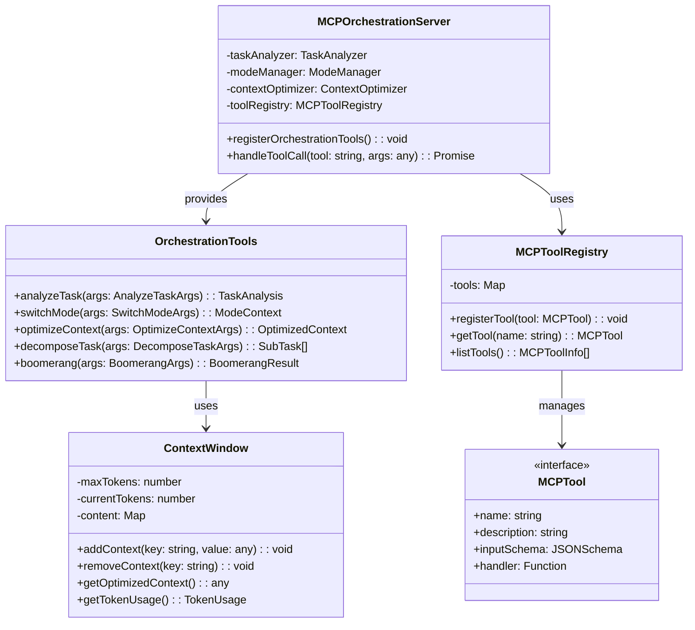

# フェーズ4: MCP拡張 - 詳細設計

## 概要

MCP（Model Context Protocol）拡張では、オーケストレーション機能をMCPツールとして提供し、タスク分解、モード切り替え、コンテキスト最適化などの機能を統合します。既存のMCPサーバーインフラストラクチャを拡張し、高度なタスク管理機能を提供します。

**📌 参考実装**: RooCode（RooCline）のオーケストレーション実装を参考にしてください：
- GitHub: https://github.com/RooCodeInc/Roo-Code
- UIthub: https://uithub.com/RooCodeInc/Roo-Code
- DeepWiki: https://deepwiki.com/RooCodeInc/Roo-Code

**💡 重要な点**: RooCodeの実装パターンを参考にしつつ、Claude Code Actionの環境に適応させることが重要です。

## アーキテクチャ



## TDD実装計画

### タスク5.1: MCP型定義の作成

#### 実装: src/mcp/orchestration-types.ts

```typescript
import type { TaskAnalysis, SubTask } from '../orchestration/types';
import type { Mode } from '../modes/types';

export interface MCPTool {
  name: string;
  description: string;
  inputSchema: JSONSchema;
  handler: (args: any) => Promise<any>;
}

export interface JSONSchema {
  type: string;
  properties?: Record<string, any>;
  required?: string[];
  additionalProperties?: boolean;
}

export interface AnalyzeTaskArgs {
  task: string;
  context?: Record<string, any>;
}

export interface SwitchModeArgs {
  mode: string;
  preserveContext?: boolean;
}

export interface OptimizeContextArgs {
  context: Record<string, any>;
  maxTokens: number;
  priorityKeys?: string[];
}

export interface DecomposeTaskArgs {
  task: string;
  maxSubtasks?: number;
  autoAssignModes?: boolean;
}

export interface BoomerangArgs {
  task: string;
  targetMode: string;
  returnContext?: boolean;
}

export interface OptimizedContext {
  context: Record<string, any>;
  tokensUsed: number;
  removedKeys: string[];
  compressionRatio: number;
}

export interface BoomerangResult {
  result: string;
  mode: string;
  tokensUsed: number;
  duration: number;
}

export interface TokenUsage {
  current: number;
  max: number;
  percentage: number;
}

export interface ContextItem {
  key: string;
  value: any;
  tokens: number;
  priority: number;
  timestamp: Date;
}

export interface MCPToolInfo {
  name: string;
  description: string;
  category: string;
  version: string;
}
```

### タスク5.2: オーケストレーションツールの実装

#### テストファースト: src/mcp/orchestration-tools.ts

```typescript
// test/mcp/orchestration-tools.test.ts
import { describe, test, expect, beforeEach } from 'bun:test';
import { OrchestrationTools } from '../../src/mcp/orchestration-tools';
import type { AnalyzeTaskArgs, SwitchModeArgs } from '../../src/mcp/orchestration-types';

describe('OrchestrationTools', () => {
  let tools: OrchestrationTools;

  beforeEach(() => {
    tools = new OrchestrationTools();
  });

  test('should analyze task complexity', async () => {
    const args: AnalyzeTaskArgs = {
      task: 'Implement user authentication with OAuth2 and JWT tokens',
      context: { framework: 'Express.js' }
    };

    const analysis = await tools.analyzeTask(args);

    expect(analysis.complexity).toBeGreaterThan(5);
    expect(analysis.requiredModes).toContain('code');
    expect(analysis.requiresOrchestration).toBe(true);
  });

  test('should switch mode with context preservation', async () => {
    const args: SwitchModeArgs = {
      mode: 'architect',
      preserveContext: true
    };

    const result = await tools.switchMode(args);

    expect(result.mode.slug).toBe('architect');
    expect(result.previousMode).toBeDefined();
    expect(result.contextPreserved).toBe(true);
  });

  test('should optimize context for token limit', async () => {
    const largeContext = {
      fileContents: 'Large file content...'.repeat(1000),
      history: ['Previous command 1', 'Previous command 2'],
      metadata: { timestamp: new Date(), user: 'test' }
    };

    const args = {
      context: largeContext,
      maxTokens: 1000,
      priorityKeys: ['fileContents']
    };

    const optimized = await tools.optimizeContext(args);

    expect(optimized.tokensUsed).toBeLessThanOrEqual(1000);
    expect(optimized.removedKeys.length).toBeGreaterThan(0);
    expect(optimized.compressionRatio).toBeGreaterThan(0.5);
  });

  test('should decompose complex task into subtasks', async () => {
    const args = {
      task: `Build a complete e-commerce platform with:
        - User authentication system
        - Product catalog management
        - Shopping cart functionality
        - Payment processing
        - Order tracking`,
      maxSubtasks: 10,
      autoAssignModes: true
    };

    const subtasks = await tools.decomposeTask(args);

    expect(subtasks.length).toBeGreaterThan(3);
    expect(subtasks.length).toBeLessThanOrEqual(10);
    expect(subtasks.every(st => st.mode)).toBe(true);
    expect(subtasks.some(st => st.dependencies.length > 0)).toBe(true);
  });

  test('should handle boomerang pattern for mode delegation', async () => {
    const args = {
      task: 'Debug memory leak in payment processor',
      targetMode: 'debug',
      returnContext: true
    };

    const result = await tools.boomerang(args);

    expect(result.mode).toBe('debug');
    expect(result.result).toContain('memory');
    expect(result.tokensUsed).toBeGreaterThan(0);
  });
});
```

#### 実装: src/mcp/orchestration-tools.ts

```typescript
import { TaskAnalyzer } from '../orchestration/task-analyzer';
import { modeManager } from '../modes/mode-manager';
import { ContextOptimizer } from '../orchestration/context-optimizer';
import { SubtaskGenerator } from '../orchestration/subtask-generator';
import type {
  AnalyzeTaskArgs,
  SwitchModeArgs,
  OptimizeContextArgs,
  DecomposeTaskArgs,
  BoomerangArgs,
  OptimizedContext,
  BoomerangResult
} from './orchestration-types';
import type { TaskAnalysis, SubTask } from '../orchestration/types';
import type { Mode } from '../modes/types';

export class OrchestrationTools {
  private taskAnalyzer: TaskAnalyzer;
  private contextOptimizer: ContextOptimizer;
  private subtaskGenerator: SubtaskGenerator;
  private currentMode: Mode;

  constructor() {
    this.taskAnalyzer = new TaskAnalyzer();
    this.contextOptimizer = new ContextOptimizer();
    this.subtaskGenerator = new SubtaskGenerator();
    this.currentMode = modeManager.getDefaultMode();
  }

  async analyzeTask(args: AnalyzeTaskArgs): Promise<TaskAnalysis> {
    const { task, context } = args;

    // Analyze task complexity
    const analysis = this.taskAnalyzer.analyzeTask(task);

    // Enhance analysis with context if provided
    if (context) {
      analysis.suggestedApproach = this.enhanceApproachWithContext(
        analysis.suggestedApproach,
        context
      );
    }

    return analysis;
  }

  async switchMode(args: SwitchModeArgs): Promise<{
    mode: Mode;
    previousMode: Mode;
    contextPreserved: boolean;
  }> {
    const { mode: modeSlug, preserveContext = false } = args;

    const previousMode = this.currentMode;
    const newMode = modeManager.getModeBySlug(modeSlug);

    this.currentMode = newMode;

    return {
      mode: newMode,
      previousMode,
      contextPreserved: preserveContext
    };
  }

  async optimizeContext(args: OptimizeContextArgs): Promise<OptimizedContext> {
    const { context, maxTokens, priorityKeys = [] } = args;

    return this.contextOptimizer.optimizeContext({
      context,
      maxTokens,
      priorityKeys
    });
  }

  async decomposeTask(args: DecomposeTaskArgs): Promise<SubTask[]> {
    const { task, maxSubtasks = 10, autoAssignModes = true } = args;

    // Analyze task first
    const analysis = await this.analyzeTask({ task });

    // Generate subtasks
    const subtasks = this.subtaskGenerator.generateSubtasks(analysis);

    // Limit number of subtasks
    const limitedSubtasks = subtasks.slice(0, maxSubtasks);

    // Auto-assign modes if requested
    if (autoAssignModes) {
      return limitedSubtasks.map(subtask => ({
        ...subtask,
        mode: subtask.mode || this.selectOptimalMode(subtask.description)
      }));
    }

    return limitedSubtasks;
  }

  async boomerang(args: BoomerangArgs): Promise<BoomerangResult> {
    const { task, targetMode, returnContext = false } = args;
    const startTime = Date.now();

    // Switch to target mode
    const switchResult = await this.switchMode({
      mode: targetMode,
      preserveContext: returnContext
    });

    // Execute task in target mode (simulated)
    const result = await this.executeInMode(task, switchResult.mode);

    // Return to previous mode if context was preserved
    if (returnContext) {
      await this.switchMode({
        mode: switchResult.previousMode.slug,
        preserveContext: true
      });
    }

    return {
      result: result.output,
      mode: targetMode,
      tokensUsed: result.tokensUsed,
      duration: Date.now() - startTime
    };
  }

  private enhanceApproachWithContext(
    approach: string,
    context: Record<string, any>
  ): string {
    const contextInfo = Object.entries(context)
      .map(([key, value]) => `${key}: ${value}`)
      .join(', ');

    return `${approach} Context: ${contextInfo}`;
  }

  private selectOptimalMode(taskDescription: string): string {
    const modeSelector = new (require('../orchestration/mode-selector').ModeSelector)();
    return modeSelector.selectOptimalMode(taskDescription);
  }

  private async executeInMode(
    task: string,
    mode: Mode
  ): Promise<{ output: string; tokensUsed: number }> {
    // Simulate execution in specific mode
    const baseTokens = 500;
    const complexityMultiplier = task.length / 100;

    return {
      output: `Executed "${task}" in ${mode.name} mode. ${mode.roleDefinition}`,
      tokensUsed: Math.floor(baseTokens * complexityMultiplier)
    };
  }
}
```

### タスク5.3: MCPサーバー統合の実装

#### テストファースト: src/mcp/orchestration-server.ts

```typescript
// test/mcp/orchestration-server.test.ts
import { describe, test, expect, beforeEach } from 'bun:test';
import { MCPOrchestrationServer } from '../../src/mcp/orchestration-server';

describe('MCPOrchestrationServer', () => {
  let server: MCPOrchestrationServer;

  beforeEach(() => {
    server = new MCPOrchestrationServer();
  });

  test('should register orchestration tools', () => {
    server.registerOrchestrationTools();

    const tools = server.listTools();
    const toolNames = tools.map(t => t.name);

    expect(toolNames).toContain('analyze_task');
    expect(toolNames).toContain('switch_mode');
    expect(toolNames).toContain('optimize_context');
    expect(toolNames).toContain('decompose_task');
    expect(toolNames).toContain('boomerang');
  });

  test('should handle analyze_task tool call', async () => {
    server.registerOrchestrationTools();

    const result = await server.handleToolCall('analyze_task', {
      task: 'Implement user authentication'
    });

    expect(result).toHaveProperty('complexity');
    expect(result).toHaveProperty('requiredModes');
  });

  test('should handle switch_mode tool call', async () => {
    server.registerOrchestrationTools();

    const result = await server.handleToolCall('switch_mode', {
      mode: 'architect'
    });

    expect(result.mode.slug).toBe('architect');
  });

  test('should handle optimize_context tool call', async () => {
    server.registerOrchestrationTools();

    const result = await server.handleToolCall('optimize_context', {
      context: { data: 'Large context data'.repeat(100) },
      maxTokens: 500
    });

    expect(result.tokensUsed).toBeLessThanOrEqual(500);
  });

  test('should validate tool arguments', async () => {
    server.registerOrchestrationTools();

    await expect(
      server.handleToolCall('analyze_task', {})
    ).rejects.toThrow('Missing required argument: task');
  });

  test('should handle unknown tool gracefully', async () => {
    await expect(
      server.handleToolCall('unknown_tool', {})
    ).rejects.toThrow('Unknown tool: unknown_tool');
  });
});
```

#### 実装: src/mcp/orchestration-server.ts

```typescript
import { OrchestrationTools } from './orchestration-tools';
import { MCPToolRegistry } from './tool-registry';
import type { MCPTool, MCPToolInfo } from './orchestration-types';

export class MCPOrchestrationServer {
  private toolRegistry: MCPToolRegistry;
  private orchestrationTools: OrchestrationTools;

  constructor() {
    this.toolRegistry = new MCPToolRegistry();
    this.orchestrationTools = new OrchestrationTools();
  }

  registerOrchestrationTools(): void {
    // Register analyze_task tool
    this.toolRegistry.registerTool({
      name: 'analyze_task',
      description: 'Analyze task complexity and determine required modes',
      inputSchema: {
        type: 'object',
        properties: {
          task: { type: 'string', description: 'Task description to analyze' },
          context: { type: 'object', description: 'Optional context information' }
        },
        required: ['task'],
        additionalProperties: false
      },
      handler: async (args) => this.orchestrationTools.analyzeTask(args)
    });

    // Register switch_mode tool
    this.toolRegistry.registerTool({
      name: 'switch_mode',
      description: 'Switch to a different AI mode',
      inputSchema: {
        type: 'object',
        properties: {
          mode: { type: 'string', description: 'Target mode slug' },
          preserveContext: { type: 'boolean', description: 'Preserve current context' }
        },
        required: ['mode'],
        additionalProperties: false
      },
      handler: async (args) => this.orchestrationTools.switchMode(args)
    });

    // Register optimize_context tool
    this.toolRegistry.registerTool({
      name: 'optimize_context',
      description: 'Optimize context to fit within token limits',
      inputSchema: {
        type: 'object',
        properties: {
          context: { type: 'object', description: 'Context to optimize' },
          maxTokens: { type: 'number', description: 'Maximum token limit' },
          priorityKeys: {
            type: 'array',
            items: { type: 'string' },
            description: 'Keys to prioritize'
          }
        },
        required: ['context', 'maxTokens'],
        additionalProperties: false
      },
      handler: async (args) => this.orchestrationTools.optimizeContext(args)
    });

    // Register decompose_task tool
    this.toolRegistry.registerTool({
      name: 'decompose_task',
      description: 'Decompose a complex task into subtasks',
      inputSchema: {
        type: 'object',
        properties: {
          task: { type: 'string', description: 'Task to decompose' },
          maxSubtasks: { type: 'number', description: 'Maximum number of subtasks' },
          autoAssignModes: { type: 'boolean', description: 'Auto-assign modes to subtasks' }
        },
        required: ['task'],
        additionalProperties: false
      },
      handler: async (args) => this.orchestrationTools.decomposeTask(args)
    });

    // Register boomerang tool
    this.toolRegistry.registerTool({
      name: 'boomerang',
      description: 'Delegate task to specific mode and return',
      inputSchema: {
        type: 'object',
        properties: {
          task: { type: 'string', description: 'Task to delegate' },
          targetMode: { type: 'string', description: 'Target mode for delegation' },
          returnContext: { type: 'boolean', description: 'Return to original mode after' }
        },
        required: ['task', 'targetMode'],
        additionalProperties: false
      },
      handler: async (args) => this.orchestrationTools.boomerang(args)
    });

    // Register list_modes tool
    this.toolRegistry.registerTool({
      name: 'list_modes',
      description: 'List all available AI modes',
      inputSchema: {
        type: 'object',
        properties: {},
        additionalProperties: false
      },
      handler: async () => {
        const modeManager = require('../modes/mode-manager').modeManager;
        return modeManager.getAllModes();
      }
    });

    // Register get_context_usage tool
    this.toolRegistry.registerTool({
      name: 'get_context_usage',
      description: 'Get current context token usage',
      inputSchema: {
        type: 'object',
        properties: {},
        additionalProperties: false
      },
      handler: async () => {
        // Simulate context usage tracking
        return {
          current: 2500,
          max: 4000,
          percentage: 62.5
        };
      }
    });
  }

  async handleToolCall(toolName: string, args: any): Promise<any> {
    const tool = this.toolRegistry.getTool(toolName);

    if (!tool) {
      throw new Error(`Unknown tool: ${toolName}`);
    }

    // Validate arguments
    this.validateArguments(tool, args);

    // Execute tool handler
    return await tool.handler(args);
  }

  listTools(): MCPToolInfo[] {
    return this.toolRegistry.listTools();
  }

  private validateArguments(tool: MCPTool, args: any): void {
    const schema = tool.inputSchema;

    // Check required properties
    if (schema.required) {
      for (const required of schema.required) {
        if (!(required in args)) {
          throw new Error(`Missing required argument: ${required}`);
        }
      }
    }

    // Type validation could be more comprehensive
    // This is a simplified version
    if (schema.properties) {
      for (const [key, prop] of Object.entries(schema.properties)) {
        if (key in args) {
          const value = args[key];
          const expectedType = (prop as any).type;

          if (expectedType === 'string' && typeof value !== 'string') {
            throw new Error(`Invalid type for ${key}: expected string`);
          } else if (expectedType === 'number' && typeof value !== 'number') {
            throw new Error(`Invalid type for ${key}: expected number`);
          } else if (expectedType === 'boolean' && typeof value !== 'boolean') {
            throw new Error(`Invalid type for ${key}: expected boolean`);
          } else if (expectedType === 'object' && typeof value !== 'object') {
            throw new Error(`Invalid type for ${key}: expected object`);
          }
        }
      }
    }
  }
}

// Tool Registry implementation
class MCPToolRegistry {
  private tools: Map<string, MCPTool>;

  constructor() {
    this.tools = new Map();
  }

  registerTool(tool: MCPTool): void {
    this.tools.set(tool.name, tool);
  }

  getTool(name: string): MCPTool | undefined {
    return this.tools.get(name);
  }

  listTools(): MCPToolInfo[] {
    return Array.from(this.tools.values()).map(tool => ({
      name: tool.name,
      description: tool.description,
      category: 'orchestration',
      version: '1.0.0'
    }));
  }
}
```

### タスク5.4: コンテキストウィンドウ管理の実装

#### 実装: src/mcp/context-window.ts

```typescript
import type { ContextItem, TokenUsage } from './orchestration-types';

export class ContextWindow {
  private maxTokens: number;
  private content: Map<string, ContextItem>;
  private tokenCalculator: TokenCalculator;

  constructor(maxTokens: number = 4000) {
    this.maxTokens = maxTokens;
    this.content = new Map();
    this.tokenCalculator = new TokenCalculator();
  }

  addContext(key: string, value: any, priority: number = 1): void {
    const tokens = this.tokenCalculator.calculateTokens(value);

    // Check if adding would exceed limit
    if (this.getCurrentTokens() + tokens > this.maxTokens) {
      this.makeSpace(tokens);
    }

    this.content.set(key, {
      key,
      value,
      tokens,
      priority,
      timestamp: new Date()
    });
  }

  removeContext(key: string): void {
    this.content.delete(key);
  }

  getOptimizedContext(): any {
    const context: Record<string, any> = {};

    // Sort by priority (descending) and timestamp (newer first)
    const sortedItems = Array.from(this.content.values()).sort((a, b) => {
      if (a.priority !== b.priority) {
        return b.priority - a.priority;
      }
      return b.timestamp.getTime() - a.timestamp.getTime();
    });

    for (const item of sortedItems) {
      context[item.key] = item.value;
    }

    return context;
  }

  getTokenUsage(): TokenUsage {
    const current = this.getCurrentTokens();
    return {
      current,
      max: this.maxTokens,
      percentage: (current / this.maxTokens) * 100
    };
  }

  private getCurrentTokens(): number {
    return Array.from(this.content.values())
      .reduce((sum, item) => sum + item.tokens, 0);
  }

  private makeSpace(neededTokens: number): void {
    const currentTokens = this.getCurrentTokens();
    const targetTokens = this.maxTokens - neededTokens;

    if (currentTokens <= targetTokens) return;

    // Sort by priority (ascending) and timestamp (older first) for removal
    const itemsToRemove = Array.from(this.content.values()).sort((a, b) => {
      if (a.priority !== b.priority) {
        return a.priority - b.priority;
      }
      return a.timestamp.getTime() - b.timestamp.getTime();
    });

    let removedTokens = 0;
    for (const item of itemsToRemove) {
      this.content.delete(item.key);
      removedTokens += item.tokens;

      if (currentTokens - removedTokens <= targetTokens) {
        break;
      }
    }
  }
}

class TokenCalculator {
  calculateTokens(value: any): number {
    if (typeof value === 'string') {
      // Rough approximation: 1 token per 4 characters
      return Math.ceil(value.length / 4);
    } else if (typeof value === 'object') {
      const jsonString = JSON.stringify(value);
      return Math.ceil(jsonString.length / 4);
    } else {
      return 10; // Default for simple values
    }
  }
}
```

## コミット計画

### コミット1: MCP型定義
```bash
git add src/mcp/orchestration-types.ts
git commit -m "feat(mcp): add MCP orchestration type definitions"
```

### コミット2: オーケストレーションツール
```bash
git add src/mcp/orchestration-tools.ts test/mcp/orchestration-tools.test.ts
git commit -m "feat(mcp): implement orchestration tools with tests"
```

### コミット3: MCPサーバー統合
```bash
git add src/mcp/orchestration-server.ts test/mcp/orchestration-server.test.ts
git commit -m "feat(mcp): implement MCP server integration with tool registry"
```

### コミット4: コンテキストウィンドウ管理
```bash
git add src/mcp/context-window.ts test/mcp/context-window.test.ts
git commit -m "feat(mcp): implement context window management"
```

### コミット5: エクスポートと統合
```bash
git add src/mcp/index.ts test/mcp/integration.test.ts
git commit -m "feat(mcp): add exports and integration tests"
```

## ディレクトリ構造

```
src/
├── mcp/
│   ├── orchestration-types.ts    # MCP型定義
│   ├── orchestration-tools.ts    # オーケストレーションツール実装
│   ├── orchestration-server.ts   # MCPサーバー統合
│   ├── context-window.ts         # コンテキストウィンドウ管理
│   ├── tool-registry.ts          # ツールレジストリ
│   └── index.ts                  # エクスポート

test/
└── mcp/
    ├── orchestration-tools.test.ts
    ├── orchestration-server.test.ts
    ├── context-window.test.ts
    └── integration.test.ts
```

## 統合テスト

```typescript
// test/mcp/integration.test.ts
import { describe, test, expect } from 'bun:test';
import { MCPOrchestrationServer } from '../../src/mcp/orchestration-server';

describe('MCP Orchestration Integration', () => {
  test('should handle complete orchestration workflow via MCP', async () => {
    const server = new MCPOrchestrationServer();
    server.registerOrchestrationTools();

    // 1. Analyze complex task
    const analysis = await server.handleToolCall('analyze_task', {
      task: `Create a complete user management system with:
        - Authentication and authorization
        - User profile management
        - Admin dashboard
        - Email notifications`
    });

    expect(analysis.requiresOrchestration).toBe(true);

    // 2. Decompose into subtasks
    const subtasks = await server.handleToolCall('decompose_task', {
      task: analysis.suggestedApproach,
      maxSubtasks: 5,
      autoAssignModes: true
    });

    expect(subtasks.length).toBeGreaterThan(2);
    expect(subtasks.every(st => st.mode)).toBe(true);

    // 3. Switch modes for different subtasks
    for (const subtask of subtasks) {
      const modeResult = await server.handleToolCall('switch_mode', {
        mode: subtask.mode,
        preserveContext: true
      });

      expect(modeResult.mode.slug).toBe(subtask.mode);
    }

    // 4. Use boomerang for specific task
    const debugResult = await server.handleToolCall('boomerang', {
      task: 'Debug authentication issues',
      targetMode: 'debug',
      returnContext: true
    });

    expect(debugResult.mode).toBe('debug');
    expect(debugResult.result).toContain('Debug');

    // 5. Check context usage
    const usage = await server.handleToolCall('get_context_usage', {});
    expect(usage.percentage).toBeLessThanOrEqual(100);
  });

  test('should optimize large contexts effectively', async () => {
    const server = new MCPOrchestrationServer();
    server.registerOrchestrationTools();

    const largeContext = {
      files: Array(50).fill('Large file content...').join('\n'),
      history: Array(100).fill('Command history').join('\n'),
      metadata: {
        timestamp: new Date(),
        user: 'test',
        environment: 'development'
      }
    };

    const optimized = await server.handleToolCall('optimize_context', {
      context: largeContext,
      maxTokens: 1000,
      priorityKeys: ['files']
    });

    expect(optimized.tokensUsed).toBeLessThanOrEqual(1000);
    expect(optimized.compressionRatio).toBeGreaterThan(0);
    expect(optimized.context).toHaveProperty('files');
  });
});
```

## MCPサーバー設定

```json
// mcp-config.json
{
  "mcpServers": {
    "orchestration": {
      "command": "node",
      "args": ["./dist/mcp/server.js"],
      "tools": [
        "analyze_task",
        "switch_mode",
        "optimize_context",
        "decompose_task",
        "boomerang",
        "list_modes",
        "get_context_usage"
      ]
    }
  }
}
```

## 実行手順

### 実行フロー
```bash
# 1. phase3-github-actions から作業ブランチを作成
git checkout phase3-github-actions
git pull origin phase3-github-actions # 念のため最新化
git checkout -b phase4-mcp-extension phase3-github-actions

# 2. AI実装（Claude Code、Cursor等）
# TDDに従ってテストファーストで実装 (プロジェクトルートで行う)

# 3. プリコミットチェック
bun test && bun run format:check && bun run typecheck

# 4. コミット
git add .
git commit -m "feat(mcp-extension): implement MCP extension" # コミットメッセージは適宜変更

# 5. プッシュしてPR作成
git push origin phase4-mcp-extension

# 6. GitHubでPR作成・レビュー・マージ
#    PRのターゲットブランチは phase3-github-actions とする

# 7. クリーンアップ (PRマージ後)
git checkout phase3-github-actions
git pull origin phase3-github-actions # リモートの変更を取り込み最新化
git branch -d phase4-mcp-extension # ローカルの作業ブランチを削除
# git push origin --delete phase4-mcp-extension # (任意) リモートの作業ブランチも削除する場合
```

### 詳細ステップ（TDD）
```bash
# 1. phase3-github-actions から作業ブランチ作成
git checkout phase3-github-actions
git pull origin phase3-github-actions # 念のため最新化
git checkout -b phase4-mcp-extension phase3-github-actions

# プロジェクトルートで作業を進める

# (テストファイル作成、テスト実行、実装、スクリプト実行などはドキュメントの各フェーズに従う)
# ... (省略) ...

# X. プリコミットチェック (実装完了後)
bun test && bun run format:check && bun run typecheck

# Y. コミット
git add .
git commit -m "feat(mcp-extension): implement MCP extension" # コミットメッセージは適宜変更

# Z. 統合 (PR経由でのマージ)
#    上記「実行フロー」のステップ5以降に従ってPRを作成し、マージする
git push origin phase4-mcp-extension
# GitHub上で phase3-github-actions をターゲットブランチとしてPRを作成・レビュー・マージ
# マージ後、ローカルブランチをクリーンアップ
git checkout phase3-github-actions
git pull origin phase3-github-actions
git branch -d phase4-mcp-extension
```

## 依存関係

このフェーズは以下のフェーズ完了後に実装してください：
- フェーズ1: モードシステム（モード管理）
- フェーズ2: オーケストレーション（タスク分析、コンテキスト最適化）
- フェーズ3.2: GitHub Actions統合（実行基盤）

## 次のステップ

1. フェーズ5で統合テストと最適化を実施
2. MCPツールのドキュメントを作成
3. Claude CodeエディタとのMCP統合をテスト

**💡 重要な点**: MCPツールとして提供することで、オーケストレーション機能を他のMCP対応ツールからも利用可能にし、エコシステム全体の価値を高めることが重要です。
