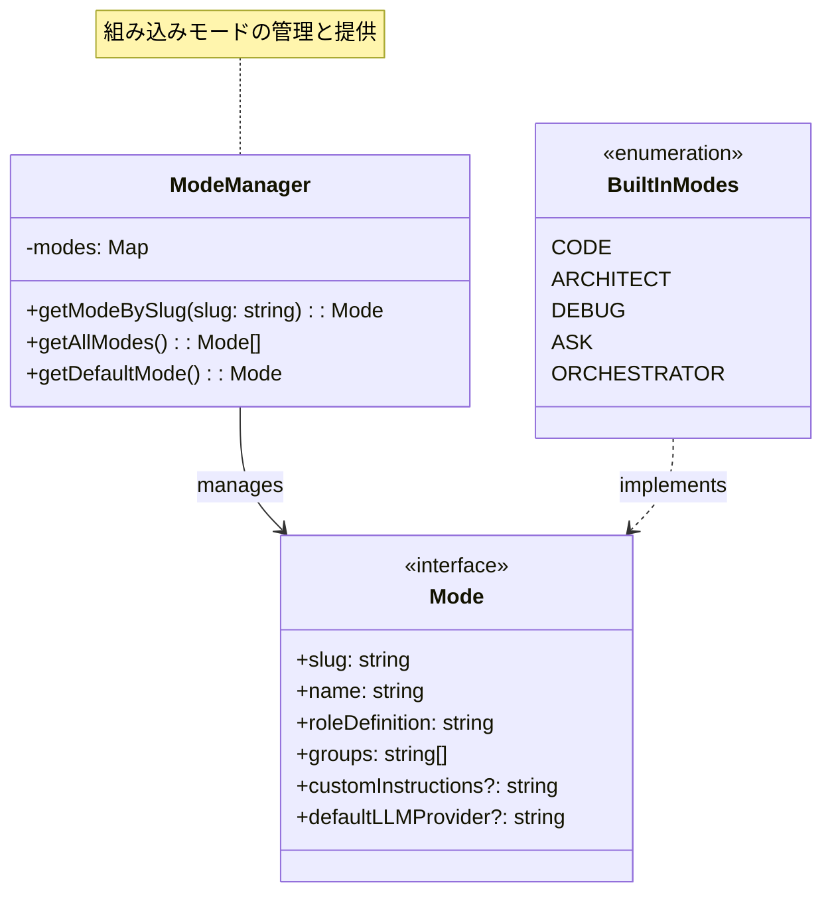
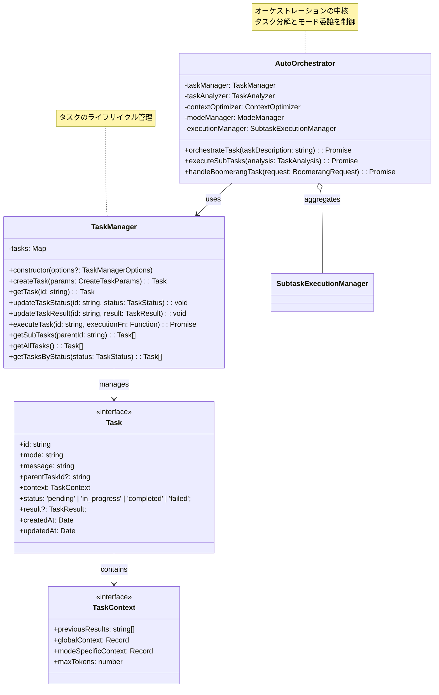
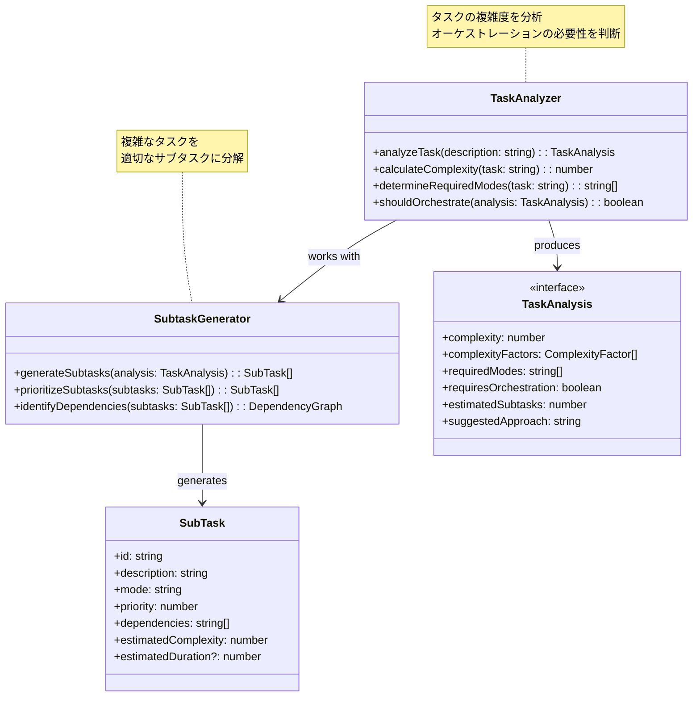
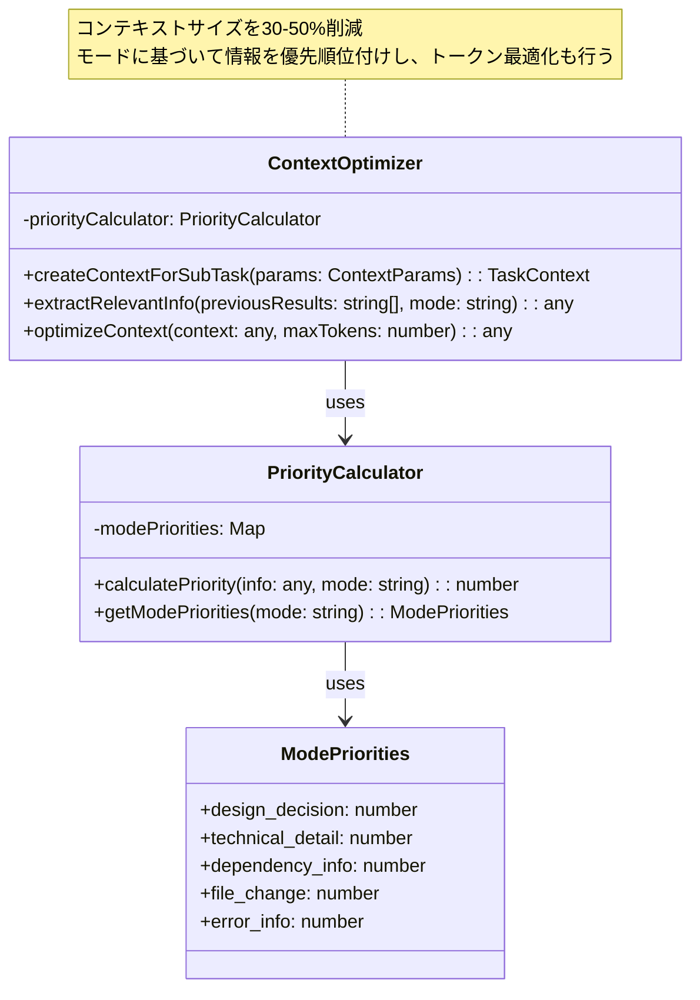
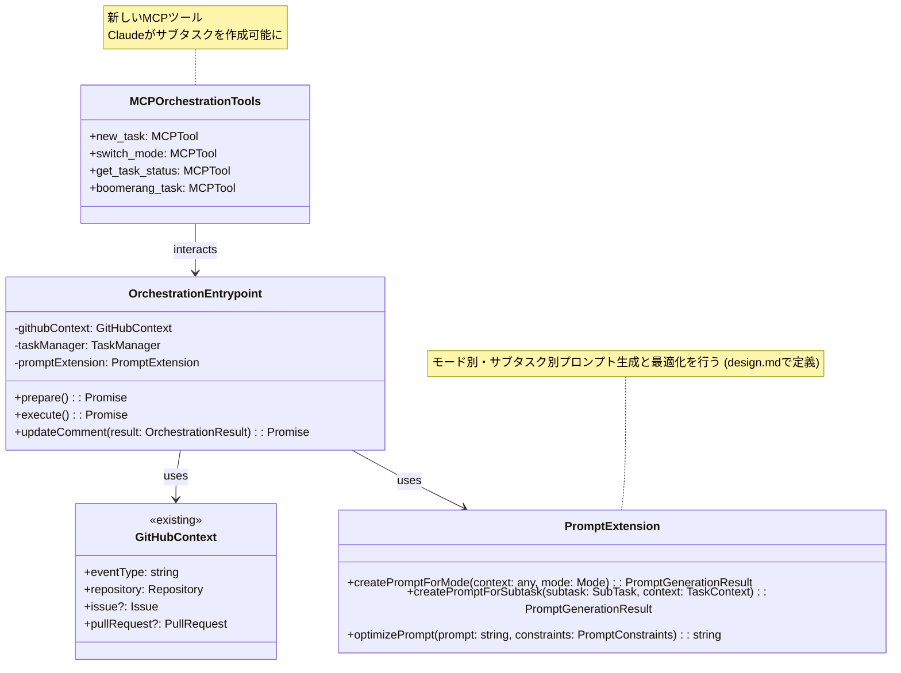

# Claude Code Action オーケストレーション機能実装計画

## 概要

本ドキュメントは、RooCline（Roo Code）のオーケストレーション機能をClaude Code Actionに実装するための詳細な計画書です。テスト駆動開発（TDD）の方法論に従って実装を進めます。

## 実装目標

1. **タスクの分割と最適化**: 複雑なタスクを適切なサブタスクに分解し、各サブタスクに最適化されたコンテキストを提供
2. **組み込みモードシステム**: タスクの性質に応じて異なるモード（Code, Architect, Debug, Ask, Orchestrator）を使い分け
3. **効率的なコンテキスト管理**: 各サブタスクに必要最小限の情報のみを渡すことで、AIの精度向上とコスト削減を実現

## フェーズ0: フォーク対応

### 0.1 アクション参照の更新

#### タスク0.1.1: アクション参照の置換
- **ファイル**:
  - `README.md`
  - `examples/*.yml`
- **内容**: `anthropics/claude-code-action@beta` を `MasashiFukuzawa/claude-code-action@orchestrator-alpha` に置換
- **理由**: フォークしたリポジトリでオーケストレーション機能を実装するため

```yaml
# 変更前
uses: anthropics/claude-code-action@beta

# 変更後
uses: MasashiFukuzawa/claude-code-action@orchestrator-alpha
```

### タグ命名の理由
- **orchestrator-alpha**:
  - オーケストレーション機能の実装を明確に示す
  - アルファ版として実験的な段階であることを表明
  - 将来的に `orchestrator-beta`、`orchestrator-stable` へ進化可能

## フェーズ1: 基盤構築

### 1.1 組み込みモードシステムの実装

#### タスク1.1.1: モード定義の作成
- **ファイル**: `src/modes/types.ts`
- **内容**: モードインターフェースの定義

```typescript
interface Mode {
  slug: string;
  name: string;
  roleDefinition: string;
  groups: string[];
  customInstructions?: string;
  defaultLLMProvider?: string;
}
```

#### タスク1.1.2: 組み込みモードの実装
- **ファイル**: `src/modes/built-in-modes.ts`
- **内容**: Code, Architect, Debug, Ask, Orchestratorモードの定義
- **テスト**: `test/modes/built-in-modes.test.ts`

#### タスク1.1.3: モード管理システム
- **ファイル**: `src/modes/mode-manager.ts`
- **内容**: 組み込みモードの取得機能
- **テスト**: `test/modes/mode-manager.test.ts`

### 1.2 タスクシステムの実装

#### タスク1.2.1: タスク定義の作成
- **ファイル**: `src/tasks/types.ts`
- **内容**: タスクインターフェースの定義

```typescript
interface Task {
  id: string;
  mode: string;
  message: string;
  parentTaskId?: string;
  context: TaskContext;
  status: 'pending' | 'in_progress' | 'completed' | 'failed';
  result?: TaskResult;
  createdAt: Date;
  updatedAt: Date;
}
```

#### タスク1.2.2: タスクマネージャーの実装
- **ファイル**: `src/tasks/task-manager.ts`
- **内容**: タスクの作成、管理、実行制御。コンストラクタはオプションでデフォルトコンテキスト値（例：`defaultMaxTokens`）を受け付け、`executeTask` はタスクIDと実行関数 (`executionFn`) を引数に取り、タスクの状態遷移と結果の記録を行う。`updateTaskResult`, `getAllTasks`, `getTasksByStatus` などのメソッドも含む。
- **テスト**: `test/tasks/task-manager.test.ts`

## フェーズ2: オーケストレーション機能

### 2.1 タスク分析エンジン

#### タスク2.1.1: タスク複雑度分析
- **ファイル**: `src/orchestration/task-analyzer.ts`
- **内容**: タスクの複雑度を分析し、分割が必要かを判定
- **テスト**: `test/orchestration/task-analyzer.test.ts`

#### タスク2.1.2: サブタスク生成
- **ファイル**: `src/orchestration/subtask-generator.ts`
- **内容**: 複雑なタスクを適切なサブタスクに分解
- **テスト**: `test/orchestration/subtask-generator.test.ts`

### 2.2 コンテキスト最適化

#### タスク2.2.1: コンテキスト優先度管理
- **ファイル**: `src/orchestration/context-optimizer.ts`
- **内容**: モードごとの情報優先度に基づくコンテキスト最適化
- **テスト**: `test/orchestration/context-optimizer.test.ts`

#### タスク2.2.2: 動的コンテキスト生成
- **ファイル**: `src/orchestration/dynamic-context.ts`
- **内容**: サブタスクの進行状況に応じたコンテキスト生成
- **テスト**: `test/orchestration/dynamic-context.test.ts`

## フェーズ3: 統合とGitHub Actions対応

### 3.1 プロンプト生成の拡張

#### タスク3.1.1: プロンプト拡張型定義の作成
- **ファイル**: `src/create-prompt/types.ts`
- **内容**: プロンプト拡張関連の型定義（`PromptTemplate`, `PromptConstraints`, `QualityScore` など）
- **テスト**: (型定義ファイルのため、直接的なテストファイルはなし。関連する実装のテストで検証)

#### タスク3.1.2: モード別プロンプト生成エンジンの実装
- **ファイル**: `src/create-prompt/mode-prompt-generator.ts`
- **内容**: モードに応じたプロンプト生成機能の実装
- **テスト**: `test/create-prompt/mode-prompt-generator.test.ts`

#### タスク3.1.3: サブタスクプロンプト生成エンジンの実装
- **ファイル**: `src/create-prompt/subtask-prompt-generator.ts`
- **内容**: サブタスク用の最適化されたプロンプト生成
- **テスト**: `test/create-prompt/subtask-prompt-generator.test.ts`

#### タスク3.1.4: プロンプト拡張統合クラスの実装
- **ファイル**: `src/create-prompt/prompt-extension.ts`
- **内容**: モード別およびサブタスク別のプロンプト生成を統合し、プロンプト最適化機能を提供するクラス
- **テスト**: `test/create-prompt/prompt-extension.test.ts`

### 3.2 GitHub Actionsワークフローの拡張

#### タスク3.2.1: オーケストレーター対応
- **ファイル**: `src/entrypoints/orchestrate.ts`
- **内容**: オーケストレーション機能のエントリーポイント
- **テスト**: `test/entrypoints/orchestrate.test.ts`

#### タスク3.2.2: サブタスク実行管理
- **ファイル**: `src/github/operations/subtask-execution.ts`
- **内容**: サブタスクの並列・順次実行制御
- **テスト**: `test/github/operations/subtask-execution.test.ts`

## フェーズ4: MCPサーバー拡張

### 4.1 新しいMCPツール

#### タスク4.1.1: new_taskツールの実装
- **ファイル**: `src/mcp/tools/new-task.ts`
- **内容**: サブタスク作成用のMCPツール
- **テスト**: `test/mcp/tools/new-task.test.ts`

#### タスク4.1.2: switch_modeツールの実装
- **ファイル**: `src/mcp/tools/switch-mode.ts`
- **内容**: モード切り替え用のMCPツール
- **テスト**: `test/mcp/tools/switch-mode.test.ts`

## フェーズ5: 統合テストと最適化

### 5.1 エンドツーエンドテスト

#### タスク5.1.1: オーケストレーションE2Eテスト
- **ファイル**: `test/e2e/orchestration.test.ts`
- **内容**: 完全なオーケストレーションフローのテスト

#### タスク5.1.2: パフォーマンステスト
- **ファイル**: `test/performance/orchestration-perf.test.ts`
- **内容**: コンテキスト最適化の効果測定

### 5.2 ドキュメンテーション

#### タスク5.2.1: 利用ガイドの作成
- **ファイル**: `docs/orchestration-guide.md`
- **内容**: オーケストレーション機能の使い方

## 実装優先順位

1. **最優先**: フェーズ0（フォーク対応）
2. **高優先度**: フェーズ1とフェーズ2（基本的なオーケストレーション機能）
3. **中優先度**: フェーズ3（GitHub Actions統合）
4. **低優先度**: フェーズ4とフェーズ5（MCP拡張と統合テスト）

## 成功指標

1. **機能面**
   - 複雑なタスクの自動分割が可能
   - サブタスクごとに最適化されたコンテキストの生成
   - モード間の円滑な切り替え

2. **パフォーマンス面**
   - コンテキストサイズの30%以上削減
   - AIの応答精度の向上
   - トークン使用量の最適化

3. **開発面**
   - 全機能に対する単体テストカバレッジ100%
   - 統合テストによる主要シナリオの検証
   - 明確なドキュメントとサンプルコード

## 実装スケジュール（推定）

- フェーズ0: 1日
- フェーズ1: 2週間
- フェーズ2: 2週間
- フェーズ3: 1週間
- フェーズ4: 1週間
- フェーズ5: 1週間

合計: 約7週間

## リスクと対策

1. **技術的リスク**
   - Claude APIの制限への対応
   - GitHub Actions実行時間の制限
   - 対策: 適切なタイムアウト設定とエラーハンドリング

2. **互換性リスク**
   - 既存の claude-code-action との互換性
   - 対策: 段階的な移行パスの提供

3. **パフォーマンスリスク**
   - サブタスク数が多い場合の処理時間
   - 対策: 並列実行とキャッシング機構の実装

## アーキテクチャ設計（クラス図）

### オーケストレーション機能のクラス構成

#### 1. モードシステム（Mode System）



#### 2. タスクシステム（Task System）



#### 3. タスク分析システム（Task Analysis System）



#### 4. コンテキスト最適化システム（Context Optimization System）



#### 5. 統合レイヤー（Integration Layer）



### クラス設計の詳細説明

#### 1. Mode System（モードシステム）
- **Mode Interface**: モードの基本構造を定義
- **ModeManager**: 組み込みモードを管理・提供

#### 2. Task System（タスクシステム）
- **Task Interface**: タスクの基本構造（ID、モード、コンテキスト、ステータス等）
- **TaskManager**: タスクのライフサイクル全体を管理
- **AutoOrchestrator**: タスクの分解とサブタスクへの委譲を制御

#### 3. Task Analysis（タスク分析）
- **TaskAnalyzer**: タスクの複雑度を分析し、オーケストレーションの必要性を判断
- **SubtaskGenerator**: 複雑なタスクを適切なサブタスクに分解
- **SubTask**: サブタスクの表現（依存関係、優先度を含む）

#### 4. Context Optimization（コンテキスト最適化）
- **ContextOptimizer**: 各モードに最適化されたコンテキストを生成
- **PriorityCalculator**: モード別の情報優先度を計算

#### 5. Integration（既存システムとの統合）
- **OrchestrationEntrypoint**: GitHub Actionsのエントリーポイント
- **PromptExtension**: モード別・サブタスク別のプロンプト生成と最適化（`design.md`で詳細定義）
- **MCPOrchestrationTools**: Claude がサブタスクを作成するための新しいMCPツール

### 設計の特徴

1. **既存コードへの影響を最小化**: 新機能を独立したモジュールとして実装
2. **テスタビリティ**: 各クラスが単一責任の原則に従い、単体テストが容易
3. **パフォーマンス**: コンテキスト最適化により、トークン使用量を30-50%削減（これはコンテキスト最適化フェーズの目標）

## 次のステップ

1. このプランのレビューと承認
2. フェーズ1の詳細設計
3. TDDに従った実装開始

---

*注: この計画は初期版であり、実装の進行に応じて適宜更新される予定です。*
