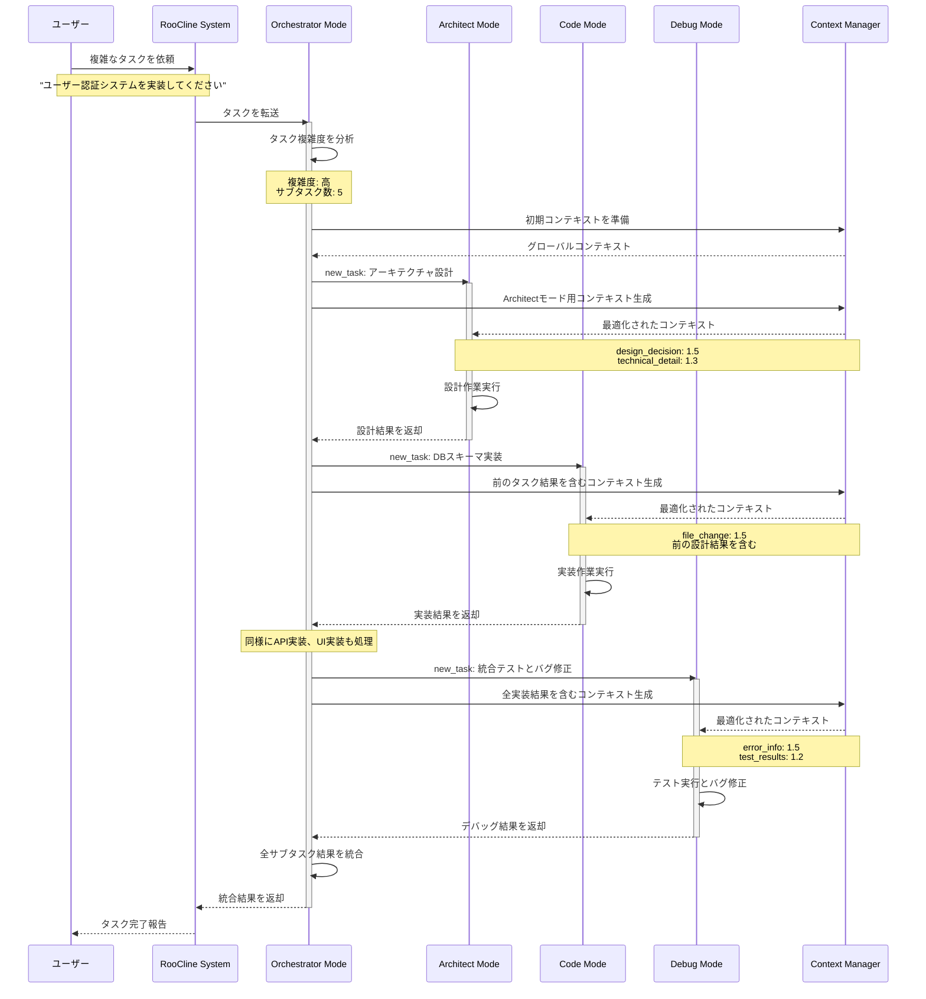
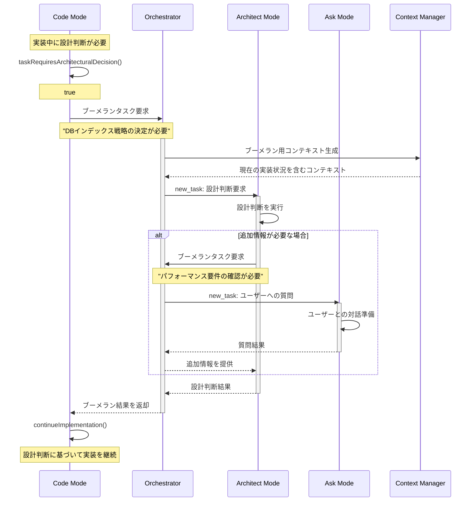
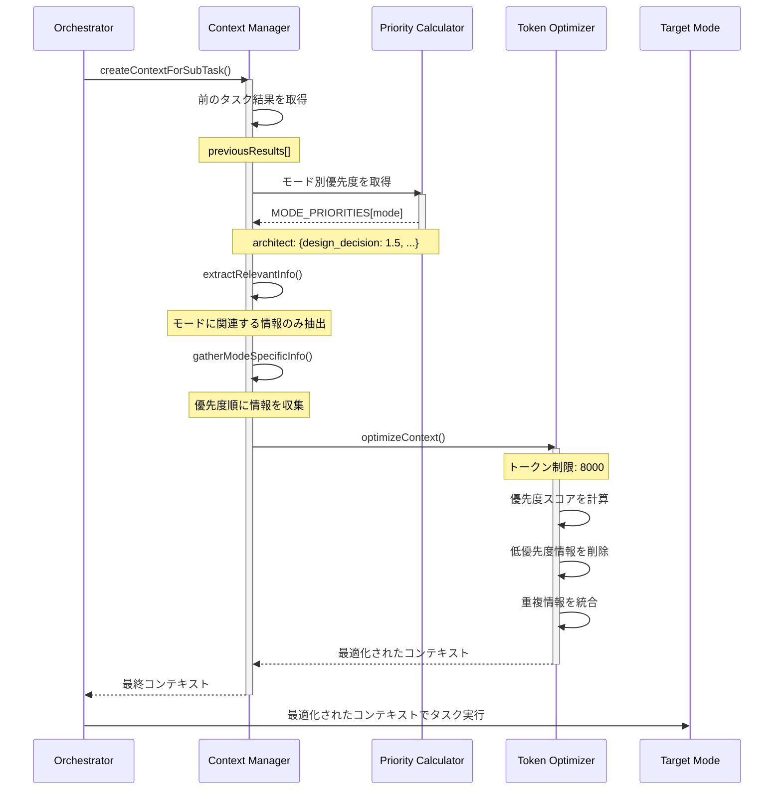
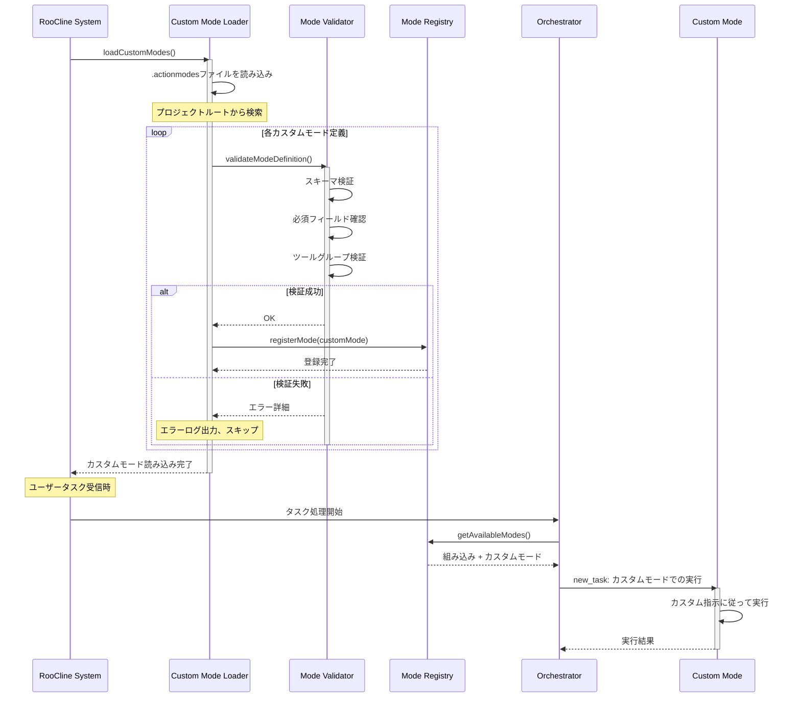
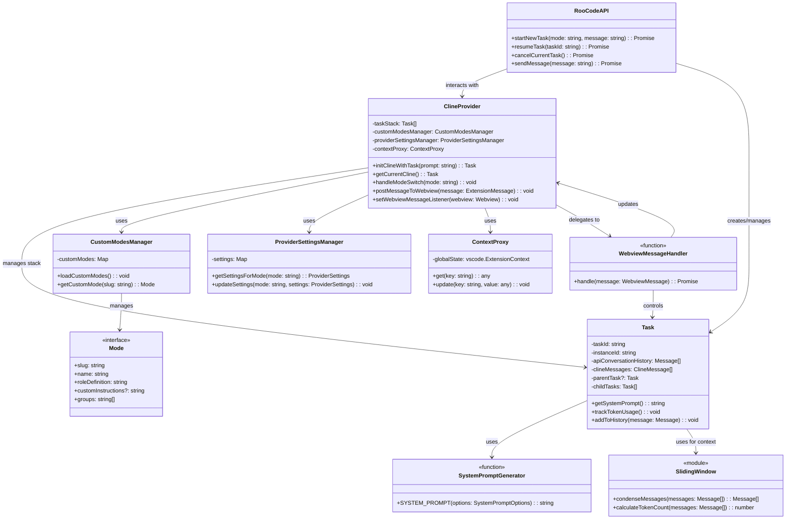

# RooCline (Roo Code) のオーケストレーション機能解説

## 概要

RooCline（現在は Roo Code）は、AI支援開発ツールにおいて「オーケストレーション」という革新的なアプローチを採用しています。この機能は、複雑なタスクを効率的に処理するために、タスクの分解、適切なモードへの委譲、そしてコンテキストの最適化を自動的に行います。

## 核心概念：なぜオーケストレーションが必要か？

### 従来の問題点
1. **クソデカコンテキスト問題**: 全ての情報をAIに渡すと、重要な情報が埋もれてしまう
2. **数撃ちゃ当たる戦略の限界**: 並列で複数の試行を行うとコストが膨大になる
3. **専門性の欠如**: 全てのタスクを同じ設定で処理すると、各タスクに最適な結果が得られない

### オーケストレーションによる解決
- **タスクの分解**: 大きな問題を管理可能な小さな部分に分割
- **専門モードの活用**: 各サブタスクに最適な専門モードを選択
- **コンテキストの最適化**: 各タスクに必要最小限の情報のみを提供

## モードシステムの詳細

### 1. Code Mode（コードモード）
```yaml
役割: 実際のコーディング作業を担当
アクセス可能なツール:
  - read（ファイル読み取り）
  - edit（ファイル編集）
  - browser（ブラウザ操作）
  - command（コマンド実行）
  - mcp（Model Context Protocol）
特徴: コード変更に焦点を当て、技術的詳細とエラー情報を優先
```

### 2. Architect Mode（アーキテクトモード）
```yaml
役割: システム設計と技術的意思決定
アクセス可能なツール: Code Modeと同様
特徴:
  - 設計決定を最優先
  - 技術的詳細と依存関係情報を重視
  - 実装前の計画立案に特化
```

### 3. Debug Mode（デバッグモード）
```yaml
役割: エラーの診断と修正
特徴:
  - エラー情報とスタックトレースを優先
  - 問題の根本原因分析に特化
  - 修正提案の生成
```

### 4. Ask Mode（質問モード）
```yaml
役割: 情報収集と明確化
特徴:
  - ユーザーとの対話を重視
  - 不明確な要件の明確化
  - 追加情報の収集
```

### 5. Orchestrator Mode（オーケストレーターモード）🪃
```yaml
役割: 戦略的なワークフロー調整
機能:
  - 複雑なタスクの分析
  - サブタスクへの分解
  - 適切なモードへの委譲
  - 進捗の追跡と調整
```

## オーケストレーションの動作フロー

### 1. タスク受信と分析
```xml
<!-- ユーザーからのタスク -->
「新しいユーザー認証システムを実装してください」
```

### 2. Orchestratorによる分解
```xml
<orchestration>
  <analysis>
    - タスクの複雑度: 高
    - 必要な専門性: 設計、実装、テスト
    - 推定サブタスク数: 5
  </analysis>

  <subtasks>
    <subtask id="1" mode="architect">
      認証システムのアーキテクチャ設計
    </subtask>
    <subtask id="2" mode="code">
      認証モデルとデータベーススキーマの実装
    </subtask>
    <subtask id="3" mode="code">
      認証APIエンドポイントの実装
    </subtask>
    <subtask id="4" mode="code">
      フロントエンド認証UIの実装
    </subtask>
    <subtask id="5" mode="debug">
      統合テストとバグ修正
    </subtask>
  </subtasks>
</orchestration>
```

### 3. new_task ツールによる委譲
```xml
<new_task>
  <mode>architect</mode>
  <message>
    ユーザー認証システムのアーキテクチャを設計してください。

    要件:
    - JWT基盤の認証
    - リフレッシュトークンのサポート
    - ロールベースのアクセス制御

    制約:
    - 既存のExpressアプリケーションとの統合
    - PostgreSQLデータベースの使用

    成果物:
    - アーキテクチャ図
    - 技術スタックの選定
    - 実装計画
  </message>
</new_task>
```

## コンテキスト最適化の仕組み

### モード別優先度設定
```typescript
const MODE_PRIORITIES = {
  architect: {
    design_decision: 1.5,      // 最優先
    technical_detail: 1.3,
    dependency_info: 1.2,
    file_change: 0.8,         // 低優先度
    error_info: 0.7
  },
  code: {
    file_change: 1.5,         // 最優先
    technical_detail: 1.3,
    error_info: 1.2,
    design_decision: 0.9,
    dependency_info: 0.8
  },
  debug: {
    error_info: 1.5,          // 最優先
    stack_trace: 1.4,
    recent_changes: 1.3,
    test_results: 1.2,
    design_decision: 0.7
  }
};
```

### 動的コンテキスト生成
```typescript
// サブタスク用のコンテキスト生成例
function createContextForSubTask(
  previousResults: string[],
  taskDescription: string,
  mode: string,
  maxTokens: number
) {
  // 1. 前のタスクの結果から必要な情報を抽出
  const relevantPreviousInfo = extractRelevantInfo(
    previousResults,
    mode
  );

  // 2. モード固有の情報を優先度順に収集
  const modeSpecificContext = gatherModeSpecificInfo(
    mode,
    MODE_PRIORITIES[mode]
  );

  // 3. トークン制限内で最適化
  return optimizeContext(
    relevantPreviousInfo,
    modeSpecificContext,
    taskDescription,
    maxTokens
  );
}
```

## ブーメランタスク機能

### 概念
「ブーメランタスク」は、あるモードが自身では処理できないタスクを検出し、適切なモードに「投げる」機能です。処理が完了すると、結果が元のモードに「戻ってくる」ことからこの名前が付けられています。

### 実装例
```typescript
// Codeモードでの実行中
if (taskRequiresArchitecturalDecision(currentTask)) {
  // Architectモードにブーメラン
  const architectResult = await boomerangTask({
    targetMode: 'architect',
    task: 'このデータベース設計の選択について判断してください',
    context: currentContext
  });

  // 結果を使って実装を継続
  continueImplementation(architectResult);
}
```

## カスタムモードの実装

### .actionmodes ファイル形式
```yaml
# プロジェクトルートの .actionmodes ファイル
custom_modes:
  - slug: "api-designer"
    name: "🌐 API Designer"
    role_definition: "RESTful APIとGraphQLスキーマの設計専門家"
    groups: ["read", "edit", "architect"]
    custom_instructions: |
      - OpenAPI 3.0仕様に準拠
      - GraphQLベストプラクティスの適用
      - バージョニング戦略の考慮

  - slug: "security-auditor"
    name: "🔒 Security Auditor"
    role_definition: "セキュリティ脆弱性の検出と修正提案"
    groups: ["read", "analyze", "report"]
    custom_instructions: |
      - OWASP Top 10の確認
      - 依存関係の脆弱性スキャン
      - セキュリティベストプラクティスの適用
```

## 実装上の利点

### 1. 精度の向上
- 各タスクに特化したプロンプトとコンテキスト
- 不要な情報によるノイズの削減
- 専門モードによる深い分析

### 2. コスト効率
- トークン使用量の最適化（30-50%削減）
- 必要な情報のみを処理
- 再試行の削減

### 3. スケーラビリティ
- 複雑なプロジェクトへの対応
- チーム固有のワークフローサポート
- カスタムモードによる拡張性

### 4. デバッグとメンテナンス
- 各サブタスクの明確な責任範囲
- 問題の特定が容易
- 段階的な改善が可能

## オーケストレーション機能の詳細フロー（シーケンス図）

### 基本的なオーケストレーションフロー



### ブーメランタスク機能のフロー



### コンテキスト最適化の詳細フロー



### カスタムモードの読み込みと実行フロー



## RooCline（Roo Code）の実際のアーキテクチャ

### クラス構成の概要

RooClineの実際の実装は、以下の主要コンポーネントで構成されています：



### claude-code-actionとの比較

#### 共通点
1. **モードシステム**: 両者ともモードの概念を採用
2. **タスク管理**: タスクの作成と実行管理
3. **コンテキスト最適化**: トークン使用量の最適化

#### RooClineの特徴（claude-code-actionでは省略された部分）
1. **VSCode統合**
   - `ClineProvider`によるWebviewProviderの実装
   - VSCode拡張機能としての深い統合
   - Webview UIとの双方向通信

2. **階層的タスク管理**
   - タスクスタックによる親子関係の管理
   - ネストされたタスクの実行サポート

3. **プロバイダー設定管理**
   - モードごとのAPI設定の永続化
   - 動的なプロバイダー切り替え

4. **リアルタイムUI連携**
   - WebviewMessageHandlerによる即時応答
   - 進捗状況の視覚的フィードバック

#### claude-code-actionでの簡略化
1. **GitHub Actions特化**
   - VSCode依存の削除
   - GitHub APIとの直接統合
   - コメントベースのUI

2. **シンプルなタスク管理**
   - フラットなタスク構造
   - GitHub Actionsのワークフローに最適化

3. **MCPツール中心**
   - new_task、switch_modeなどのMCPツール
   - GitHub Actions環境での動作に特化

### アーキテクチャの違い

RooClineは**VSCode拡張機能**として設計されており、リッチなUIとリアルタイムの対話を提供します。一方、claude-code-actionは**GitHub Actions環境**で動作することを前提とし、よりシンプルで自動化に適した設計となっています。

この違いにより、claude-code-actionでは：
- Webview関連のコンポーネントを削除
- GitHub APIとの統合を強化
- MCPツールによるオーケストレーションを採用
- コメントベースのシンプルなUI

これらの変更により、GitHub Actions環境でも効果的なオーケストレーション機能を実現できるよう設計されています。

## まとめ

RooClineのオーケストレーション機能は、単なるタスク分割以上の価値を提供します。それは、AIが人間のように「適材適所」で問題を解決する能力を実現し、より効率的で正確な開発支援を可能にします。この機能により、「数撃ちゃ当たる」アプローチから「狙って確実に成功する」アプローチへの転換が実現されています。

上記のシーケンス図により、オーケストレーション機能の動作フローがより明確に理解できるようになりました。特に重要なのは：

1. **タスクの階層的な分解と委譲**: Orchestratorが中心となってサブタスクを適切なモードに振り分ける
2. **コンテキストの動的最適化**: 各モードに必要な情報のみを優先度に基づいて提供
3. **ブーメランタスクによる柔軟な協調**: モード間で必要に応じて動的にタスクを委譲

claude-code-actionへの実装では、RooClineの核心的な価値を維持しながら、GitHub Actions環境に最適化された形でこれらの機能を提供することを目指しています。
